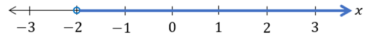
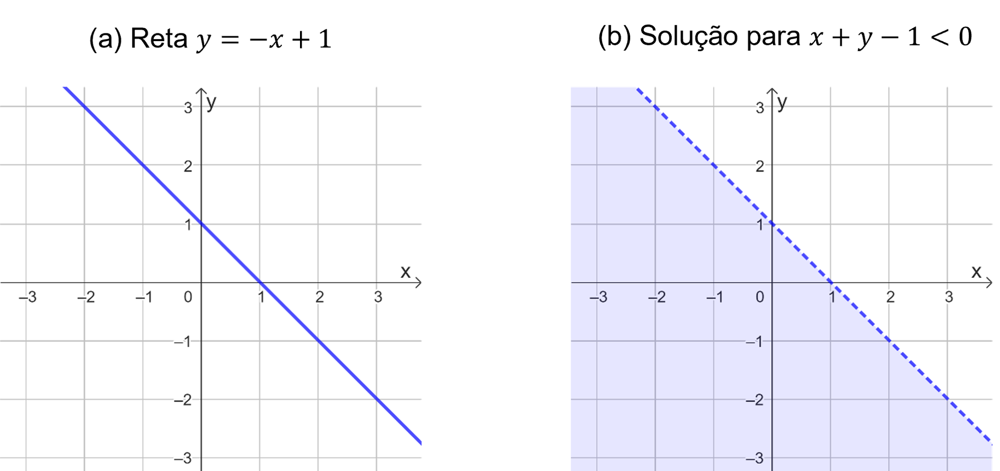

# Aula 2 — Equações e Inequações

## Ponto de Partida

Desejamos boas-vindas a você, estudante! Vamos agora aprofundar nossos estudos a respeito das equações e inequações. Pela sua aplicabilidade na interpretação e resolução de problemas reais provenientes de diversos contextos, é importante direcionarmos nossos estudos a esses tópicos, observando principalmente as equações lineares e quadráticas, além das inequações de 1º grau.

As equações e inequações, além da aplicação direta em determinados problemas, estão diretamente relacionadas ao estudo das funções, que consiste em um dos principais conceitos estudados na Matemática e aplicado nas mais variadas áreas de conhecimento.

Diante desse tema, vamos à análise da seguinte situação. Uma empresa de tecnologia está contratando funcionários para fazer atendimentos remotos aos clientes, resolvendo os problemas identificados nos computadores de uso pessoal, dos diferentes setores da empresa. O setor de recursos humanos organizou duas propostas de salário para esse cargo:

| Proposta | Salário fixo | Bônus por atendimento |
|:--:|:--:|:--:|
| **I** | R$ 1.600,00 | R$ 7,00 |
| **II** | R$ 1.800,00 | R$ 5,00 |

> Considerando essas informações, em que condições a proposta I é a melhor opção para a empresa contratante? E a proposta II?

Prossiga em seus estudos e confira os conceitos que podem contribuir para a solução desse problema.

---

## Vamos Começar!

O estudo das equações é um tópico de destaque na Matemática, pois em muitos contextos buscamos a representação de problemas por meio de equações ou, ainda, quando empregamos o conceito de função na construção de modelos, em muitos casos resumimos nossos problemas à resolução de equações. Assim, vamos iniciar nossos estudos pela definição de equação e, mais especificamente, pelas equações de 1º grau.

### Equações de 1º grau

Uma equação consiste em uma declaração de que duas expressões são iguais, sendo essa relação evidenciada pela presença do símbolo de igualdade (=). Assim, teremos uma expressão da forma 𝐴 = 𝐵. Nesse contexto, são exemplos de equações:

- $\dfrac{4y}{3} = \dfrac{3y}{2}$
- $\dfrac{x}{3} = 3x - 1$
- $x^2 + 2x - 15 = 0$

Nos exemplos anteriores, não são conhecidos previamente os valores assumidos por 𝑥 e 𝑦. O termo desconhecido de uma equação é denominado **incógnita**, às vezes chamado também de **variável**, sendo representado por uma letra.

Considerando ainda os exemplos anteriores, da equação

$$\dfrac{4y}{3} = \dfrac{3y}{2}$$

podemos dizer que $\dfrac{4y}{3}$ corresponde ao **1º membro** da equação, que seria o termo à esquerda do símbolo de igualdade, e $\dfrac{3y}{2}$ consiste no **2º membro** da equação, o qual está à direita do símbolo =.

Ao representar um problema por meio de uma equação, podemos buscar suas soluções para que seja possível determinar respostas para o problema em estudo. Nesse sentido, são denominados **raízes** ou **soluções** da equação aos valores que a tornam válida, ou que satisfazem a equação. Vejamos o caso da equação 𝑥 + 1 = 3, ao adotar 𝑥 = 2 teremos que 2 + 1 = 3, o que torna válida a equação, logo, esse valor corresponde à solução da equação 𝑥 + 1 = 3.

A equação 2𝑥 − 1 = 3 também admite 𝑥 = 2 como solução, pois 2 · 2 − 1 = 3. Observe que essa equação e 𝑥 + 1 = 3 têm a mesma solução, por isso podemos dizer que essas equações são **equivalentes** entre si.

O processo de resolução de uma equação, isto é, de obtenção das soluções, envolve o processo de conversão da equação em uma outra equação, equivalente à primeira, e cuja solução é óbvia. As operações que podem ser empregadas nesse processo são:

1. Adição ou subtração do mesmo número em ambos os membros da equação.
2. Multiplicar ou dividir ambos os membros pelo mesmo número não nulo.
3. Simplificar expressões em um dos membros da equação.

Agora, vamos à aplicação dos conceitos estudados até o momento para uma categoria específica de equações, as de 1º grau.

Uma **equação polinomial de 1º grau**, também chamada de **equação linear**, corresponde a uma equação na forma 𝑎𝑥 + 𝑏 = 0, ou que possa ser transformada em uma equação equivalente nesse formato. Quando 𝑎 ≠ 0, a equação linear possui uma única solução. Se 𝑎 = 0, a única solução possível é 𝑥 = 0 quando 𝑏 = 0, caso contrário ela não terá solução. As demais equações que não atendem a esse formato são chamadas de **equações não lineares**.

Por exemplo, a equação 2𝑥 + 4 = 0 é linear, em que 𝑎 = 2 e 𝑏 = 4. Ainda, a equação 3𝑥 = −1 é também linear, porque ela pode ser transformada em 3𝑥 + 1 = 0, por meio da adição de 1 em ambos os membros da equação original. Já 2𝑥² − 3 = 1 é do tipo não linear.

Para a obtenção da solução de uma equação linear precisamos empregar os procedimentos já citados, tendo em vista isolar a incógnita em um membro. Nesse processo, a ideia é combinar incógnitas em um membro da equação e os termos constantes no outro membro. A seguir é apresentado um exemplo de como podemos resolver a equação linear dada por 5𝑥 − 8 = 2𝑥 + 1.

> **5𝑥 − 8 = 2𝑥 + 1**
>
> *Subtraia 2𝑥 de ambos os membros.*
>
> 5𝑥 − 8 − 2𝑥 = 2𝑥 + 1 − 2𝑥
>
> **3𝑥 − 8 = 1**
>
> *Adicione 8 a ambos os membros.*
>
> 3𝑥 − 8 + 8 = 1 + 8
>
> **3𝑥 = 9**
>
> *Divida ambos os membros por 3.*
>
> **𝑥 = 3**

Logo, as equações 5𝑥 − 8 = 2𝑥 + 1 e 𝑥 = 3 são equivalentes, logo a raiz da equação em estudo é 𝑥 = 3.

Na sequência, vejamos o caso das equações de 2º grau.

### Equações de 2º grau

Uma **equação polinomial de 2º grau**, ou **equação quadrática**, é aquela que pode ser escrita na forma 𝑎𝑥² + 𝑏𝑥 + 𝑐 = 0, com 𝑎 ≠ 0, ou que pode ser transformada em uma equação equivalente nesse formato. Por apresentar a incógnita em uma potência de expoente 2, indicada por 𝑥², temos que essa equação pode apresentar até duas raízes ou soluções.

Para esse tipo de equação, existem alguns métodos de resolução que podem ser aplicados. No entanto, estudaremos o método que pode ser aplicado em qualquer contexto e que envolve a aplicação de uma fórmula específica.

Se a equação quadrática está representada em sua forma padrão 𝑥² + 𝑏𝑥 + 𝑐 = 0, com 𝑎 ≠ 0, suas soluções podem ser obtidas a partir da fórmula:

$$x = \dfrac{-b \pm \sqrt{b^2 - 4ac}}{2a}$$

Note que essa fórmula traz implícita as duas soluções da equação. O termo ± indica que teremos que aplicar essa fórmula duas vezes, em uma utilizaremos o sinal + e na outra o sinal −. O termo Δ = 𝑏² − 4𝑎𝑐, que aparece no radicando da raiz, é chamado de **discriminante**. O valor do discriminante Δ pode ser empregado na identificação dos tipos de soluções que a equação quadrática possui:

- Se Δ > 0, a equação quadrática terá **duas soluções reais e distintas**.
- Se Δ = 0, a equação quadrática terá **duas soluções reais e iguais**.
- Se Δ < 0, a equação quadrática **não terá soluções reais**.

Desse modo, calculando o valor de Δ, já podemos prever o comportamento das soluções da equação, caso existam. Ainda, considerando a expressão do discriminante, a fórmula para resolução de equação quadrática pode ser escrita na forma:

$$x = \dfrac{-b \pm \sqrt{\Delta}}{2a}$$

Analisemos o exemplo da equação 𝑥² − 2𝑥 − 3 = 0. Observe que essa equação pode ser escrita como 1 · 𝑥² + (−2) · 𝑥 + (−3) = 0, assim, 𝑎 = 1, 𝑏 = −2 e 𝑥 = −3. Calculando o discriminante, segue que:

$$\Delta = b^2 - 4ac = (-2)^2 - 4 \cdot 1 \cdot (-3) = 4 + 12 = 16$$

Como Δ > 0, então a equação tem duas soluções distintas. Vamos aplicar a fórmula no cálculo das soluções 𝑥₁ e 𝑥₂, sabendo que a fórmula deve ser aplicada duas vezes, uma com adição e outra com subtração:

$$x_1 = \dfrac{-b - \sqrt{\Delta}}{2a} = \dfrac{-(-2) - \sqrt{16}}{2 \cdot 1} = \dfrac{2 - 4}{2} = -1$$

$$x_2 = \dfrac{-b + \sqrt{\Delta}}{2a} = \dfrac{-(-2) + \sqrt{16}}{2 \cdot 1} = \dfrac{2 + 4}{2} = 3$$

Portanto, as soluções para a equação são 𝑥 = −1 e 𝑥 = 3.

Para qualquer equação quadrática, podemos empregar esse procedimento em sua resolução. No entanto, perceba a importância de identificar corretamente os valores dos coeficientes 𝑎, 𝑏 e 𝑐 para as substituições nas fórmulas correspondentes.

Agora, prossigamos ao estudo das inequações, as quais envolvem desigualdades.

---

## Siga em Frente...

### Inequações de 1º grau

Quando trabalhamos com equações, buscamos valores que tornam duas expressões iguais. Já no caso das inequações, não teremos igualdades, mas desigualdades. Assim, **inequação** é uma expressão que envolve a comparação entre dois termos por meio da utilização dos símbolos < ("menor que"), > ("maior que"), ≤ ("menor ou igual a") ou ≥ ("maior ou igual a"), além da presença de uma variável, indicada por uma ou mais letras. Veja a seguir exemplos de expressões que podem ser classificadas como inequações.

- $3x < 5$
- $2y^2 \le y + 4$
- $x + 2 \ge 2x - 5$

Para identificar se um número é solução de uma inequação, basta substituir e verificar se a expressão é válida. Por exemplo, para o primeiro caso note que 𝑥 = 1 é solução, porque 3 · 1 < 5, enquanto 𝑥 = 3 não é solução devido a 3 · 3 ≮ 5 (nesse caso, ≮ significa "não é menor que"). Ainda para essa inequação, note que a variável 𝑥 apresenta expoente 1, então este é um exemplo de **inequação de 1º grau**. Nesse caso, o maior expoente da variável da inequação deve ser 1.

Para as inequações, quando desejamos determinar todas as soluções, não é viável fazer testes individuais, mas buscar um método que permita obter todas elas por uma estratégia única, visto que podemos ter infinitas soluções. Para isso, precisamos empregar algumas propriedades envolvendo as operações, como indicado a seguir:

- **Somar ou subtrair:** as inequações 𝑎 < 𝑏, 𝑎 + 𝑐 < 𝑏 + 𝑐 e 𝑎 − 𝑐 < 𝑏 − 𝑐 são equivalentes para qualquer número 𝑐.
- **Multiplicar ou dividir por um número positivo:** as inequações 𝑎 < 𝑏, 𝑎𝑐 < 𝑏𝑐 e $\dfrac{a}{c} < \dfrac{b}{c}$ são equivalentes para qualquer número positivo 𝑐.
- **Multiplicar ou dividir por um número negativo:** as inequações 𝑎 < 𝑏, 𝑎𝑐 > 𝑏𝑐 e $\dfrac{a}{c} > \dfrac{b}{c}$ são equivalentes para qualquer número negativo 𝑐. Note que, nesse caso, são alterados os sentidos das desigualdades com a multiplicação e a divisão.
- **Simplificar** as expressões em cada lado de uma inequação.

Podemos ainda adaptar essas propriedades para contemplar os demais tipos de desigualdades. Agora, apliquemos as propriedades na identificação da solução da inequação seguinte.

> **𝑥 + 2 < 4𝑥 + 8**
>
> *Subtraia 4𝑥 de ambos os lados.*
>
> 𝑥 + 2 − 4𝑥 < 4𝑥 + 8 − 4𝑥
>
> **−3𝑥 + 2 < 8**
>
> *Subtraia 2 de ambos os lados.*
>
> **−3𝑥 < 6**
>
> *Divida ambos os membros por −3.*
>
> $$\dfrac{-3x}{-3} > \dfrac{6}{-3}$$
>
> **𝑥 > −2**

Portanto, a solução para o problema é 𝑥 > −2. Note que a divisão por −3 ocasiona a mudança da desigualdade < para >, isso ocorre sempre que ocorrer uma multiplicação ou uma divisão envolvendo um número negativo. Se o estudo toma por base o conjunto de números reais, podemos exibir o conjunto solução, formado por todas as soluções do problema, da seguinte forma 𝑆 = {𝑥 ∈ ℝ; 𝑥 > −2}. A representação gráfica para essa solução está contemplada na Figura 1.

**Figura 1** | Representação gráfica de 𝑆 = {𝑥 ∈ ℝ; 𝑥 > −2}

Vejamos agora o caso de uma inequação de 1º grau que envolve duas variáveis, como é o caso de 𝑥 + 𝑦 − 1 < 0. Nessa situação, iniciamos pelo ajuste da inequação para 𝑦 < −𝑥 + 1, isolando 𝑦. Agora vamos representar a reta 𝑦 = −𝑥 + 1 graficamente, sabendo que ela contém os pontos (1,0) e (0,1) (basta assumir um valor para 𝑥 na equação e encontrar o 𝑦 correspondente), como indicado na Figura 2(a). Como temos uma desigualdade do tipo "menor que", os pontos da reta não farão parte da solução, então vamos representá-la tracejada. Agora, como queremos 𝑦 < −𝑥 + 1, observamos que a região em que os pares ordenados atendem esse critério é abaixo da reta, portanto, a solução para essa inequação corresponde à região hachurada da Figura 2(b).

**Figura 2** | Estudo da inequação 𝑥 + 𝑦 − 1 < 0

Com base nas equações e inequações, podemos construir modelos e solucionar problemas diversos, envolvendo tanto os conjuntos discretos quanto os não discretos.

---

## Vamos Exercitar?

Com base no estudo das equações e inequações, principalmente as de 1º grau, analisemos as propostas de salário para a empresa de tecnologia. Representando por 𝑥 o número de atendimentos feitos por mês, o salário conforme cada proposta pode ser calculado pelas expressões:

- **Proposta I:** salário fixo de R$ 1.600,00, além de um bônus de R$ 7,00 por cada atendimento realizado no mês, então temos a expressão **7𝑥 + 1600**.
- **Proposta II:** salário fixo de R$ 1.800,00, além de um bônus de R$ 5,00 por cada atendimento realizado no mês, donde segue a expressão **5𝑥 + 1800**.

Para comparar as propostas, vamos analisar inicialmente quantos atendimentos precisam ser feitos para que o funcionário receba o mesmo salário segundo cada proposta. Para isso, vamos resolver a equação linear:

> **7𝑥 + 1600 = 5𝑥 + 1800**
>
> 7𝑥 − 5𝑥 = 1800 − 1600
>
> **2𝑥 = 200**
>
> **𝑥 = 100**

Logo, se forem feitos 100 atendimentos no mês, o salário obtido pelo funcionário será o mesmo nas duas propostas.

Vejamos em que condição a proposta I é a melhor opção para a empresa, isto é, quando 7𝑥 + 1600 < 5𝑥 + 1800. Resolvendo a inequação:

> **7𝑥 + 1600 < 5𝑥 + 1800**
>
> 7𝑥 − 5𝑥 < 1800 − 1600
>
> **2𝑥 < 200**
>
> **𝑥 < 100**

Portanto, a proposta I é a melhor opção se forem feitos menos do que 100 atendimentos no mês, e a II é a melhor opção para o caso de o número de atendimentos for superior a 100. Com isso, é possível fazer a tomada de decisão e, portanto, solucionar o problema.
