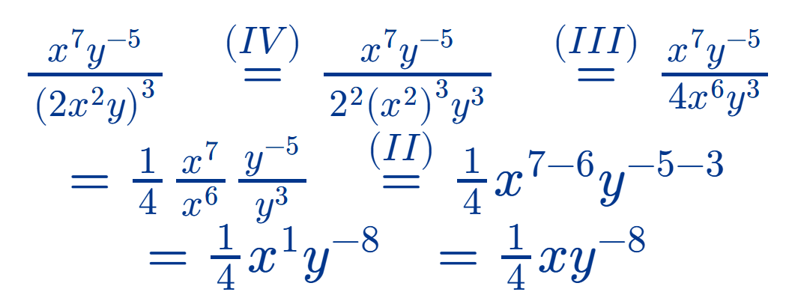

# Aula 3 — Potências e Logaritmos

## Vamos Começar!

A potenciação é uma operação envolvendo números reais e que é aplicada em diversos estudos, principalmente quando trata de fenômenos sujeitos a crescimentos ou decrescimentos rápidos. Vejamos os conceitos essenciais para o trabalho com as potências e suas propriedades.

Para o estudo das potências e suas propriedades, vamos separar os possíveis casos em categorias, de acordo com o conjunto empregado na descrição dos expoentes.

### Potências com expoentes inteiros e suas propriedades

Vamos analisar separadamente os valores positivos e negativos para os expoentes inteiros. Primeiramente, podemos entender a potência de expoente natural, ou inteiro positivo, como uma multiplicação de fatores iguais. Assim, sendo 𝑎 um número real e 𝑛 um inteiro positivo, denominamos de potência de base 𝑎 e expoente 𝑛 ao número 𝑎ⁿ, que pode ser representado por:

$$a^n = \underbrace{a \cdot a \cdot a \cdots a}_{n \text{ fatores}}$$

Por exemplo, $2^4 = 2 \cdot 2 \cdot 2 \cdot 2 = 16$ e $(-1)^4 = (-1) \cdot (-1) \cdot (-1) \cdot (-1) = 1$. Além disso, quando tomamos um número real 𝑎 não nulo, podemos afirmar que $a^0 = 1$. É necessário adotar 𝑎 ≠ 0 porque $0^0$ não é um resultado definido na Matemática, sendo conhecido como indeterminação.

> **Observação:** por exemplo, ao denotar a potência $(1{,}3)^3$, podemos utilizar os parênteses para que não haja dúvidas que a base é o número 1,3 e o expoente é o 3.

Em relação aos expoentes inteiros negativos, a partir deles também podemos construir potências, mas com uma interpretação diferente. Nesse caso, seja 𝑎 um número real diferente de zero e 𝑛 um número inteiro positivo, logo, −𝑛 é um inteiro negativo. A partir desses números, podemos definir a potência $a^{-n}$, a qual pode ser escrita como:

$$a^{-n} = \dfrac{1}{a^n}$$

Por exemplo:

$$3^{-4} = \dfrac{1}{3^4} = \dfrac{1}{3 \cdot 3 \cdot 3 \cdot 3} = \dfrac{1}{81}$$

Consideremos agora dois números reais 𝑎 e 𝑏 diferentes de zero, bem como 𝑚 e 𝑛 números inteiros. Dessa forma, são válidas as propriedades indicadas na Tabela 1.

| Propriedade | Fórmula | Exemplo |
|---|:--:|:--:|
| **I.** Produto de potências de mesma base | $a^m \cdot a^n = a^{m+n}$ | $4^3 \cdot 4^{-2} = 4^{3+(-2)} = 4^1$ |
| **II.** Quociente de potências de mesma base | $\dfrac{a^m}{a^n} = a^{m-n}$ | $\dfrac{(0{,}5)^7}{(0{,}5)^4} = (0{,}5)^{7-4} = (0{,}5)^3$ |
| **III.** Potência de potência | $(a^m)^n = a^{m \cdot n}$ | $(5^3)^{-2} = 5^{3 \cdot (-2)} = 5^{-6}$ |
| **IV.** Potência de produto | $(a \cdot b)^m = a^m \cdot b^m$ | $\left(\dfrac{1}{2} \cdot 9\right)^2 = \left(\dfrac{1}{2}\right)^2 \cdot 9^2$ |
| **V.** Potência de quociente | $\left(\dfrac{a}{b}\right)^m = \dfrac{a^m}{b^m}$ | $\left(\dfrac{4}{0{,}2}\right)^{-3} = \dfrac{4^{-3}}{(0{,}2)^{-3}}$ |

**Tabela 1** | Propriedades das potências

Podemos empregar essas propriedades em conjunto durante a resolução de problemas, principalmente no caso em que há a necessidade de fazer simplificações em expressões envolvendo potências. Vejamos no exemplo seguinte como podemos empregar essas propriedades na simplificação de uma expressão.

**Figura 1** | Simplificação de $\dfrac{x^7y^{-5}}{(2x^2y)^3}$ aplicando as propriedades IV, III e II da Tabela 1

### Potências de expoente racional

Podemos estudar potências cujo expoente é um número racional, em sua forma fracionária. Nesse caso, podemos associar as potências com as raízes. Assim, sendo 𝑎 um número real e $\dfrac{m}{n}$ um número racional na forma fracionária, ou seja, com 𝑚 e 𝑛 números inteiros e 𝑛 ≠ 0, teremos a potência:

$$a^{\frac{m}{n}} = \sqrt[n]{a^m}$$

Ou seja, quando temos o caso das potências de expoente racional, podemos associá-las às raízes. Por exemplo:

$$5^{\frac{1}{2}} = \sqrt{5} \qquad \qquad 2^{\frac{3}{4}} = \sqrt[4]{2^3} = \sqrt[4]{8}$$

Dessa forma, o estudo da potenciação é essencial quando precisamos representar e solucionar problemáticas que lidam com questões envolvendo, por exemplo, crescimentos ou decrescimentos rápidos, sendo as propriedades indispensáveis para a solução desses problemas ou mesmo na simplificação de outros nos quais as potências estão presentes. A seguir, avancemos ao estudo dos logaritmos.

---

## Siga em Frente...

### Logaritmos

Logaritmo — do Latim: *logos* significa razão e *aritmos*, número — foi um termo elaborado por John Napier (1550-1617) para substituir o expoente em uma potência que representa uma multiplicação de fatores iguais. Por exemplo, no caso de $2^3 = 8$, 3 é o logaritmo de 8 na base 2. Com a definição formal de logaritmo foi possível estender essa ideia para os expoentes reais como um todo.

A proposta com a construção dos logaritmos era a de tornar cálculos mais complexos, como as multiplicações e as divisões, em problemas mais simples, envolvendo adições e subtrações. Esse recurso foi desenvolvido por volta do século XVII e teve uma grande contribuição para o desenvolvimento tecnológico e científico da época.

O logaritmo do número 𝑏 na base 𝑎 resulta em um número 𝑐 e pode ser descrito na forma $\log_a b = c$, com 𝑎 > 0, 𝑏 > 0 e 𝑎 ≠ 1. Nessa expressão, temos que 𝑎 corresponde à base, 𝑏 é o logaritmando e 𝑐 é o logaritmo.

Por definição, o logaritmo de 𝑏 na base 𝑎 consiste no expoente ao qual devemos elevar a base 𝑎 para que o resultado seja 𝑏, assim, podemos estabelecer a seguinte correspondência:

$$\log_a b = c \iff a^c = b$$

Por exemplo, a expressão $\log_2 5 = x$ é equivalente a $2^x = 5$.

Para calcular os logaritmos, podemos empregar diferentes estratégias, de acordo com o perfil de cada expressão. Uma delas toma por referência a relação apresentada anteriormente envolvendo as potências. Queremos calcular $\log_2 8$. Para isso, vamos empregar a seguinte estratégia:

$$\log_2 8 = x \iff 2^x = 8$$

Note que a última expressão corresponde a uma equação exponencial, a qual podemos resolver por meio da igualdade de potências de mesma base. Assim:

$$2^x = 8 \iff 2^x = 2^3 \iff x = 3$$

Portanto, $\log_2 8 = 3$.

A estratégia descrita anteriormente é válida quando é possível resolver a equação exponencial correspondente por meio do método de igualdade entre potências de mesma base. Os resultados obtidos podem ainda ser empregados no cálculo de expressões como em $\log_2 32 + \log_3 27$. Nesse caso, como $\log_2 32 = 5$ e $\log_3 27 = 3$, podemos concluir que $\log_2 32 + \log_3 27 = 5 + 3 = 8$.

Agora, considerando 𝑎 > 0, 𝑎 ≠ 1, bem como 𝑥 > 0 e 𝑦 > 0, vejamos algumas consequências da definição de logaritmo.

- $\log_a a = 1$, pois $a^1 = a$.
- $\log_a 1 = 0$, pois $a^0 = 1$.
- $\log_a a^n = n$, pois $a^n = a^n$ para todo 𝑛.
- $\log_a x = \log_a y \iff x = y$.
- $a^{\log_a x} = x$, pois $\log_a x = y \Rightarrow a^y = x$, então substituindo 𝑦 obtemos $a^{\log_a x} = x$.

Vamos analisar alguns exemplos associados à definição de logaritmo e às consequências apresentadas.

- $\log_3 27 = 3$ porque $3^3 = 27$.
- $\log_{\frac{1}{2}} 0{,}25 = 2$ porque $\left(\dfrac{1}{2}\right)^2 = \dfrac{1}{4} = 0{,}25$.
- $\log_2(-4)$ não existe porque não existe expoente 𝑛 para o qual $2^n = -4$.
- $\log_2 1 = 0$ porque $2^0 = 1$.
- $\log_3 3 = 1$ porque $3^1 = 3$.

Analisemos agora algumas propriedades operatórias envolvendo logaritmos, as quais são essenciais no cálculo e na simplificação de expressões que contenham esse tipo de termo. As propriedades são indicadas na Tabela 2 a seguir, para 𝑎 > 0, 𝑎 ≠ 1, 𝑏 > 0 e 𝑐 > 0.

| Propriedade | Fórmula | Exemplo |
|---|:--:|:--:|
| **I.** Logaritmo de produto | $\log_a(b \cdot c) = \log_a b + \log_a c$ | $\log_2 96 + \log_2 \dfrac{1}{3} = \log_2\left(96 \cdot \dfrac{1}{3}\right) = \log_2 32 = 5$ |
| **II.** Logaritmo de quociente | $\log_a\left(\dfrac{b}{c}\right) = \log_a b - \log_a c$ | $\log_3 45 - \log_3 5 = \log_3\left(\dfrac{45}{5}\right) = \log_3 9 = 2$ |
| **III.** Logaritmo de potência | $\log_a b^k = k \cdot \log_a b$ | $\log_2 8^5 = 5 \cdot \log_2 8 = 5 \cdot 3 = 15$ |

**Tabela 2** | Propriedades dos logaritmos

Outra possibilidade é o emprego dessas propriedades em expressões envolvendo incógnitas. Por exemplo:

$$\log_3(3x) = \log_3 3 + \log_3 x = 1 + \log_3 x$$

No estudo dos logaritmos, podemos destacar a utilização de duas bases específicas, a base 10 e a base 𝑒, construída a partir do número de Euler. Uma importância dessas bases consiste no fato de que muitas calculadoras científicas trazem os resultados dos logaritmos apenas nessas duas bases.

#### Logaritmo decimal

Quando adotamos a base 10 na construção de um logaritmo, dizemos que estamos estudando um **logaritmo decimal**. Geralmente, para essa base, escrevemos o logaritmo omitindo sua base. Assim, ao invés de escrever $\log_{10} x$, utilizamos a notação $\log x$. Subentende-se, por essa escrita, que se trata de um logaritmo decimal, ou de base 10. Para a utilização de calculadoras científicas, nesse caso, utilizamos a tecla:

> `log`

Assim, por exemplo, o valor aproximado para $\log 3{,}56$ é $0{,}5514$, considerando apenas quatro casas decimais.

> **Observação:** para calcular $\log 3{,}56$ na calculadora basta utilizar as seguintes teclas, nesta ordem:
>
> `log` `3` `.` `5` `6` `=`

#### Logaritmo natural (neperiano)

Outro caso envolve o emprego do número 𝑒. Quando construímos um logaritmo cuja base é o número de Euler, ou número 𝑒, dizemos que estamos estudando um **logaritmo natural** ou **neperiano**. Nesse caso, ao invés de usar a notação $\log_e x$, adotamos a escrita $\ln x$. A expressão $\ln$ é utilizada apenas para o logaritmo de base 𝑒. Na calculadora científica, o cálculo do logaritmo natural de um número é feito utilizando a tecla:

> `ln`

Por exemplo, $\ln 15 \approx 2{,}708$.

> **Observação:** para calcular $\ln 15$ na calculadora basta utilizar as seguintes teclas, nesta ordem:
>
> `ln` `1` `5` `=`

Todas as propriedades válidas para os logaritmos podem ser adaptadas para os casos dos logaritmos decimais e naturais, considerando inclusive as mudanças nas notações.

Vejamos alguns exemplos de cálculos considerando os logaritmos decimais e naturais.

- $\log 10 = 1$, porque $10^1 = 10$.
- $\ln 1 = 0$, porque $e^0 = 1$.
- $\log 1000 = \log 10^3 = 3$.
- $e^{\ln 2} = 2$.
- $\log 0{,}01 = \log 10^{-2} = -2$.
- $\log 5 + \log 20 = \log(5 \cdot 20) = \log 100 = \log 10^2 = 2$.

O uso de calculadoras científicas é bastante comum no estudo dos logaritmos, pois em muitos casos temos apenas aproximações para os resultados, especificamente quando não conseguimos converter $\log_a b = x$ em uma equação exponencial $a^x = b$ que possa ser solucionada por meio da igualdade de potências de mesma base.

De posse da definição e das propriedades apresentadas, podemos articular os logaritmos às potências de modo a desenvolver estratégias de simplificação e resolução de problemas que possam ser representados por meio desses conceitos.

---

## Vamos Exercitar?

Para a solução do problema envolvendo a cultura de bactérias, precisamos inicialmente construir um modelo matemático correspondente. Sabemos que no instante inicial, 𝑡 = 0, a quantidade de bactérias é igual a $q(0) = 1$. A cada 40 minutos, a quantidade de bactérias duplica. Assim, para esse estudo, vamos considerar que a variável 𝑡 indica a quantidade de períodos de 40 minutos, contados a partir do instante inicial (9h). Com isso, podemos construir a Tabela 3 para evidenciar as quantidades observadas nos primeiros momentos.

| Tempo (𝑡) | Quantidade de bactérias (𝑞) |
|:--:|:--:|
| 0 | $1 = 2^0$ |
| 1 | $2 = 2^1$ |
| 2 | $4 = 2^2$ |
| 3 | $8 = 2^3$ |

**Tabela 3** | Evolução da quantidade de bactérias

Dessa forma, podemos relacionar as variáveis 𝑡 e 𝑞 por meio da expressão:

$$q = 2^t$$

Para a primeira questão, devemos determinar 𝑡 para o qual 𝑞 = 2048, isto é, $2048 = 2^t$. Como $2048 = 2^{11}$, então 𝑡 = 11. Ou seja, após 11 períodos de 40 minutos a quantidade de bactérias será de 2048, o que corresponde a 7 horas e 20 minutos. Assim, esse total será obtido às 16h20.

Queremos determinar a quantidade às 13h40, isto é, a quantidade após 4 horas e 40 minutos, ou ainda, após 7 períodos de 40 minutos. Como $2^7 = 128$, então a quantidade de bactérias às 13h40 será de 128, o que conclui a solução do problema.
