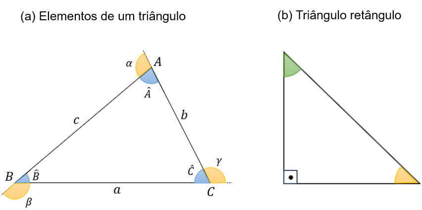
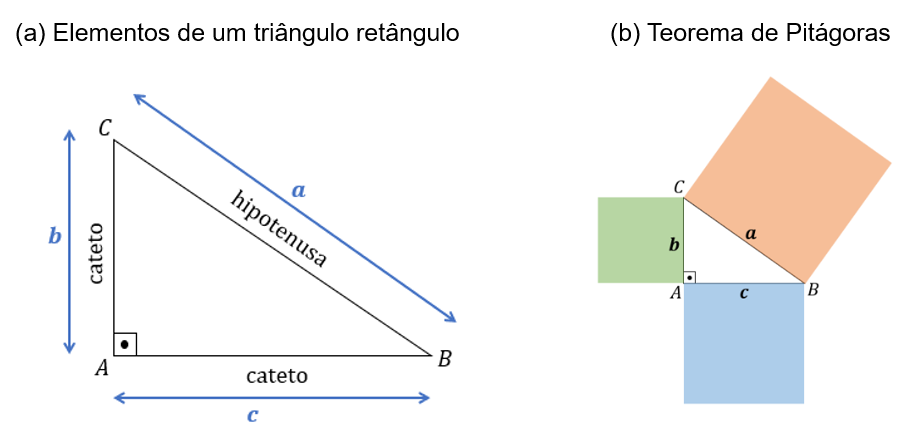
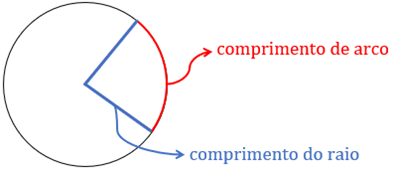
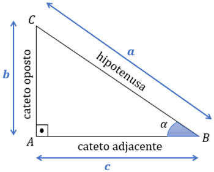
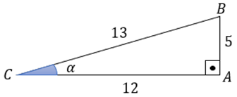
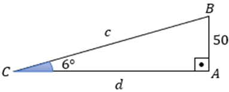

# Aula 4 — Tópicos de Trigonometria

## Ponto de Partida

Desejamos boas-vindas a você! Nesta aula discutiremos a respeito de tópicos iniciais envolvendo a trigonometria, os quais são base para estudos posteriores envolvendo as razões e funções trigonométricas.

De acordo com Young (2017), a palavra trigonometria tem origem no grego, de modo que *trigonon* significa triângulo e *metrein*, medir. Isto é, a trigonometria é o campo responsável pelo estudo de medidas associadas a triângulos. Assim, os conceitos básicos que precisamos envolvem a caracterização dos triângulos, sua classificação — com enfoque nos triângulos retângulos —, bem como o conhecimento do teorema de Pitágoras e das razões trigonométricas.

Para contribuir com o estudo dessa temática, avaliemos a situação a seguir.

> De acordo com a norma NBR 9050, que dispõe a respeito da acessibilidade em edificações, mobiliários, espaços e equipamentos urbanos, estabelecida pela Associação Brasileira de Normas Técnicas (ABNT), a inclinação das rampas pode variar de 5% até 8,33%, podendo exceder em caso de reformas, mas atingindo o máximo de 12,5%.
>
> Suponha que será instalada uma rampa de acesso a uma agência bancária, de modo que atenda à norma apresentada. Para isso, como a rampa precisa atender um desnível de 50 cm, ficou estabelecido que o ângulo de inclinação da rampa deve ser de 6°. Adotando as aproximações $\text{sen}(6°) = 0{,}1$ e $\cos(6°) = 0{,}99$, determine qual deve ser o comprimento dessa rampa e qual a distância horizontal ocupada por ela. Como podemos solucionar esse problema?

Assim, dê continuidade aos seus estudos, conferindo os conceitos essenciais para a solução dessa problemática.

---

## Vamos Começar!

Uma das principais figuras geométricas estudadas no campo da Matemática é o triângulo, um polígono formado por três lados e que apresenta uma estrutura rígida, isto é, não pode ser deformado mediante a aplicação de forças sobre seus vértices, por isso é bastante empregado, por exemplo, em estruturas de sustentação, como em telhados. Vamos iniciar conhecendo as características dessa figura geométrica.

### Triângulos

O triângulo é um polígono formado por três vértices, denotados por 𝐴, 𝐵 e 𝐶 na Figura 1(a) de referência, possuindo também três lados, os quais são representados pelos segmentos de reta $\overline{AB}$, $\overline{AC}$ e $\overline{BC}$. Perceba que o lado $\overline{BC}$ é oposto ao vértice 𝐴, $\overline{AC}$ é oposto ao vértice 𝐵 e $\overline{AB}$ é oposto ao vértice 𝐶. Podemos ainda denotar os lados a partir de letras minúsculas 𝑎, 𝑏 e 𝑐, indicados na figura.

**Figura 1** | Estudo dos triângulos

Ainda com base na Figura 1(a), a partir de cada vértice podemos identificar um ângulo interno e um externo. Os ângulos $\hat{A}$, $\hat{B}$ e $\hat{C}$ correspondem aos ângulos internos do triângulo, enquanto 𝛼, 𝛽 e 𝛾 são os ângulos externos do triângulo. É importante destacar que nos triângulos é válida a seguinte igualdade:

$$\hat{A} + \hat{B} + \hat{C} = 180°$$

isto é, a soma dos ângulos internos é igual a 180°. Outras características interessantes dos triângulos é que esse é o único polígono que não possui diagonais, e é tal que a medida de um lado é sempre menor do que a soma das medidas dos outros dois lados. Dos casos especiais de triângulos, podemos destacar a categoria dos **triângulos retângulos**, os quais possuem um dos ângulos internos de medida 90°, conforme exemplo presente na Figura 1(b).

Conhecendo as características dos triângulos, principalmente dos retângulos, vamos prosseguir ao estudo do teorema de Pitágoras.

### Teorema de Pitágoras

O teorema de Pitágoras recebeu essa nomenclatura em homenagem a um grande matemático grego da Antiguidade, Pitágoras, fundador da Escola Pitagórica e que ensinava aritmética, geometria, música, religião, entre outros.

O teorema de Pitágoras é aplicado somente a triângulos retângulos, isto é, aos triângulos que apresentam um ângulo interno de medida 90°. Seja um triângulo retângulo, conforme a Figura 2(a). Nessa figura, o ângulo de 90° está localizado no vértice 𝐴, sendo o lado $\overline{BC}$ oposto a ele denominado **hipotenusa**. Os outros dois lados, $\overline{AB}$ e $\overline{AC}$, são chamados de **catetos** do triângulo.

**Figura 2** | Triângulo retângulo

O teorema de Pitágoras afirma que o quadrado da medida da hipotenusa é igual à soma dos quadrados das medidas dos catetos, o que simbolicamente podemos representar pela expressão:

$$a^2 = b^2 + c^2$$

Note que a Figura 2(b) traz uma interpretação para essa expressão, em que os quadrados das medidas estão vinculados às áreas de quadrados. Nesse sentido, a área do quadrado de lado sendo a hipotenusa é igual à soma das áreas dos quadrados formados a partir dos catetos do triângulo.

Por exemplo, se um triângulo retângulo tem os catetos de medidas 𝑏 = 3 cm e 𝑐 = 4 cm, então a medida de sua hipotenusa pode ser calculada por:

$$a^2 = 3^2 + 4^2 \Rightarrow a^2 = 9 + 16 = 25 \Rightarrow a = \sqrt{25} = 5 \text{ cm}$$

Essa estratégia pode ser empregada também com hipotenusa e um dos catetos conhecidos para a determinação da medida do outro cateto. Assim, o teorema de Pitágoras é um resultado que pode ser empregado apenas com triângulos retângulos e que permite, a partir das medidas de dois lados conhecidas, identificar a medida do terceiro lado do triângulo.

Agora, para iniciar os estudos a respeito das razões trigonométricas, precisamos identificar quais são as unidades de medidas adotadas para os ângulos, como segue.

---

## Siga em Frente...

### Graus e radianos

**Graus (°)** e **radianos (rad)** são duas unidades de medidas utilizadas para ângulos.

Podemos associar 1° com a fração $\dfrac{1}{360}$ de um círculo, visto que os ângulos construídos a partir de um círculo variam de 0° a 360°. Por sua vez, o radiano é definido como a razão entre o comprimento do arco e o comprimento do raio do círculo, conforme indicações presentes na Figura 3, e, nesse caso, associamos o círculo completo à medida $2\pi$ rad.

**Figura 3** | Comprimento de raio e de arco num círculo

Diante dessas informações, podemos estabelecer a correspondência $360° = 2\pi \text{ rad}$, ou ainda, dividindo ambos os membros por 2, $180° = \pi \text{ rad}$. Estabelecendo uma relação de proporcionalidade, podemos identificar o correspondente em radianos $\varphi(\text{rad})$ para uma medida em graus $\alpha(°)$ por meio da seguinte relação:

$$\varphi(\text{rad}) = \alpha(°) \cdot \dfrac{\pi}{180}$$

Por exemplo, para a medida $\alpha = 30°$, a representação correspondente em radianos é:

$$\varphi = 30 \cdot \dfrac{\pi}{180} = \dfrac{30\pi}{180} = \dfrac{3\pi}{18} = \dfrac{\pi}{6} \text{ rad}$$

A partir das unidades de medidas de ângulos, vamos estudar a seguir as razões trigonométricas.

### Razões trigonométricas

Seja inicialmente um triângulo retângulo ABC, de acordo com a Figura 4. O lado oposto ao ângulo reto (90°) é denominado **hipotenusa** e cada um dos outros dois lados do triângulo é chamado de **cateto**. Fixando um dos ângulos agudos internos, o qual representaremos por 𝛼, o lado oposto a ele será chamado de **cateto oposto**, enquanto o outro cateto passa a receber o nome **cateto adjacente**. Essa diferenciação entre cateto oposto e cateto adjacente só pode ser feita desde que seja fixado um dos ângulos agudos interno ao triângulo.

**Figura 4** | Elementos de um triângulo retângulo

Na Figura 4, ainda adotamos as representações 𝑎 como a medida de comprimento da hipotenusa, 𝑏 como a medida do cateto oposto e 𝑐 a medida do cateto adjacente. A partir dessas medidas, vamos à definição das razões trigonométricas associadas a esse triângulo.

O **seno** do ângulo 𝛼 corresponde na razão entre a medida do cateto oposto e a medida da hipotenusa do triângulo. Assim:

$$\text{sen}(\alpha) = \dfrac{\text{cateto oposto}}{\text{hipotenusa}} = \dfrac{b}{a}$$

O **cosseno** do ângulo 𝛼 corresponde na razão entre a medida do cateto adjacente e a medida da hipotenusa do triângulo. Assim:

$$\cos(\alpha) = \dfrac{\text{cateto adjacente}}{\text{hipotenusa}} = \dfrac{c}{a}$$

A **tangente** do ângulo 𝛼 corresponde na razão entre a medida do cateto oposto e a medida do cateto adjacente do triângulo. Assim:

$$\text{tg}(\alpha) = \dfrac{\text{cateto oposto}}{\text{cateto adjacente}} = \dfrac{b}{c}$$

Vejamos o exemplo do triângulo da Figura 5. Observe que ele é um triângulo retângulo, em que o ângulo reto está localizado no vértice A. A hipotenusa corresponde ao lado $\overline{BC}$, o cateto oposto ao ângulo 𝛼 é o lado $\overline{AB}$ e o cateto adjacente a 𝛼 é o lado $\overline{AC}$.

**Figura 5** | Exemplo de triângulo retângulo

Em relação às razões trigonométricas teremos:

$$\text{sen}(\alpha) = \dfrac{5}{13} \qquad \cos(\alpha) = \dfrac{12}{13} \qquad \text{tg}(\alpha) = \dfrac{5}{12}$$

Note que as razões trigonométricas são valores numéricos associados a cada ângulo interno do triângulo cuja medida seja inferior a 90°.

Existem alguns ângulos chamados de **notáveis**, visto sua aplicabilidade prática. Considerando as possíveis medidas para os ângulos internos de um triângulo, os ângulos notáveis que podemos destacar são 30°, 45° e 60°. Para eles, os valores de seno, cosseno e tangente são tabelados, conforme disposto na Tabela 1. Poderíamos utilizar também as medidas dos ângulos em radianos, assim teríamos $30° = \dfrac{\pi}{6} \text{ rad}$, $45° = \dfrac{\pi}{4} \text{ rad}$ e $60° = \dfrac{\pi}{3} \text{ rad}$.

| | 30° | 45° | 60° |
|---|:--:|:--:|:--:|
| **Seno** | $\dfrac{1}{2}$ | $\dfrac{\sqrt{2}}{2}$ | $\dfrac{\sqrt{3}}{2}$ |
| **Cosseno** | $\dfrac{\sqrt{3}}{2}$ | $\dfrac{\sqrt{2}}{2}$ | $\dfrac{1}{2}$ |
| **Tangente** | $\dfrac{\sqrt{3}}{3}$ | $1$ | $\sqrt{3}$ |

**Tabela 1** | Ângulos notáveis. Fonte: Gomes (2018, p. 466).

Por exemplo, se em um triângulo retângulo um dos ângulos internos mede 45°, sabemos que $\text{sen}(45°) = \dfrac{\sqrt{2}}{2}$, $\cos(45°) = \dfrac{\sqrt{2}}{2}$ e $\text{tg}(45°) = 1$. Com isso, além de avaliar os valores associados às razões trigonométricas, também podemos solucionar alguns problemas envolvendo, por exemplo, medidas de lado desconhecidas.

Quando precisamos lidar com ângulos diferentes dos notáveis, usualmente utilizamos a calculadora científica. Para calcular, por exemplo, o seno de 32° basta utilizarmos as seguintes teclas, nesta ordem:

> `sin` → `3` → `2` → `=`

Isso resultará em $\text{sen}(32°) \approx 0{,}53$.

O termo "sin" é a representação em língua inglesa para o seno, por isso geralmente essa é a representação adotada nas calculadoras científicas. Também temos que o termo "tan" se refere à representação em língua inglesa para a tangente.

> **Atenção!** Quando recorremos às calculadoras científicas, podemos trabalhar tanto com os ângulos medidos em graus quanto em radianos. Por isso, é preciso conferir em qual unidade de medida a calculadora está configurada.

Associados a essas razões trigonométricas, podemos definir ainda razões trigonométricas inversas. Retomando a Figura 4, podemos definir:

- A **secante** de um ângulo consiste na razão inversa do cosseno: $\text{sec}(\alpha) = \dfrac{a}{c} = \dfrac{1}{c/a} = \dfrac{1}{\cos(\alpha)}$.
- A **cossecante** de um ângulo é a razão inversa do seno: $\text{cossec}(\alpha) = \dfrac{a}{b} = \dfrac{1}{b/a} = \dfrac{1}{\text{sen}(\alpha)}$.
- A **cotangente** de um ângulo é a razão inversa da tangente: $\text{cotg}(\alpha) = \dfrac{c}{b} = \dfrac{1}{b/c} = \dfrac{1}{\text{tg}(\alpha)}$.

Por meio das razões trigonométricas, podemos fazer estudos de problemas diversos, mas desde que seja possível recorrer às representações via triângulos retângulos, com o intuito de fazer as associações das dimensões com as classificações dos lados do triângulo e, assim, identificar as incógnitas dos problemas, associando-as às soluções dos problemas reais correspondentes.

---

## Vamos Exercitar?

Para a construção da rampa de acesso, ficou definido que o ângulo de inclinação deve ser de 6° e que o desnível a ser atendido por essa rampa é de 50 cm. Podemos representar essa situação a partir da Figura 6.

**Figura 6** | Dimensões da rampa de acessibilidade

Queremos calcular o comprimento 𝑐 da rampa e a distância horizontal 𝑑 ocupada por ela. Para isso, adotemos as aproximações $\text{sen}(6°) = 0{,}1$ e $\cos(6°) = 0{,}99$.

Iniciando pelo cálculo do comprimento da rampa, recorrendo ao seno, obtemos:

$$\text{sen}(6°) = \dfrac{50}{c} \Rightarrow 0{,}1 = \dfrac{50}{c} \Rightarrow c = \dfrac{50}{0{,}1} = 500 \text{ cm} = 5 \text{ m}$$

Logo, a rampa deve ter 5 m de comprimento. Agora, com esse valor podemos calcular a distância horizontal, recorrendo ao cosseno:

$$\cos(6°) = \dfrac{d}{500} \Rightarrow 0{,}99 = \dfrac{d}{500} \Rightarrow d = 0{,}99 \cdot 500 = 495 \text{ cm} = 4{,}95 \text{ m}$$

Portanto, a distância horizontal ocupada pela rampa é de 4,95 m, o que conclui a resolução do problema.

---

## Saiba mais

Para aprofundar os estudos a respeito dos triângulos, consulte o livro *Geometria plana e trigonometria*, de Nelson P. Castanheira e Álvaro E. Leite. No capítulo 4 *Triângulos*, entre as páginas 65 e 70 e entre as páginas 82 e 87, são apresentados os conceitos iniciais sobre os triângulos, inclusive com as classificações e a semelhança de triângulos. Já no capítulo 5 *Triângulos retângulos*, entre as páginas 93 e 101, o foco se dá sobre o triângulo retângulo, o teorema de Pitágoras e as relações métricas.

Como referência para o estudo das razões trigonométricas, sugerimos o livro *Fundamentos de matemática para engenharias e tecnologias*, de Giácomo A. Bonetto e Afrânio C. Murolo. Na seção 8.1 *Trigonometria no triângulo retângulo*, entre as páginas 172 a 176, você poderá conferir outros exemplos envolvendo as razões trigonométricas no contexto dos triângulos retângulos.

Uma segunda sugestão é a obra *Matemática com aplicações tecnológicas: matemática básica*, de Seizen Yamashiro e Suzana A. de O. Souza. No capítulo 10 *Trigonometria*, no trecho entre as páginas 173 a 176, você poderá conferir uma discussão sobre os elementos do triângulo retângulo, as razões trigonométricas, bem como os ângulos notáveis de 30°, 45° e 60°.
