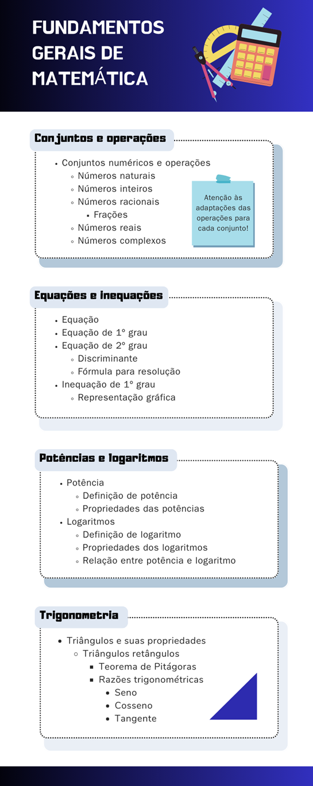

# Aula 5 — Encerramento da Unidade

## Ponto de Chegada

Para desenvolver a competência desta Unidade, que é compreender os principais aspectos relacionados aos conjuntos numéricos, às equações e à trigonometria para resolver problemas em diferentes contextos, você deverá primeiramente conhecer os conceitos fundamentais da Teoria de Conjuntos, especificamente direcionados aos conjuntos numéricos, suas operações e propriedades.

De posse desses conhecimentos, um outro assunto relevante à sua formação é a compreensão do conceito de equação e das estratégias para solucionar equações de 1º e 2º graus, além das inequações de 1º grau, considerando sua aplicabilidade na modelagem e representação de fenômenos provenientes dos mais variados contextos.

Outro tema indispensável para a aplicação da Matemática é o conhecimento das potências e dos logaritmos, tanto em relação às suas características específicas quanto em relação à associação que pode ser estabelecida entre esses dois conceitos. Fenômenos que envolvem crescimentos e decrescimentos rápidos são usualmente vinculados a potências e, tendo em vista sua conexão com os logaritmos, é um dos tópicos importantes quando pensamos na resolução de problemas provenientes das mais variadas áreas.

Por fim, outro tópico essencial é a Trigonometria, com enfoque nos triângulos retângulos e nos estudos desenvolvidos a partir dessa figura, como é o caso do teorema de Pitágoras e das razões trigonométricas, em conjunto com suas múltiplas aplicações.

> **Reflita**
>
> - Quais as estratégias utilizadas na resolução de equações lineares e quadráticas?
> - Quais relações podemos estabelecer entre potências e logaritmos?
> - Em quais tipos de problemas podemos empregar os conceitos de Trigonometria?

---

## É Hora de Praticar!

Suponha que uma instituição de ensino superior está organizando um curso de extensão a respeito de conceitos da Matemática Básica, o qual será oferecido como parte das atividades complementares para diversos cursos.

Esse curso será organizado de forma semelhante a uma disciplina regular, com sistema de avaliação próprio. Nesse curso, a nota final de cada aluno será calculada por:

$$N = \dfrac{2T + 3P}{5}$$

em que 𝑇 representa a nota do trabalho e 𝑃 a nota da prova que precisam ser realizados no curso.

Como a instituição trabalha com conceitos na avaliação dos alunos em cursos de extensão, após o cálculo da nota final, que varia de 0 a 10, será feita uma conversão para um conceito, que varia de A até E, o qual é divulgado no histórico escolar do aluno. A tabela utilizada para conversão é a seguinte:

| Intervalo | Conceito |
|:--:|:--:|
| $9 \le NF \le 10$ | A |
| $7 \le NF < 9$ | B |
| $5 \le NF < 7$ | C |
| $3 \le NF < 5$ | D |
| $0 \le NF < 3$ | E |

*Fonte: Gomes (2018, p. 149).*

> **Reflita**
>
> Com base nas informações apresentadas, responda aos seguintes itens:
>
> - **(a)** Se um aluno obtiver nota 7 no trabalho e nota 8 na prova, qual será o conceito registrado em seu histórico escolar?
> - **(b)** Se um aluno obtiver nota 8 no trabalho, qual deve ser sua nota mínima na prova para que mantenha o conceito A em seu histórico escolar?

### Resolução do Estudo de Caso

Para o problema das notas dos alunos na instituição de ensino, iniciemos pelo item (a). Consideremos 𝑇 = 7 e 𝑃 = 8. Aplicando a fórmula para o cálculo das notas, teremos:

$$N = \dfrac{2 \cdot 7 + 3 \cdot 8}{5} = \dfrac{14 + 24}{5} = \dfrac{38}{5} = 7{,}6$$

Como $7 < 7{,}6 < 9$, o resultado obtido por esse aluno foi o **conceito B**.

Em relação ao item (b), o aluno obteve a nota do trabalho igual a 8, então 𝑇 = 8. Queremos determinar 𝑃 de modo que o conceito final seja A, logo, devemos ter $9 \le NF \le 10$. Assim:

$$9 \le NF \le 10$$

$$9 \le \dfrac{2 \cdot 8 + 3P}{5} \le 10$$

$$9 \le \dfrac{16 + 3P}{5} \le 10$$

$$45 \le 16 + 3P \le 50$$

$$45 - 16 \le 3P \le 50 - 16$$

$$29 \le 3P \le 34$$

$$\dfrac{29}{3} \le P \le \dfrac{34}{3}$$

$$9{,}67 \le P \le 11$$

Sendo assim, a nota mínima que o estudante deve obter na prova é 9,67, o que conclui a resolução do problema.

---

## Assimile

O infográfico a seguir destaca os principais conceitos relacionados aos fundamentos da Matemática e pode ser empregado como um roteiro de estudos sobre esse tema. A partir desse infográfico, a sugestão é que você faça uma complementação, acrescentando observações importantes, fórmulas relevantes, propriedades, entre outros conceitos que considerar relevantes, visando traçar um panorama geral a respeito dos conceitos estudados.

---

## Referências

- ADAMI, A. M.; FILHO, A. A D.; LORANDI, M. M. **Pré-cálculo**. Porto Alegre: Bookman, 2015.
- BONETTO, G. A.; MUROLO, A. C. **Fundamentos de matemática para engenharias e tecnologias**. São Paulo: Cengage Learning Brasil, 2018.
- GOMES, F.M. **Pré-cálculo: operações, equações, funções e trigonometria**. São Paulo: Cengage Learning Brasil, 2018.
- MEDEIROS, V. Z. et al. **Pré-Cálculo**. São Paulo: Cengage Learning Brasil, 2013.
- SAFIER, F. **Pré-Cálculo**. Porto Alegre: Bookman, 2011.
