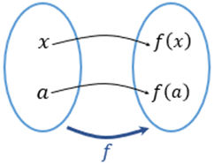
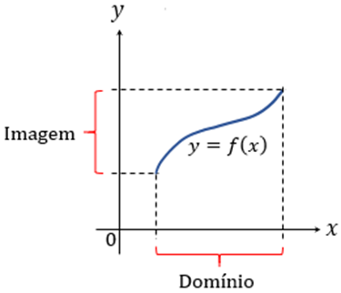
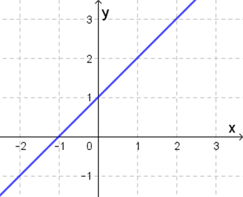
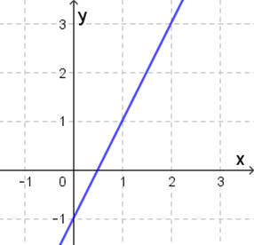
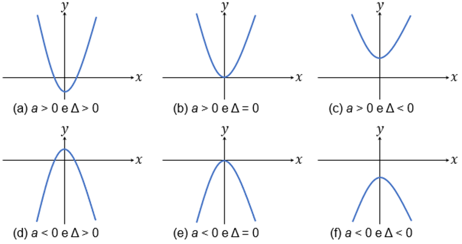
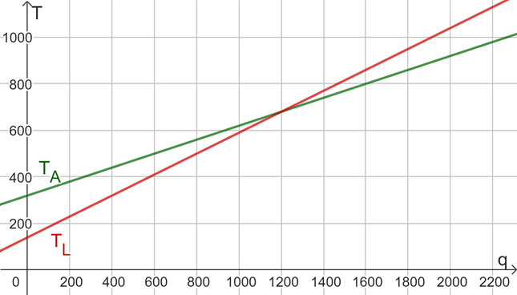

# Aula 1 — Funções Afim e Quadrática

## Ponto de Partida

Estudante, desejamos a você boas-vindas! Vamos iniciar nossos estudos a respeito do conceito de função, o qual está presente em diversas situações, especificamente quando podemos interpretá-las como um tipo de relação entre duas variáveis, considerando os mais diversos contextos nos quais elas estão inseridas. Entre os diversos tipos de funções vamos destacar as funções afim e quadrática, ambas do tipo polinomiais.

Para favorecer esse estudo, vamos analisar a seguinte problemática.

> Um grupo de empresários, proprietários de uma empresa de transporte por aplicativo, está buscando uma parceria com empresas locadoras de veículos para seus associados. Em suas buscas, eles localizaram duas possíveis parceiras: a AluCar e a LocMotors. Essas locadoras cobram suas tarifas da seguinte forma:
>
> - A tarifa mensal cobrada para o aluguel de um automóvel padrão pela **AluCar** corresponde a um valor fixo de R$ 320,00 acrescido de R$ 0,30 por quilômetro rodado.
> - A tarifa mensal cobrada para o aluguel de um automóvel padrão pela **LocMotors** é composta de um valor fixo de R$ 140,00 acrescido de R$ 0,45 por quilômetro rodado.
>
> Em quais condições compensa escolher uma ou outra empresa para a locação de veículos?

Assim, para a resolução da situação apresentada, prossiga em seus estudos, tomando como referência as propriedades das funções e selecionando a categoria de função mais adequada para a solução desse problema.

---

## Vamos Começar!

Em nosso cotidiano nos deparamos com várias situações nas quais devemos relacionar variáveis entre si, por exemplo, quando comparamos as quantidades de combustível consumidas por um automóvel com as distâncias percorridas. Esse tipo de situação pode ser estudada por meio do conceito de função, o qual permite associar duas variáveis entre si. Vejamos a seguir como podemos definir uma função e quais as possíveis representações.

### Introdução às funções

Uma função 𝑓 corresponde a uma regra que associa cada elemento 𝑥, pertencente a um conjunto 𝐷, a um único elemento $f(x)$, pertencente a um conjunto 𝐸. Nesse caso, podemos empregar a representação $f: D \to E$. Para que seja definida uma função, cada elemento do conjunto 𝐷 deve estar relacionado somente a um elemento de 𝐸. Uma representação possível para uma função é o diagrama de flechas, conforme Figura 1.

**Figura 1** | Diagrama de flechas para uma função 𝑓

No diagrama de flechas da Figura 1 apresentamos os dois conjuntos, 𝐷 e 𝐸, empregados na construção da função, e as relações existentes entre seus elementos por meio de flechas.

No estudo de uma função $f: D \to E$, o conjunto 𝐷 é chamado de **domínio** da função, no qual são indicados os possíveis valores assumidos pela variável independente, a qual pode ser representada por 𝑥. O conjunto 𝐸, por sua vez, consiste no **contradomínio** da função, no qual é estudada a variável dependente. Além disso, os possíveis valores de $f(x)$, obtidos ao variar 𝑥 por todo o domínio, pertencem a um subconjunto de 𝐸 chamado de **imagem** de 𝑓. As funções, conforme a definição apresentada, podem ser chamadas também de funções de uma variável, visto que temos a presença de uma única variável independente.

Além do diagrama de flechas, podemos representar as funções a partir de gráficos, os quais permitem analisar o comportamento da função, observando como se relacionam as variáveis dependente e independente. O gráfico de uma função $f: D \to E$ corresponde a um conjunto de pares ordenados $(x, y)$ em que $y = f(x)$, com 𝑥 pertencente ao domínio da função. Esse conjunto pode ser descrito como:

$$G = \lbrace (x, f(x)) ; x \in D \rbrace$$

Desse modo, partindo do plano cartesiano, a construção de um gráfico envolve a identificação dos pares ordenados envolvendo os valores do domínio com suas imagens correspondentes. Na Figura 2 podemos observar um exemplo de gráfico, associado a uma função 𝑓, observando o domínio e a imagem correspondentes.

**Figura 2** | Gráfico da função $f: D \to E$

Nas representações gráficas, como é o caso da Figura 2, os pares ordenados sempre são identificados de modo que os elementos do domínio sejam representados a partir do eixo das abscissas (horizontal), denominado eixo 𝑥, e a imagem seja descrita a partir do eixo das ordenadas (vertical), descrito como eixo 𝑦. Também temos a possibilidade de estudar funções definidas a partir de uma tabela de valores, ou ainda a partir de uma expressão matemática que a caracteriza. Um exemplo de função representada algebricamente consiste em:

$$f: \mathbb{R} \to \mathbb{R}$$

$$x \mapsto x + 1$$

Nesse caso, para cada 𝑥, número real, sua imagem é tal que $f(x) = x + 1$. A expressão $f(x) = x + 1$ é a **regra** ou a **lei de formação** da função, a qual deve ser apresentada em conjunto com domínio e contradomínio adequados. A representação gráfica para essa função é apresentada na Figura 3.

**Figura 3** | Representação gráfica para 𝑓, com $f(x) = x + 1$

Além disso, podemos construir uma tabela de valores associados à 𝑓, conforme a Tabela 1, de modo a estudar a função em certos pontos de seu domínio.

| 𝑥 | $f(x)$ |
|:--:|:--:|
| -2 | -1 |
| -1 | 0 |
| 0 | 1 |
| 1 | 2 |
| 2 | 3 |

**Tabela 1** | Valores correspondentes à função 𝑓, com $f(x) = x + 1$

Além dessas propriedades, de acordo com a lei de formação de uma função, podemos construir categorias específicas, das quais podemos destacar as funções polinomiais, exponenciais, logarítmicas, entre outras.

Uma **função polinomial** consiste em uma função $f: \mathbb{R} \to \mathbb{R}$ cuja lei de formação é dada por:

$$f(x) = a_0 + a_1x + a_2x^2 + a_3x^3 + \dots + a_{n-1}x^{n-1} + a_nx^n$$

sendo 𝑛 um número inteiro não negativo e os números $a_0, a_1, a_2, \dots, a_n$ são constantes denominadas **coeficientes** do polinômio. Desde que o coeficiente dominante $a_n$ seja diferente de zero, então o grau do polinômio é igual a 𝑛. No conjunto das funções polinomiais podemos destacar duas subcategorias importantes: o conjunto das funções polinomiais de grau 1, chamadas de **funções afim**, e as funções polinomiais de grau 2, denominadas **funções quadráticas**, as quais são apresentadas a seguir.

---

## Siga em Frente...

### Função afim

Uma função $f: \mathbb{R} \to \mathbb{R}$ cuja lei de formação é $f(x) = ax + b$, com 𝑎 e 𝑏 números reais, é denominada **função polinomial de 1º grau** ou **função afim**. A constante real 𝑎 é denominada **coeficiente angular** e 𝑏 é chamada de **coeficiente linear**. O gráfico que descreve uma função dessa classe é representado por uma reta no plano cartesiano, o que permite o emprego desse tipo de função na representação de fenômenos com característica linear, como é o caso do valor pago por uma quantidade específica de unidades de um mesmo produto, por exemplo, considerando a ausência de descontos. Por exemplo, a função $f: \mathbb{R} \to \mathbb{R}$ com $f(x) = 2x - 1$ é afim, cujo gráfico é ilustrado na Figura 4.

**Figura 4** | Gráfico da função real 𝑓 com lei de formação $f(x) = 2x - 1$

No conjunto das funções afim, podemos ainda destacar os seguintes casos particulares:

- **Função linear:** apresenta lei de formação na forma $f(x) = ax$, com 𝑎 um número real.
- **Função constante:** apresenta lei de formação como $f(x) = b$, com 𝑏 um número real.

O gráfico de uma função linear pode ser identificado como uma reta que passa pela origem, isto é, que contém o par ordenado $(0, 0)$, enquanto o gráfico de uma função constante corresponde a uma reta paralela ao eixo 𝑥.

O estudo do crescimento e decrescimento de funções afim pode ser realizado com base no coeficiente angular associado, de modo que em uma função crescente o coeficiente angular é positivo ($a > 0$), e na função decrescente o coeficiente angular é negativo ($a < 0$).

Além disso, independentemente do crescimento ou decrescimento da função, um valor $x \in \mathbb{R}$, no domínio de uma função afim, é chamado de **raiz da função** quando $f(x) = 0$, o qual é caracterizado, graficamente, como a interseção do gráfico da função com o eixo 𝑥.

Além das funções afim, uma outra classe importante de funções polinomiais corresponde nas funções polinomiais de 2º grau ou funções quadráticas.

### Função quadrática

Uma função $f: \mathbb{R} \to \mathbb{R}$ cuja lei de formação é $f(x) = ax^2 + bx + c$, com 𝑎, 𝑏 e 𝑐 números reais e $a \ne 0$, é denominada **função polinomial de 2º grau** ou **função quadrática**. O gráfico que descreve uma função dessa classe é representado por uma **parábola** no plano cartesiano. Por exemplo, a função $f: \mathbb{R} \to \mathbb{R}$ com $f(x) = 2x^2 + x - 1$ é uma função quadrática, cujo gráfico é ilustrado na Figura 5.

> **Figura 5** | Gráfico da função real 𝑓 com lei de formação $f(x) = 2x^2 + x - 1$
>
> *(imagem não disponível no material de origem)*

O coeficiente 𝑎, do termo de grau 2, é responsável por indicar o comportamento da parábola em relação à sua concavidade. Quando $a > 0$ a parábola que representa graficamente a função quadrática tem concavidade voltada para cima, enquanto $a < 0$ indica que a parábola terá concavidade voltada para baixo.

Também podemos estudar as raízes associadas a funções quadráticas considerando, de modo análogo às funções afim, que $x \in \mathbb{R}$ no domínio da função 𝑓 é uma raiz quando $f(x) = 0$. Sendo assim, 𝑥 é uma raiz quando for solução da equação de 2º grau na forma $x^2 + bx + c = 0$. Para estudar os tipos de raízes que uma função quadrática pode apresentar podemos estudar o discriminante ($\Delta = b^2 - 4ac$). A partir do discriminante podemos inferir que a função quadrática apresentará:

- **Duas raízes reais distintas** quando o discriminante for positivo ($\Delta > 0$).
- **Duas raízes reais e iguais**, ou uma raiz de multiplicidade 2, quando o discriminante for nulo ($\Delta = 0$).
- **Duas raízes complexas conjugadas** quando o discriminante for negativo ($\Delta < 0$).

As raízes podem ser obtidas a partir do estudo da equação de 2º grau associada, possibilitando o emprego da fórmula resolutiva para equações do 2º grau na forma:

$$x = \dfrac{-b \pm \sqrt{\Delta}}{2a}$$

Combinando as análises em relação à raízes e concavidade, podemos identificar uma das seis possibilidades para o gráfico da função quadrática, conforme situações ilustradas na Figura 6.

**Figura 6** | Estudo do sinal e das raízes de uma função quadrática

Além das propriedades já estudadas, outro elemento que se faz presente no gráfico de uma função quadrática é o **vértice**, o qual consiste no ponto em que o gráfico altera entre os comportamentos de crescimento e decrescimento. O vértice corresponde a um ponto de coordenadas $(x_v, y_v)$ em que:

$$x_v = -\dfrac{b}{2a} \qquad \qquad y_v = -\dfrac{\Delta}{4a}$$

Note que o vértice pode corresponder a um valor mínimo, quando a parábola tem concavidade voltada para cima, ou máximo, se a concavidade é voltada para baixo, dependendo da lei de formação e do domínio da função.

O conhecimento do conceito de função e suas propriedades é essencial quando desejamos interpretar fenômenos por meio dos recursos matemáticos, principalmente quando podemos identificar relações entre variáveis, sejam essas situações provenientes de contextos matemáticos ou de outras áreas do conhecimento.

---

## Vamos Exercitar?

Para solucionar o problema apresentado, envolvendo as locadoras de veículos, vamos descrevê-las por meio de uma função. Nesse caso, vamos utilizar a representação 𝑞 para a quantidade de quilômetros rodados mensalmente no estudo de cada empresa.

Considerando a empresa AluCar, o cálculo da tarifa $T_A$ pode ser feito por meio de uma função afim, cuja lei de formação é $T_A(q) = 0{,}30q + 320$, sendo seu domínio dado por $\mathbb{R}_+ = \lbrace x \in \mathbb{R} ; x \ge 0 \rbrace$. Nesse sentido, temos a notação:

$$T_A: \mathbb{R}_+ \to \mathbb{R}$$

$$q \mapsto 0{,}30q + 320$$

Por outro lado, no caso da empresa LocMotors, a tarifa $T_L$ pode ser calculada por $T_L(q) = 0{,}45q + 140$, com o mesmo domínio da anterior, e de tal modo que:

$$T_L: \mathbb{R}_+ \to \mathbb{R}$$

$$q \mapsto 0{,}45q + 140$$

Observe que ambas as funções são afim, ou polinomiais de 1º grau. Construindo as representações para elas em um mesmo plano cartesiano, podemos obter o gráfico conforme a Figura 7, em que o eixo das abscissas indica a quilometragem e o das ordenadas, o custo.

**Figura 7** | Comparações entre os planos para locação de veículos

A partir do gráfico da Figura 7, podemos observar que há uma interseção em $q = 1200$, ou seja, para 1200 km percorridos, o preço pago do aluguel é o mesmo, de modo que a LocMotors compensa para trajetos inferiores a 1200 km, e a AluCar, para trajetos superiores a 1200 km. Isso também pode ser avaliado igualando as leis de formação de ambas as funções (mesma tarifa), ou recorrendo a inequações, o que conclui a solução do problema.
