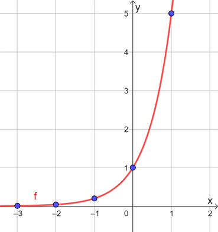
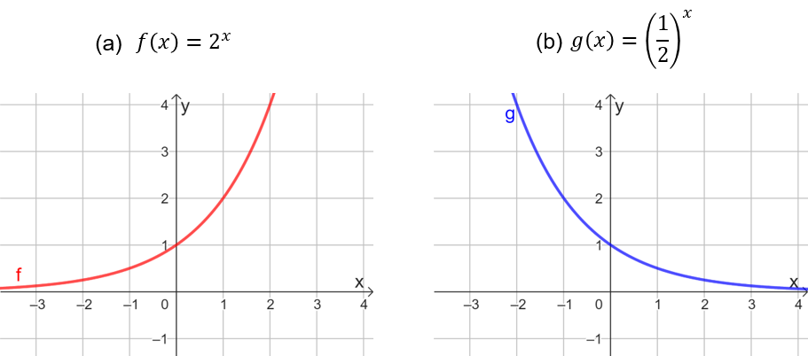
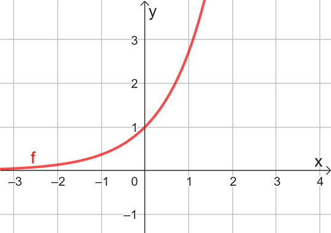

# Aula 2 — Função Exponencial

## Ponto de Partida

Desejamos a você boas-vindas! Nesta aula vamos investigar as características da função exponencial, tomando como referência o estudo das potências e suas propriedades, visto que essa é a base do estudo de funções dessa natureza. Analisaremos, além da definição, o comportamento gráfico dessas funções e as equações exponenciais.

Muitas são as aplicações das funções exponenciais em problemas reais, sendo uma das mais conhecidas o estudo da meia-vida de uma substância. Por exemplo, quando precisamos fazer um tratamento para a saúde com um medicamento, as dosagens e os intervalos de tempo para o consumo são calculados em função do volume corporal e sanguíneo do paciente, bem como do metabolismo e da velocidade de excreção dessa substância pelo corpo. Esse tipo de modelo também pode ser empregado em outras circunstâncias, como no estudo de fósseis, decaimento radioativo, entre outros.

A meia-vida de uma substância corresponde ao tempo necessário para que a quantidade dessa substância seja reduzida à metade da quantidade no instante anterior. Assim, se o tempo de meia-vida de um medicamento é de 8 horas, por exemplo, a cada 8 horas a quantidade de medicamento no corpo do paciente é reduzida à metade.

> Suponha que um paciente ingeriu um medicamento, em dose única, por meio de um comprimido cuja concentração é de 1 g. Se a meia-vida desse medicamento é de 8 horas, e sabendo que esse comprimido é a única fonte desse medicamento no organismo do paciente, em quanto tempo a quantidade desse medicamento no corpo do paciente será de 0,015625 g, ou 15,625 mg?

Prossiga em seus estudos e confira conceitos que podem auxiliá-lo na solução dessa situação.

---

## Vamos Começar!

Com base no estudo das potências, podemos investigar o conceito de função exponencial. Para isso, precisamos relembrar que função corresponde a uma relação especial definida entre conjuntos, geralmente estabelecida por meio de uma regra, de modo que cada elemento do domínio esteja associado de forma única a um elemento do contradomínio. Dessa forma, vejamos a seguir as características de uma função exponencial.

### Função exponencial

A **função exponencial** de base 𝑎 é definida por $f(x) = a^x$, sendo $a > 0$, $a \ne 1$ e 𝑥 um número real qualquer. Nesse sentido, podemos estruturar essa função da seguinte forma:

$$f: \mathbb{R} \to \mathbb{R}$$

$$x \mapsto a^x, \quad a > 0 \text{ e } a \ne 1$$

> **Observação:** devemos exigir $a > 0$ para garantir que a função esteja definida para todo $x \in \mathbb{R}$, pois lembre-se de que, por exemplo, se $x = \dfrac{1}{2}$ então $a^{\frac{1}{2}} = \sqrt{a}$, o qual não está definido para 𝑎 negativo. Além disso, devemos ter 𝑎 diferente de 1 porque, caso contrário, teríamos a função constante $f(x) = 1^x$.

Note que 𝑥 pode ser tanto racional quanto irracional, então são válidos todos os procedimentos envolvendo potências de expoente natural, inteiro, racional, além das aproximações obtidas pela calculadora científica para os expoentes irracionais.

Considere, por exemplo, a função $f: \mathbb{R} \to \mathbb{R}$ definida por $f(x) = 5^x$. Podemos calcular as imagens para os elementos do domínio de 𝑓 por meio de sua lei de formação. Note que:

$$f(1) = 5^1 = 5$$

$$f(1{,}5) = 5^{1{,}5} \approx 11{,}18$$

$$f(-3) = 5^{-3} = \dfrac{1}{5^3} = \dfrac{1}{125}$$

$$f(\sqrt{3}) = 5^{\sqrt{3}} \approx 16{,}24$$

Assim, podemos calcular imagens para qualquer elemento do domínio, sendo ele um número racional ou irracional.

Vamos agora esboçar o gráfico da função $f(x) = 5^x$. Para isso, podemos construir uma tabela e identificar alguns valores de 𝑥 em conjunto com suas imagens pela função 𝑓. Confira essas informações na Tabela 1.

| 𝑥 | -3 | -2 | -1 | 0 | 1 |
|:--:|:--:|:--:|:--:|:--:|:--:|
| $f(x) = 5^x$ | $5^{-3} = \dfrac{1}{125} = 0{,}008$ | $5^{-2} = \dfrac{1}{25} = 0{,}04$ | $5^{-1} = \dfrac{1}{5} = 0{,}2$ | $5^0 = 1$ | $5^1 = 5$ |

**Tabela 1** | Valores de $f(x) = 5^x$

Dispondo os pontos da Tabela 1 em um plano cartesiano, podemos construir o gráfico, conforme apresentado na Figura 1.

**Figura 1** | Esboço para o gráfico de $f(x) = 5^x$

Esse recurso da tabela pode ser utilizado na construção de gráficos de quaisquer categorias de funções, sendo interessante aliá-lo a um conhecimento prévio a respeito do perfil gráfico das diferentes funções. Vejamos na sequência um estudo mais generalizado acerca do gráfico de uma função exponencial.

Para o gráfico da função exponencial, vamos analisar dois casos. Como a base 𝑎 deve ser positiva e diferente de 1, vamos separar em: $0 < a < 1$ e $a > 1$. Dessa forma, contemplamos todos os valores possíveis para a base 𝑎. Quando $a > 1$, como é o caso de $f(x) = 2^x$, ilustrada na Figura 2(a), note que, à medida que o valor de 𝑥 aumenta, a sua imagem $f(x)$ também aumenta, o que caracteriza a função como crescente. Nesse caso, dizemos que a função tem um **crescimento exponencial**.

**Figura 2** | Gráfico para a função exponencial

Por outro lado, no caso $0 < a < 1$, como em $g(x) = \left(\dfrac{1}{2}\right)^x$, presente na Figura 2(b), perceba que quanto maior o valor de 𝑥, menor será a sua imagem $g(x)$, o que caracteriza essa função como decrescente. Assim, podemos afirmar que essa função possui **decrescimento exponencial**. Para ambas as situações — seja $0 < a < 1$ ou $a > 1$ —, algumas características permanecem:

- O gráfico da função exponencial é contínuo, isto é, um traçado único.
- O domínio é o conjunto ℝ, enquanto o conjunto imagem é dado por $\mathbb{R}_+ = (0, +\infty)$, basta observar que o gráfico se localiza sempre acima do eixo das abscissas.
- A interseção com o eixo 𝑦 ocorre no ponto $(0, 1)$, isto é, quando $y = 1$, porém, não há interseções com o eixo 𝑥.

Vamos investigar as características da função $f: \mathbb{R} \to \mathbb{R}$ definida por $f(x) = \left(\dfrac{1}{3}\right)^x$. Ela corresponde a uma função decrescente, porque sua base é um número entre 0 e 1. Podemos calcular imagens para elementos do domínio, como $f(0) = \left(\dfrac{1}{3}\right)^0 = 1$ e $f(-2) = \left(\dfrac{1}{3}\right)^{-2} = \left(\dfrac{3}{1}\right)^2 = 9$. Também podemos fazer investigações relacionadas, por exemplo, a reconhecer qual elemento do domínio possui como imagem o número 81, o que exige o estudo de uma equação exponencial associada. Para esse caso, queremos determinar 𝑥 para o qual $f(x) = 81$, isto é:

$$\left(\dfrac{1}{3}\right)^x = 81 \Rightarrow (3^{-1})^x = 3^4 \Rightarrow 3^{-x} = 3^4 \Rightarrow -x = 4 \Rightarrow x = -4$$

Portanto, $f(-4) = 81$.

Devido às suas características, muitos estudos envolvendo as funções exponenciais exigirão a resolução de equações exponenciais, por isso é essencial conhecer as estratégias que podem ser empregadas nesses momentos. Vejamos adiante.

---

## Siga em Frente...

### Equações exponenciais

Quando em uma equação a incógnita corresponde ao expoente de uma potência, dizemos que essa é uma **equação exponencial**. Por exemplo, $2^x = 16$ corresponde a uma equação exponencial porque nela consta uma igualdade entre duas expressões e a incógnita, 𝑥, corresponde ao expoente da potência de base 2.

Para resolver uma equação exponencial, o procedimento que empregamos é a tentativa de representação dos dois membros da equação por meio de uma potência de mesma base. Isso se deve pela propriedade de que se $a > 0$ e $a \ne 1$, então $a^m = a^n$ implica $m = n$. Por exemplo, no caso da equação $2^x = 16$, sabemos que 16 pode ser escrito como $2^4$, então se $2^x = 2^4$ podemos concluir que $x = 4$.

Vejamos outros exemplos na Tabela 2 a seguir que destacam procedimentos para a solução de equações exponenciais por meio da aplicação da propriedade apresentada.

**Exemplo 1:** $3^x = 1$

Como $3^0 = 1$, então $3^x = 3^0$ e, assim, $x = 0$.

**Exemplo 2:** $5^{x-1} = 125$

Temos que $125 = 5^3$, sendo assim, $5^{x-1} = 5^3$, o que implica $x - 1 = 3$ e, portanto, $x = 4$.

**Exemplo 3:** $(0{,}5)^x = \sqrt[3]{4}$

Note que $0{,}5 = \dfrac{1}{2} = 2^{-1}$ e que $4 = 2^2$. Assim:

$$(2^{-1})^x = \sqrt[3]{2^2} \Rightarrow 2^{-x} = 2^{\frac{2}{3}} \Rightarrow -x = \dfrac{2}{3} \Rightarrow x = -\dfrac{2}{3}$$

**Exemplo 4:** $2^{x+1} + 2^{x-1} = 5$

Note inicialmente que essa equação pode ser reescrita como $2^x \cdot 2^1 + 2^x \cdot 2^{-1} = 5$. Adotando $y = 2^x$ obtemos:

$$y \cdot 2^1 + y \cdot 2^{-1} = 5 \Rightarrow y \cdot 2 + y \cdot \dfrac{1}{2} = 5$$

$$\Rightarrow \dfrac{5}{2}y = 5 \Rightarrow y = 2$$

E se $y = 2^x$, segue que $2 = 2^x$, ou $2^1 = 2^x$, assim, $x = 1$.

**Tabela 2** | Resolvendo equações exponenciais

Em todos os exemplos apresentados na Tabela 2, apesar das equações apresentarem padrões diferentes, o objetivo sempre foi a busca pela representação de cada membro da igualdade como uma potência de mesma base, ou a mudança de variáveis para que, ao final, fosse possível comparar potências de mesma base.

As equações exponenciais podem estar presentes durante o estudo de uma função exponencial. Por exemplo, considere a função $f: \mathbb{R} \to \mathbb{R}$ definida por $f(x) = \left(\dfrac{1}{4}\right)^x$. Observe que podemos escrever a lei de formação dessa função na forma $f(x) = 4^{-x}$, ou ainda $f(x) = (0{,}25)^x$. Essas representações são possíveis a partir das diferentes representações para os números e das definições e propriedades de potências. Queremos determinar o valor do domínio 𝑥 para o qual $f(x) = 256$, assim, o objetivo é a resolução da equação exponencial $\left(\dfrac{1}{4}\right)^x = 256$. A fatoração pode ser utilizada nesse caso, com o intuito de identificar potências cujo resultado é 256. Vejamos que $256 = 4 \cdot 4 \cdot 4 \cdot 4 = 4^4$. Como $\left(\dfrac{1}{4}\right)^x = 256 = 4^4$, então $4^{-x} = 4^4$, logo, $-x = 4$ ou $x = -4$. Portanto, $f(-4) = 256$.

A seguir, vejamos um estudo da função exponencial tomando como base o número 𝑒, bastante empregado em problemas das ciências naturais.

### Função exponencial de base 𝒆

O número 𝑒, chamado de **número de Euler**, corresponde a um número irracional cujo valor aproximado com cinco casas decimais é 2,71828. Geralmente as calculadoras científicas trazem um botão com a função $e^x$, relacionada a esse número, que, no entanto, pode ser definido por meio de um conceito conhecido como limite, por meio da expressão:

$$e = \lim_{n \to \infty} \left(1 + \dfrac{1}{n}\right)^n$$

A partir do número 𝑒, podemos construir a função exponencial de base 𝑒 dada por $f(x) = e^x$. Sendo $e > 1$, podemos concluir que essa função é crescente, intersecta o eixo 𝑦 em $y = 1$ e não tem interseção com o eixo 𝑥. Veja na Figura 3.

**Figura 3** | Gráfico da função exponencial de base 𝑒

Em alguns contextos, a função exponencial de base 𝑒 também é apresentada como $f(x) = \exp(x)$. Pelas suas propriedades, a função exponencial de base 𝑒 é bastante empregada na construção de modelos matemáticos, facilitando inclusive o emprego de procedimentos algébricos e numéricos.

Assim, de posse das propriedades das funções exponenciais, podemos estudar diversos fenômenos, desde que eles apresentem características que se assemelham às da função exponencial, seja ela crescente ou decrescente.

---

## Vamos Exercitar?

Retornando ao problema do medicamento, temos que o tempo de meia-vida da substância é de 8 horas. Além disso, sua concentração inicial é de 1 g. Veja na Tabela 3 uma análise sobre a evolução da quantidade dessa substância no corpo do paciente após períodos de 8 horas, ou seja, após períodos de meia-vida.

| 𝑥 | 0 | 1 | 2 | 3 |
|:--:|:--:|:--:|:--:|:--:|
| **Quantidade da substância (𝑞)** | 1 | $\dfrac{1}{2}$ | $\left(\dfrac{1}{2}\right)^2 = \dfrac{1}{4}$ | $\left(\dfrac{1}{2}\right)^3 = \dfrac{1}{8}$ |

**Tabela 3** | Evolução da quantidade de medicamento no corpo do paciente

Podemos expressar a quantidade de substância (𝑞) em função da quantidade de períodos de meia-vida (𝑥) a partir da função exponencial:

$$q(x) = \left(\dfrac{1}{2}\right)^x$$

A função 𝑞 tem base $0 < \dfrac{1}{2} < 1$, logo, corresponde a uma função decrescente. Queremos determinar 𝑥 para o qual $q(x) = 0{,}015625$, isto é:

$$0{,}015625 = \left(\dfrac{1}{2}\right)^x \Rightarrow \dfrac{1}{64} = \left(\dfrac{1}{2}\right)^x \Rightarrow \dfrac{1}{2^6} = \left(\dfrac{1}{2}\right)^x \Rightarrow \left(\dfrac{1}{2}\right)^6 = \left(\dfrac{1}{2}\right)^x \Rightarrow x = 6$$

Assim, após 6 períodos de meia-vida a quantidade dessa substância será 0,015625 g. Como 6 períodos de 8 horas correspondem a 48 horas, então após dois dias a quantidade de medicamento no organismo do paciente será de 0,015625 g.
