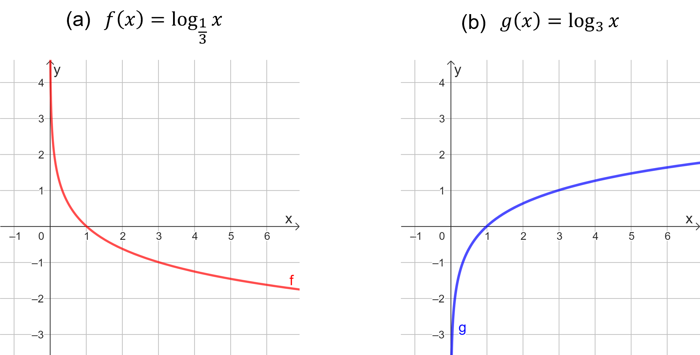
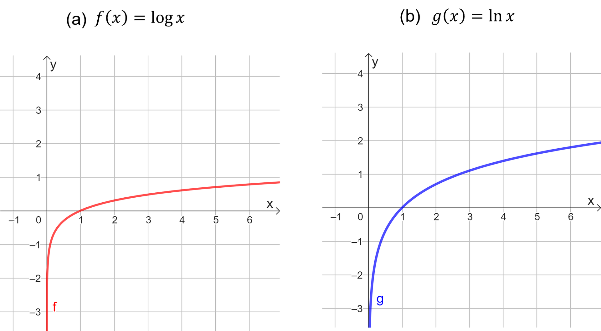
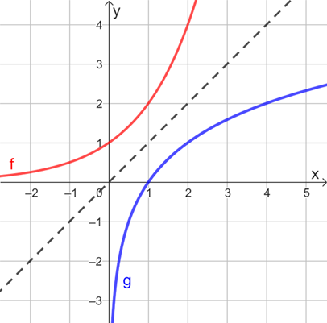

## Ponto de Partida

Estudante, desejamos boas-vindas a você! Nesta aula vamos explorar as propriedades das funções logarítmicas, bem como sua relação com as funções exponenciais, além de conhecer propriedades para a resolução de equações logarítmicas.

É importante ressaltar que, assim como existem critérios para definir um logaritmo, também precisamos considerá-los no momento de definir uma função logarítmica. Ainda, as propriedades dos logaritmos também estão presentes nessa categoria de função.

Para complementar os estudos acerca da temática apresentada, vamos analisar o seguinte problema.

> O decaimento radioativo da substância césio-137 é dado, ao longo do tempo dado em anos, pela função:
>
> 𝑄⁡(𝑡) =𝑄0 ⋅𝑒−0,023105⁢𝑡
>
> em que 𝑄0 representa a massa inicial e 𝑄⁡(𝑡), a massa no instante 𝑡. De posse dessas informações, qual o tempo mínimo necessário para que a quantidade de césio-137 seja reduzida à metade da quantidade inicial?

Prossiga em seus estudos e conheça as propriedades da função logarítmica e sua relação com a função exponencial.

---

## Vamos Começar!

Uma função é definida a partir de uma relação especial entre dois conjuntos, sendo geralmente representada pela sua lei de formação, e em muitos casos apresentados em sua forma gráfica. Diante dessa definição, vejamos a seguir quais são as especificidades da função logarítmica.

### Função logarítmica

Uma função logarítmica de base 𝑎 consiste em uma função 𝑓 :ℝ*+ →ℝ definida por

𝑓⁡(𝑥) =log𝑎⁡𝑥

com 𝑎 >0 e 𝑎 ≠1. Sabemos que o logaritmando precisa ser um número positivo, por isso devemos restringir o domínio da função a ℝ*+, ou seja, ao conjunto formado pelos números reais positivos. Note que as restrições para a definição de logaritmo devem estar presentes na definição da função logarítmica.

Por exemplo, 𝑓 :ℝ*+ →ℝ definida por 𝑓⁡(𝑥) =log2⁡𝑥 é uma função logarítmica construída a partir da base 2. Nesse caso,

- 𝑓⁡(2) =1, porque log2⁡2 =1.
- 𝑓⁡(4) =2, porque log2⁡4 =2.
- 𝑓⁡(128) =7, porque log2⁡128 =7, visto que 27 =128.

Vamos analisar o comportamento gráfico da função logarítmica. Essa função tem seu gráfico descrito pela chamada curva logarítmica. Além disso, como o domínio é dado apenas pelos números reais 𝑥 positivos, seu gráfico está sempre à direita do eixo 𝑦. E como log𝑎⁡1 =0, há interseção do gráfico da função logarítmica 𝑓⁡(𝑥) =log𝑎⁡𝑥 com o eixo 𝑥 no ponto (1,0).

Para analisar os detalhes do gráfico da função logarítmica, principalmente em relação ao crescimento e decrescimento, sendo 𝑓⁡(𝑥) =log𝑎⁡(𝑥), como 𝑎 >0 e 𝑎 ≠1, podemos fazer um estudo separado em duas categorias: 0 <𝑎 <1 e 𝑎 >1. Para o primeiro caso, como em 𝑓⁡(𝑥) =log(1/3)⁡𝑥, a função será decrescente, assumindo, portanto, um decrescimento logarítmico, conforme Figura 1(a). Por outro lado, quando 𝑎 >1, como em 𝑔⁡(𝑥) =log3⁡𝑥, a função é crescente e, assim, seu comportamento é de crescimento logarítmico, exibido na Figura 1(b).

*Figura 1 | Gráfico para a função logarítmica*

Observe que as funções 𝑓 e 𝑔, da Figura 1, intersectam o eixo 𝑥 no ponto de coordenadas (1,0) e tem seus gráficos definidos apenas para valores positivos de 𝑥. Essas características podem ser observadas para qualquer função logarítmica na forma 𝑓⁡(𝑥) =log𝑎⁡𝑥, desde que 𝑎 >0, 𝑎 ≠1, e com 𝑥 >0 pela definição do domínio.

Assim como definimos logaritmo decimal (base 10) e natural (base 𝑒), também podemos definir as funções correspondentes. Na Figura 2 você poderá observar os gráficos das duas funções, sendo 𝑓⁡(𝑥) =log⁡𝑥 a função construída a partir da base 10 e a função 𝑔⁡(𝑥) =ln⁡𝑥, construída a partir da base 𝑒.

*Figura 2 | Gráficos das funções logarítmicas decimal e natural*

Considerando a Figura 2, observe que tanto 𝑓⁡(𝑥) =log⁡𝑥 quanto 𝑔⁡(𝑥) =ln⁡𝑥 são funções crescentes, visto que suas bases são números maiores do que 1.

Podemos aplicar sobre os logaritmos uma propriedade de mudança de base. Para isso, suponha que precisamos efetuar o cálculo de log𝑎⁡𝑏, com 𝑎 >0, 𝑎 ≠1 e 𝑏 >0. Porém, precisamos modificar a base do logaritmo para 𝑐, com 𝑐 >0 e 𝑐 ≠1. Assim, a mudança de base nos diz que:

> log𝑎⁡𝑏 = log𝑐⁡𝑏 / log𝑐⁡𝑎

Essa propriedade é bastante utilizada principalmente quando precisamos realizar estudos com suporte da calculadora científica, a qual só trabalha nas bases 10 e 𝑒. Por exemplo, utilizando uma calculadora científica, vamos calcular log3⁡12. Para isso, adotando a base 10 e empregando a mudança de base, segue que:

> log3⁡12 = log⁡12 / log⁡3 ≈ 1,079 / 0,477 ≈ 2,262

Esse tipo de propriedade pode ser empregado em conjunto com o estudo das funções logarítmicas, como no caso das imagens de funções, por exemplo.

No tópico a seguir, vamos comparar as funções exponencial e logarítmica, observando as relações que podemos estabelecer entre elas.

### Relações entre função exponencial e logarítmica

As funções exponencial e logarítmica de mesma base podem ser associadas entre si, assim como percebido entre potências e logaritmos. Para isso, vamos analisar o caso das funções 𝑓⁡(𝑥) =2𝑥 e 𝑔⁡(𝑥) =log2⁡𝑥, cujos gráficos são indicados na Figura 3.

*Figura 3 | Gráficos das funções exponencial 𝑓e logarítmica 𝑔*

No gráfico da Figura 3 também foi traçada uma reta, tracejada, que representa a função 𝑝⁡(𝑥) =𝑥. Observe que os gráficos das funções 𝑓 e 𝑔 são simétricos em relação a essa reta. Esse fato é observado em outras comparações, mas desde que as duas funções – exponencial e logarítmica – sejam construídas a partir da mesma base 𝑎, com 𝑎 >0 e 𝑎 ≠1. Dessa forma, pelas características dessas funções, podemos afirmar que elas são inversas uma da outra.

Analisando ainda a Figura 3, além da simetria, podemos identificar que a função 𝑓 possui interseção com o eixo 𝑦, enquanto 𝑔 tem interseção com o eixo 𝑥, além de que ambas as funções são crescentes, porque a base é igual a 2, isto é, um número maior do que 1.

Os comparativos também poderiam ser feitos entre outros pares de funções, como 𝑚⁡(𝑥) =(1/3)𝑥 e 𝑛⁡(𝑥) =log1/3⁡(𝑥), por exemplo, mas desde que as bases sejam iguais. Nesse caso, a única diferença entre as observações é que ambas as funções são decrescentes, porque a base é um número entre 0 e 1.

Pelas relações estabelecidas entre as funções exponenciais e logarítmicas, e de posse de suas propriedades, podemos empregá-las nos mais variados estudos, considerando sua aplicabilidade em contextos de diferentes áreas do conhecimento.

Durante o estudo das funções logarítmicas, podemos nos deparar com equações envolvendo esse tipo de termo, então, adiante, vejamos como resolver esse tipo de equação.

---

## Siga em Frente...

### Resolvendo equações logarítmicas

Uma equação logarítmica corresponde a uma igualdade na qual a incógnita é apresentada no logaritmando ou na base de um logaritmo, ou ainda, em ambos os termos. Por exemplo, log2⁡(𝑥−1) =5 e log𝑥⁡3 =1 são exemplos de equações logarítmicas. Outro exemplo que podemos destacar é log𝑥−2⁡(3⁢𝑥+1) =2, sendo que nesse caso a incógnita 𝑥 está presente tanto na base quanto no logaritmando.

Por exemplo, para equações semelhantes a log2⁡𝑥 =3, basta aplicarmos a definição de logaritmo em sua resolução. Para esse caso,

> log2⁡𝑥=3⇔23 =𝑥 ⇔𝑥 =8

Um procedimento semelhante se aplica quando tivermos uma equação como log𝑥⁡4 =2.

> log𝑥⁡4 =2 ⇔𝑥2 =4 ⇔𝑥 =±√2 ⇔𝑥 =±2

Como 𝑥 representa a base, e não podemos ter base negativa, então a única solução para essa equação é 𝑥 =2. Essa avaliação é essencial para que sejam verificadas as condições de existência do logaritmo.

Os procedimentos anteriores decorrem diretamente da definição de logaritmo. Porém, podemos nos deparar com outras situações. Os logaritmos possuem como uma de suas propriedades a injetividade, isto é, dado log𝑎⁡𝑥, com 𝑎 >0 e 𝑎 ≠1, é válida a seguinte propriedade: log𝑎⁡𝑥 =log𝑎⁡𝑦 equivale a 𝑥 =𝑦. Com isso, podemos construir estratégias que permitam a resolução de alguns tipos de equações logarítmicas.

Por exemplo, para resolver a equação log2⁡(𝑥−2) =log2⁡(3⁢𝑥+5), como ambos os membros estão construídos a partir de logaritmos de mesma base, basta igualarmos os logaritmandos:

> log2⁡(𝑥−2) =log2⁡(3⁢𝑥+5) ⇔𝑥 −2 =3⁢𝑥 +5 ⇔𝑥 −3⁢𝑥 =5 +2
>
> ⇔−2⁢𝑥 =7 ⇔𝑥 =−7/2

Outra possibilidade envolve uma propriedade que associa potências e logaritmos: 𝑎log𝑎⁡𝑥 =𝑥. Como exemplo, vamos resolver log⁡(2⁢𝑥+100) =3. Seguem os procedimentos:

> log⁡(2⁢𝑥+100) =3 ⇔10log⁡(2⁢𝑥+100) =103 ⇔2⁢𝑥 +100 =1000 ⇔2⁢𝑥 =900 ⇔𝑥 =450

Logo, a solução é 𝑥 =450.

Vejamos outro exemplo. Agora, para log2⁡(4⁢𝑥) −log2⁡(12) =5.

> log2⁡(4⁢𝑥) −log2⁡(12) =5 ⇔log2⁡(4⁢𝑥) =5 +log2⁡(12) ⇔2log2⁡4⁢𝑥 =25+log2⁡(12)
>
> ⇔2log2⁡4⁢𝑥 =25⋅2log2⁡(12) ⇔4⁢𝑥 =32 ⋅12 ⇔4⁢𝑥 =384 ⇔𝑥 =384/4 =96

Portanto, a solução é 𝑥 =96.

Podemos ainda empregar o conceito de logaritmo para a resolução de equações exponenciais considerando a propriedade que envolve a igualdade entre logaritmos de mesma base, ou seja, log𝑎⁡𝑥=log𝑎⁡𝑦⇔𝑥=𝑦, para 𝑎 >0 e 𝑎 ≠1. Vejamos o caso da equação exponencial 2𝑥 =3. Utilizando a propriedade citada, se essa igualdade é válida, então também será válido que log𝑎⁡2𝑥 =log𝑎⁡3, com 𝑎 >0 e 𝑎 ≠1. Se fossemos empregar a base 10 e a calculadora científica como suporte, a solução da equação exponencial seria dada por:

> 2𝑥 =3 ⇔log⁡2𝑥 =log⁡3 ⇔𝑥 ⋅log⁡2 =log⁡3

Como log⁡2 e log⁡3 são números, a última equação obtida pode ser classificada como uma equação polinomial de 1º grau. Assim, perceba que o emprego da propriedade dos logaritmos permite a conversão de uma equação exponencial em uma equação de 1º grau, a qual pode ser resolvida isolando a incógnita em um dos membros da equação. Prosseguindo com a resolução, obtemos:

> 𝑥 ⋅log⁡2 =log⁡3 ⇔𝑥 = log⁡3 / log⁡2 ≈ 0,477 / 0,301 ≈ 1,58

Portanto, a solução de 2𝑥 =3 é, aproximadamente, 𝑥 =1,58.

Vejamos um outro exemplo. Para resolver a equação 32⁢𝑥 =8, recorrendo à base 3, teremos:

> 32⁢𝑥 =8 ⇔log3⁡32⁢𝑥 =log3⁡8 ⇔2⁢𝑥 =log3⁡8

Não conseguimos determinar o valor de log3⁡8 utilizando a calculadora científica. Por isso, apliquemos uma mudança de base:

> log3⁡8 = log⁡8 / log⁡3 ≈ 0,903 / 0,477 ≈ 1,89

Substituindo esse resultado em 2⁢𝑥 =log3⁡8 teremos:

> 2⁢𝑥 =1,89 ⇔𝑥 = 1,89 / 2 =0,945

Logo, a solução aproximada para 32⁢𝑥 =8 é 𝑥 =0,945.

Note que cada equação possui suas especificidades, porém, existem muitos padrões que se repetem nas resoluções. Por isso, é importante observar as características de cada equação, identificando as estratégias que podem ser utilizadas em cada caso, sem esquecer que as condições de existência dos logaritmos precisam ser verificadas.

---

## Vamos Exercitar?

Retomando o problema apresentado, o decaimento radioativo do césio-137 é dado, ao longo do tempo 𝑡 dado em anos, pela função exponencial:

> 𝑄⁡(𝑡) =𝑄0 ⋅𝑒−0,023105⁢𝑡

em que 𝑄0 representa a massa inicial e 𝑄⁡(𝑡), a massa no instante 𝑡.

Reescrevendo a função de tal forma a representar 𝑡 em função de 𝑄, obtemos:

> 𝑄/𝑄0 =𝑒−0,023105⁢𝑡 ⇒ln⁡(𝑄/𝑄0) =ln⁡(𝑒−0,023105⁢𝑡)
>
> ⇒−0,023105⁢𝑡 =ln⁡(𝑄/𝑄0) ⇒𝑡 =−ln⁡(𝑄/𝑄0)/0,023105

Logo, temos a função inversa da função original, dada por 𝑡⁡(𝑄) =−ln⁡(𝑄/𝑄0)/0,023105, a qual expressa agora o tempo em função da massa, sendo do tipo logarítmica.

Queremos determinar o tempo mínimo para que a quantidade de césio-137 seja reduzida à metade da quantidade inicial, isto é, determinar 𝑡 para o qual 𝑄 =𝑄0/2, isto é,

> 𝑡⁡(𝑄0/2) =−ln⁡((𝑄0/2)/𝑄0)/0,023105 ⇒𝑡⁡(𝑄0/2) =−ln⁡(1/2)/0,023105 ⇒𝑡⁡(𝑄0/2) ≈30

**Portanto, o tempo mínimo necessário é de 30 anos**, o que conclui a solução do problema.
