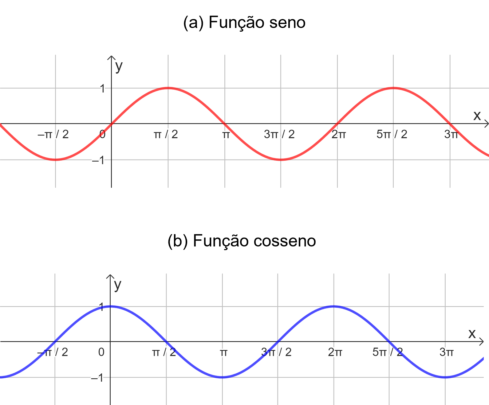
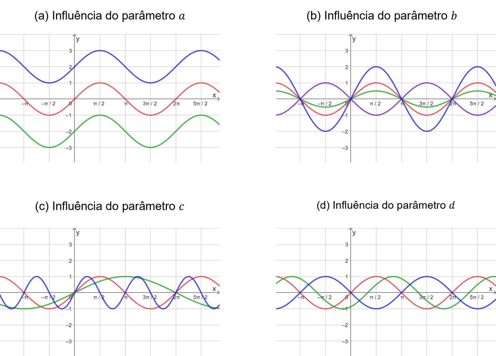
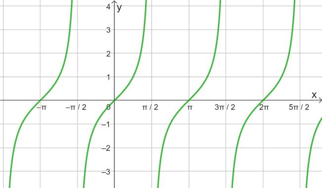
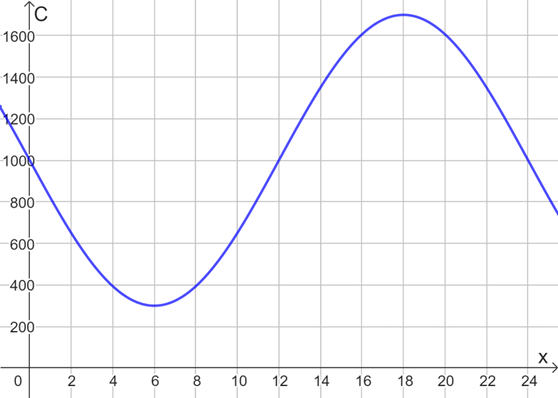

## Ponto de Partida

Nesta aula o objetivo é estudar as funções trigonométricas, tendo em vista a articulação entre o conceito de função, o ciclo ou o círculo trigonométrico e o estudo das razões trigonométricas definidas no triângulo retângulo.

Nesse sentido, daremos início ao estudo do ciclo trigonométrico, a partir do qual podemos estudar as razões trigonométricas seno, cosseno e tangente para qualquer ângulo. É importante ressaltar que nesse momento priorizaremos os ângulos medidos em radianos. De posse desses conhecimentos, concluiremos nosso estudo investigando os comportamentos das funções seno, cosseno e tangente, tendo em vista principalmente a sua aplicação na modelagem de fenômenos periódicos.

> Diante desse tema, vamos refletir a respeito do seguinte problema. Considere que a quantidade de clientes que frequentam diariamente um supermercado, aberto 24 horas por dia, apresenta um comportamento periódico em função do tempo. Fazendo um levantamento da quantidade 𝐶 de clientes no tempo 𝑥, em horas, suponha que foi possível construir o modelo:
>
> 𝐶⁡(𝑥) =1000 −700 ⋅sen⁡(𝜋⋅𝑥/12)
>
> considere que 𝑡 é um inteiro tal que 0 ≤𝑥 ≤24.

Analisando esse modelo, em quais horários a quantidade de clientes assumiu seu valor máximo? E seu valor mínimo? Como podemos solucionar esse problema? Confira a seguir os conceitos essenciais para esse estudo.

---

## Vamos Começar!

As razões trigonométricas seno, cosseno e tangente podem ser estudadas por meio de uma associação com os triângulos retângulos e suas propriedades. No entanto, podemos adequar esse estudo com o objetivo de trabalhar com as medições dos ângulos e das razões utilizando circunferências, bem como construir funções derivadas delas. Para isso, iniciemos com o estudo do ciclo ou da circunferência trigonométrica no tópico a seguir, lembrando da correspondência 𝜋⁢𝑟⁢𝑎⁢𝑑 =180 °, visto que precisaremos trabalhar com os ângulos em radianos.

### Ciclo trigonométrico ou circunferência trigonométrica

Para estudar os valores assumidos por seno, cosseno e tangente de diferentes ângulos, podemos utilizar o ciclo trigonométrico, conhecido também por circunferência trigonométrica. Esse ciclo é construído, no plano cartesiano, a partir de uma circunferência centrada na origem 𝑂⁡(0,0) e de raio com medida igual a uma unidade, conforme a Figura 1. Os eixos coordenados dividem o círculo em quatro quadrantes, sendo o 1º quadrante o que inclui os ângulos no intervalo 0 ° <𝛼 <90 °, o 2º quadrante inclui os ângulos no intervalo 90 ° <𝛼 <180 °, o 3º quadrante inclui os ângulos no intervalo 180 ° <𝛼 <270 ° e o 4º quadrante inclui os ângulos no intervalo 270 ° <𝛼 <360 °, finalizando novamente no ponto 𝐴⁡(1,0), como na Figura 1(b).

*Figura 1 | Ciclo trigonométrico*

Percorremos o ciclo no sentido anti-horário, partindo do eixo 𝑥, mais especificamente do ponto de coordenadas 𝐴⁡(1,0), de acordo com a Figura 1(a), por meio da construção de arcos centrados na origem. Para um arco ̂𝐴⁢𝑂⁢𝐵, como o exemplo ilustrado na Figura 1(a), o valor do seno do ângulo central associado é dado pela distância entre o centro 𝑂 da circunferência e a projeção do ponto 𝐵 sobre o eixo 𝑦 (vertical), enquanto o cosseno é dado pela distância entre 𝑂 e a projeção do ponto 𝐵 sobre o eixo x (horizontal), isto é, os valores de seno são avaliados sobre o eixo y e os de cosseno sobre o eixo x, de modo que em ambos os casos os valores variam de -1 a 1, limitados pela circunferência cujo raio tem medida uma unidade. A tangente é avaliada em uma reta tangente à circunferência, que contém o ponto 𝐴⁡(1,0) e é perpendicular ao eixo 𝑥. Assim, para o ângulo destacado na Figura 1(a), a tangente consiste na distância do ponto 𝐴 até o ponto de interseção entre a reta tangente e a reta que contém os pontos 𝑂 e 𝐵.

No estudo do ciclo trigonométrico, podemos destacar alguns ângulos, chamados ângulos notáveis: 𝜋/6, 𝜋/4 e 𝜋/3 radianos. Além deles, podemos definir os ângulos correspondentes a 0, 𝜋/2, 𝜋, 3𝜋/2 e 2𝜋 radianos. Podemos ainda identificar os simétricos a eles em relação aos eixos 𝑥 e 𝑦, conforme ângulos destacados na Figura 1(b), o que permite comparar os valores de seno, cosseno e tangente dos simétricos por meio da identificação dos sinais associados a cada quadrante. Veja na Tabela 1 os valores de seno, cosseno e tangente para os ângulos citados.

| Ângulos | 0° ou 0 rad | 30° ou 𝝅/6 rad | 45° ou 𝝅/4 rad | 60° ou 𝝅/3 rad | 90° ou 𝝅/2 rad | 180° ou 𝝅 rad | 270° ou 3𝝅/2 rad | 360° ou 2𝝅 rad |
|---|---|---|---|---|---|---|---|---|
| Seno | 0 | 1/2 | √2/2 | √3/2 | 1 | 0 | −1 | 0 |
| Cosseno | 1 | √3/2 | √2/2 | 1/2 | 0 | −1 | 0 | 1 |
| Tangente | 1 | √3/3 | 1 | √3 | ∄ | 0 | ∄ | 0 |

*Tabela 1 | Valores das razões trigonométricas para ângulos notáveis. Fonte: Gomes (2018, p. 466).*

Veja que 𝑡⁢𝑔⁡(90°) e 𝑡⁢𝑔⁡(270°) não estão definidas (∄). Basta lembrar que 𝑡⁢𝑔⁡(𝛼) = 𝑠⁢𝑒⁢𝑛⁡(𝛼) / cos⁡(𝛼) e que, para os dois ângulos citados, o cosseno é nulo, o que impossibilita efetuar a divisão por zero para cálculo da tangente.

Com base nas razões apresentadas, e a estrutura do ciclo trigonométrico, podemos construir as funções seno, cosseno e tangente, cujos detalhes serão apresentados no que segue.

---

## Siga em Frente...

### Funções trigonométricas

A função 𝑓 :ℝ →ℝ chamada de função seno é dada por 𝑓⁡(𝑥) =sen⁡(𝑥). Seu gráfico é descrito por uma curva do tipo senoide e é dada conforme a Figura 2(a). A função seno é periódica de período 2⁢𝜋, basta observar que o comportamento de seu gráfico se repete a cada intervalo de comprimento 2⁢𝜋. Além disso, a função tem sua imagem limitada e descrita pelo intervalo 𝐼⁢𝑚⁡(𝑓) =[−1,1]. Isso se deve ao fato de que os valores de seno no ciclo trigonométrico variam de -1 a 1. O gráfico pode ser analisado com base nos dados da Tabela 1.

*Figura 2 | Gráficos das funções trigonométricas*

Por outro lado, a função cosseno é dada por 𝑔 :ℝ →ℝ em que 𝑔⁡(𝑥) =cos⁡(𝑥), cujo gráfico é dado na Figura 2(b). Essa função é também periódica de período 2⁢𝜋, apresentando também limitação em sua imagem com 𝐼⁢𝑚⁡(𝑔) =[−1,1]. Veja a associação entre o gráfico e os dados da Tabela 1.

As funções seno e cosseno são usualmente aplicadas no estudo de problemas que envolvem periodicidade. No entanto, em muitos casos precisamos fazer modificações no gráfico original para atender às propriedades do problema em estudo. Vejamos a seguir de que forma essas modificações influenciam nas características dessas funções, tomando como referência a função seno, mas sabendo que a cosseno apresenta comportamento semelhante.

Nesse sentido, seja a função original 𝑓⁡(𝑥) =sen⁡(𝑥) e 𝑔⁡(𝑥) =𝑎 +𝑏 ⋅sen⁢(𝑐⋅𝑥+𝑑), sendo domínio e contradomínio reais para ambas. Analisemos o papel de cada um dos parâmetros 𝑎,𝑏,𝑐,𝑑 ∈ℝ e as interferências no gráfico da função quando comparado à função original 𝑓.

- O parâmetro 𝑎 é responsável pelo deslocamento vertical do gráfico da função, de modo que a movimentação é feita para cima quando 𝑎 >0 e para baixo se 𝑎 <0. Veja o exemplo da Figura 3(a), em que o gráfico azul ilustra 𝑔⁡(𝑥) =2 +sen⁡(𝑥) e o verde, 𝑔⁡(𝑥) =−2 +sen⁡(𝑥).
- O parâmetro 𝑏 corresponde à alteração na amplitude do gráfico, podendo “encolher” o gráfico, se |𝑏| >1 ou “esticar” o gráfico se |𝑎| <1. Ainda, se 𝑎 <0, ocorre uma reflexão do gráfico em relação ao eixo 𝑥. Observe a Figura 3(b), em que o gráfico azul ilustra 𝑔⁡(𝑥) =2⁢sen⁡(𝑥), o verde representa 𝑔⁡(𝑥) =1/2⁢𝑠⁢𝑒⁢𝑛⁡(𝑥) e o roxo, 𝑔⁡(𝑥) =−sen⁡(𝑥).
- O parâmetro 𝑐 está associado ao período da função. Para 𝑔⁡(𝑥) =sen⁡(𝑐⁢𝑥) o período é dado por 𝑝 =2⁢𝜋/𝑐. Veja na Figura 3(c) o exemplo da função 𝑔⁡(𝑥) =sen⁡(2⁢𝑥), indicado em azul, e o da função 𝑔⁡(𝑥) =sen⁡(1/2⁢𝑥), descrito em verde.
- O parâmetro 𝑑 corresponde ao deslocamento horizontal da função. A curva é deslocada em 𝑑/𝑐 unidades para a esquerda quando a razão foi positiva, e em 𝑑/𝑐 unidades para a direita quando a razão for negativa. Observe a Figura 3(d), na qual estão indicadas as funções 𝑔⁡(𝑥) =sen⁢(𝑥+𝜋) em azul e 𝑔⁡(𝑥) =sen⁢(𝑥−𝜋/3) em verde.

*Figura 3 | Comparação entre as funções 𝑓 e 𝑔*

Uma outra função que podemos definir é a tangente. A função tangente é definida por ℎ :𝐷 →ℝ, tal que ℎ⁡(𝑥) =𝑡⁢𝑔⁡(𝑥), em que o domínio é dado pelo conjunto 𝐷 ={𝑥∈ℝ;𝑥≠𝜋/2+𝑘⁢𝜋,com⁢𝑘∈ℤ}. Note a necessidade de restrição do domínio, visto que a tangente não está definida para 𝑥 =90 ° =𝜋/2 e para 𝑥 =270 ° =3𝜋/2, bem como os ângulos correspondentes das demais voltas. O gráfico dessa função é apresentado na Figura 4. Comparando os gráficos das funções seno e cosseno com o da tangente percebemos várias diferenças, porém, os três representam funções periódicas, mas sendo a tangente de período 𝜋.

*Figura 4 | Gráfico da função trigonométrica tangente*

A aplicabilidade das funções trigonométricas seno, cosseno e tangente está vinculada a problemas que manifestam algum tipo de periodicidade, como é o caso das marés, cargas estruturais e superfícies em obras arquitetônicas, pressão sanguínea, a música e as ondas sonoras, entre outros.

Conhecendo as características básicas das funções trigonométricas, poderemos construir modelos a partir delas com o intuito de representar fenômenos reais e, por meio de sua interpretação, obter as soluções adequadas aos problemas reais associados.

---

## Vamos Exercitar?

Retornemos o problema do supermercado 24 horas. O modelo que foi construído para representar a quantidade de clientes em função do tempo é 𝐶⁡(𝑥) =1000 −700 ⋅sen⁡(𝜋⋅𝑥/12).

Queremos estudar os valores máximo e mínimo dessa função, para isso, precisamos investigar as características da função seno. Avaliando 𝑓⁡(𝑥) =sen⁡(𝑥), sabemos que ela tem seus valores variando no intervalo [−1,1], então -1 é o valor mínimo e 1 é o valor máximo da função. Sendo assim, 𝑓 admite o valor máximo 1 quando 𝑥 =90 ° =𝜋/2 rad ou qualquer ângulo das demais voltas que, no ciclo trigonométrico, coincidam com esse ângulo. Logo, o valor 1 é atingido para qualquer ângulo na forma 𝜋/2 +2⁢𝜋 ⋅𝑘, com 𝑘 ∈ℤ. Por outro lado, o valor mínimo -1 é atingido para 𝑥 =270 ° =3𝜋/2 rad, ou em qualquer ângulo das demais voltas que coincidam com esse ponto. Logo, o valor -1 é atingido para 3𝜋/2 +2⁢𝜋 ⋅𝑛, com 𝑛 ∈ℤ.

Considerando o valor máximo do seno, e tomando a função 𝐶, então podemos afirmar que o valor máximo de 𝐶 será atingido quando sen⁡(𝜋⋅𝑥/12) =−1 porque, nesse caso, teremos 𝐶⁡(𝑥) =1000 −700 ⋅(−1) =1000 +700 =1700. Assim, devemos ter:

> 𝜋⋅𝑥/12 =3𝜋/2 +2⁢𝜋 ⋅𝑛 ⇒𝑥/12 =3/2 +2⁢𝑛 ⇒𝑥 =18 +24⁢𝑛

Como 𝑥 varia de 0 até 24, então admitindo 𝑛 =0 teremos que a maior quantidade de clientes é verificada às 18:00. De modo análogo, o menor valor de 𝐶 será atingido quando sen⁡(𝜋⋅𝑥/12) =1, pois teremos 𝐶⁡(𝑥) =1000 −700 ⋅1 =1000 −700 =300. Dessa forma,

> 𝜋⋅𝑥/12 =𝜋/2 +2⁢𝜋 ⋅𝑘 ⇒𝑥/12 =1/2 +2⁢𝑘 ⇒𝑥 =6 +24⁢𝑘

Como 𝑥 varia de 0 até 24, então admitindo 𝑘 =0 teremos que a menor quantidade de clientes é verificada às 6:00. Observe na Figura 5 o gráfico para essa função, confirmando essas análises.

*Figura 5 | Gráfico para a função 𝐶⁡(𝑥) =1000 −700 ⋅sen⁡(𝜋⋅𝑥/12)*

**Com isso, concluímos a resolução desse problema, identificando que a quantidade máxima de clientes é 1700 e a mínima 300**, sendo a variação no número de clientes dada por 1700 −300 =1400.
