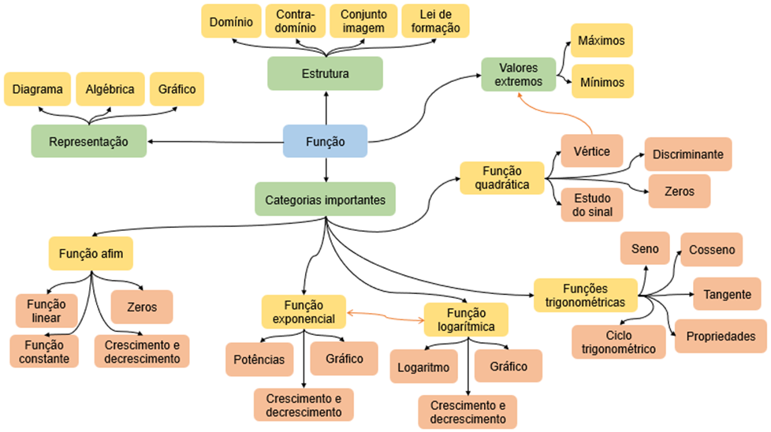

## Ponto de Chegada

A competência desta unidade consiste em compreender os principais aspectos relacionados a funções para resolver problemas em diferentes contextos. Para desenvolver essa competência você precisa, inicialmente, conhecer o conceito de função, o qual é a base para o estudo de qualquer categoria de função. É importante destacar que uma função precisa de três elementos para ser bem definida: domínio, contradomínio e lei de formação.

Em seguida, você deve compreender as características dos diferentes tipos de funções, reconhecendo-as e diferenciando-as entre si. Em relação às polinomiais, você deve compreender as características da função afim, cuja lei de formação assume o formato 𝑓⁡(𝑥) =𝑎⁢𝑥 +𝑏 com 𝑎 e 𝑏 números reais, e da função quadrática, com lei de formação 𝑓⁡(𝑥) =𝑎⁢𝑥2 +𝑏⁢𝑥 +𝑐 sendo 𝑎, 𝑏 e 𝑐 números reais com 𝑎 diferente de zero. Para ambas as funções podemos estudar imagem, zeros, no entanto, enquanto a função afim tem uma característica linear, a função quadrática é descrita por uma parábola, podendo admitir um valor máximo ou mínimo.

Outras categorias importantes de funções são as exponenciais e logarítmicas, as quais estão relacionadas, respectivamente, às potências e aos logaritmos. Essas funções estão intimamente ligadas entre si, sendo inclusive inversas uma da outra, visto a relação existente entre as potências e os logaritmos por meio, entre outros, da própria definição de logaritmos. As funções exponenciais são relacionadas a fenômenos com crescimento ou decrescimentos rápidos, em comparação com as funções afim, enquanto na função logarítmica percebemos uma certa estabilidade a partir de certo ponto.

Por fim, com base nas razões trigonométricas, investigadas inicialmente a partir do triângulo retângulo, podemos definir as funções trigonométricas, com destaque para as funções seno, cosseno e tangente. Essas funções são do tipo periódicas, o que demonstra sua aplicabilidade em fenômenos que possuem essa natureza, como é o caso dos batimentos cardíacos, por exemplo. Nesse caso, é importante retomar a relação entre as medidas graus e radianos, tendo em vista a prevalência no uso dos radianos.

Nesse sentido, para desenvolver a competência, é importante que você estude os conceitos associados a cada categoria de função, refletindo sobre eles e reconhecendo os tipos de problemas que podem ser estudados com base nessas funções.

> **Reflita**
> - Como é definida uma função?
> - Quais são os principais tipos de funções e quais suas principais características?
> - Em quais tipos de problemas podemos aplicar cada tipo de função?

---

## É Hora de Praticar!

Estudante, tendo em vista a importância das funções para o estudo de diversos problemas reais, uma questão bastante importante consiste em avaliar diferentes fenômenos tendo em vista o reconhecimento da categoria de função mais adequada para sua representação. Nesse sentido, considere as situações descritas a seguir:

- **(a)** Durante uma partida de futebol, o goleiro chuta uma bola para enviá-la a um colega de equipe que está do outro lado do campo, de modo que a bola atinge um trajeto no formato parabólico. Qual foi a altura máxima atingida por essa bola durante esse trajeto?
- **(b)** Uma torneira foi aberta para esvaziar um reservatório, de modo que a vazão da água por essa torneira é constante. Qual o tempo necessário para esvaziar completamente esse reservatório, sabendo que a água está sendo retirada dele apenas por essa torneira?
- **(c)** A variação das marés em uma praia ao longo do dia ocorre periodicamente, de modo que a maré alta é de 3 metros, ocorrendo às 5h e às 11h, enquanto a maré baixa é de 1 metro e acontece às 14h e às 20h. Em quais instantes a maré atinge 2 metros?
- **(d)** Em uma cultura, a população de bactérias dobra a cada hora. Partindo de uma quantidade inicial de indivíduos, em quanto tempo a população de bactérias será oito vezes maior do que a quantidade inicial?

Para cada situação, faça um estudo acerca do tipo de função mais adequada para sua representação, evidenciando as características das funções que possibilitam esse tipo de associação.

> **Reflita**
> De que forma as propriedades da função escolhida contribuem para investigar o fenômeno apresentado?

### Resolução do Estudo de Caso

Vamos fazer uma análise de cada situação apresentada, tendo em vista a categoria de função mais adequada para cada uma delas.

No contexto (a), envolvendo a partida de futebol, como o trajeto seguido pela bola é parabólico, então a função mais adequada é a quadrática, cujo gráfico tem o formato de uma parábola. Assim, pode ser construída, por exemplo, uma função 𝑓⁡(𝑥) que expressa a altura da bola em função do tempo ou da distância do ponto inicial. O valor máximo pode ser associado ao vértice da função, considerando que a função do modelo deve ter seu coeficiente 𝑎 <0, isto é, com concavidade voltada para baixo.

Em relação à situação (b), como a vazão é constante, podemos construir uma função afim 𝑓⁡(𝑥) que associa o volume de água retirado do reservatório em função do tempo. Assim, é um fenômeno com característica linear e, por isso, pode ser associado a uma função polinomial de 1º grau.

Com relação à situação (c), a variação das marés em uma praia, sendo um fenômeno periódico, a função mais adequada é a trigonométrica, principalmente as do tipo seno e cosseno. Assim, para esse tipo de fenômeno, pode ser construída uma função do tipo 𝑓⁡(𝑥) =𝑎 +𝑏⁢sen⁢(𝑐⁢𝑥+𝑑) ou 𝑓⁡(𝑥) =𝑎 +𝑏⁢cos⁡(𝑐⁢𝑥+𝑑), com o ajuste dos parâmetros 𝑎, 𝑏, 𝑐 e 𝑑 conforme as propriedades do fenômeno.

Por fim, para o problema da população de bactérias do item (d), por se tratar de um fenômeno em que a quantidade dobra, ou se multiplica, a função mais adequada é a exponencial, visto que em problemas populacionais, em geral, tem crescimento exponencial. Assim, uma função na forma 𝑓⁡(𝑥) =𝑎 ⋅𝑏𝑐⁢𝑥 pode ser ajustada para a representação e solução do problema em questão.

---

### Assimile

O conceito de função permeia diversos estudos feitos no campo da Matemática e nas áreas associadas. Assim, para contribuir com os estudos iniciais acerca das funções, estude o mapa mental apresentado no que segue, que engloba os conceitos iniciais sobre funções, bem como as características das principais categorias de funções. Complemente esse mapa incluindo expressões que auxiliam no estudo de cada categoria de função, como a fórmula do discriminante, por exemplo.

*Categorias importantes*

1. **Função**
   - 1.1. Estrutura: Domínio, Contradomínio, Conjunto imagem, Lei de formação
   - 1.2. Representação: Diagrama, Algébrica, Gráfico
   - 1.3. Valores extremos: Máximos, Mínimos
2. **Função quadrática:** Vértice, Estudo do sinal, Discriminante, Zeros
3. **Funções trigonométricas:** Seno, Cosseno, Ciclo trigonométrico, Tangente, Propriedades
4. **Função afim:** Função linear, Zeros, Função constante, Crescimento e decrescimento
5. **Função exponencial:** Potências, Gráfico, Crescimento e decrescimento
6. **Função logarítmica:** Logaritmo, Gráfico, Crescimento e decrescimento

### Referências

AXLER, S. Pré-cálculo: uma preparação para o cálculo com manual de soluções para o estudante. 2. ed. Rio de Janeiro: LTC, 2016.

BONETTO, G. A.; MUROLO, A. C. Fundamentos de matemática para engenharias e tecnologias. São Paulo: Cengage Learning Brasil, 2018.

GOMES, F. M. Pré-cálculo: operações, equações, funções e trigonometria. São Paulo: Cengage Learning Brasil, 2018.

SEIZEN, Y.; SOUZA, S. A. de O. Matemática com aplicações tecnológicas: matemática básica. v. 1. São Paulo: Editora Blucher, 2014.

STEWART, J.; CLEGG, D.; WATSON, S. Cálculo: Volume I. Tradução da 9. Ed. norte-americana. São Paulo: Cengage Learning Brasil, 2021.
