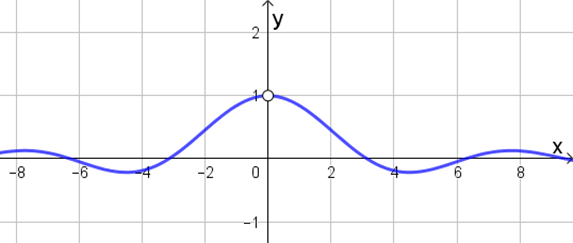
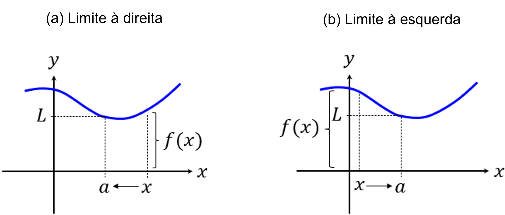
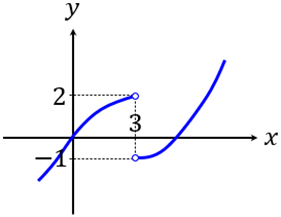
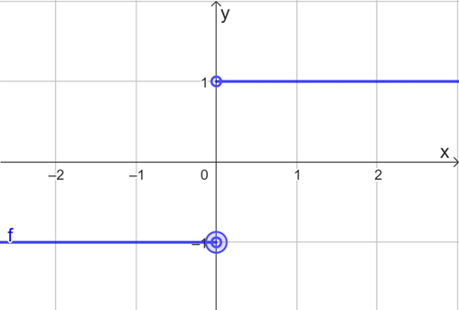
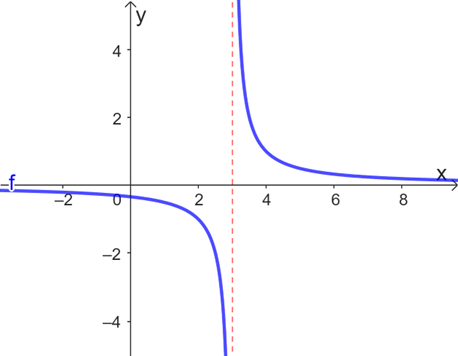

## Ponto de Partida

Desejamos boas-vindas a você, caro estudante! Nesta aula iniciaremos os estudos a respeito do conceito de limite de função, o qual é indispensável para a análise de propriedades das funções, bem como para a definição posterior dos conceitos de derivada e integral.

Quando definimos uma função, podendo estar associada a um modelo matemático para um problema real, por exemplo, podemos investigar suas propriedades por meio das raízes, pontos de interseção com os eixos coordenados, imagens específicas. No entanto, para um estudo mais aprofundado sobre as características de uma função, o conceito mais adequado é o de limite, que permite analisar inclusive o seu comportamento próximo a valores que não fazem parte de seu domínio.

> Em nossos estudos, vamos investigar a definição de limite, bem como a avaliação dos limites laterais e algumas de suas propriedades. Para favorecer a compreensão desse tema, vamos investigar as propriedades da função 𝑓 :ℝ −{3} →ℝ definida por 𝑓⁡(𝑥) =1/(𝑥−3). Construa uma tabela de valores para análise do comportamento de 𝑓 em torno de 𝑥 =3, construindo hipóteses a respeito da existência do limite da função 𝑓 quando 𝑥 tende a 3, tendo em vista também o conceito de limite lateral.

Prossiga em seus estudos e confira os conceitos essenciais para a resolução desses desafios.

---

## Vamos Começar!

O conceito de limite corresponde a um dos principais temas de estudo do campo da Matemática conhecido como Cálculo Diferencial e Integral. Esse conceito é empregado principalmente quando desejamos analisar o comportamento de uma função em valores de seu domínio ou em pontos próximos de pontos desse conjunto.

Para iniciar o estudo dos limites de funções, tendo em vista a definição de função, vamos analisar o comportamento da função 𝑓 :ℝ* →ℝ dada por 𝑓⁡(𝑥) =sen⁡(𝑥)/𝑥, cujo gráfico é ilustrado na Figura 1.

*Figura 1 | Gráfico da função 𝑓⁡(𝑥) =sen⁡(𝑥)/𝑥*

Veja que essa função não está definida em 𝑥 =0, porém, podemos estudar o comportamento da função em pontos próximos de zero, observe os dados presentes na Tabela 1.

| 𝑥 | 𝑓⁡(𝑥) | 𝑥 | 𝑓⁡(𝑥) |
|---|---|---|---|
| -1,0 | 0,8414709 | 1,0 | 0,8414709 |
| -0,1 | 0,9983341 | 0,1 | 0,9983341 |
| -0,01 | 0,9999833 | 0,01 | 0,9999833 |
| -0,001 | 0,9999998 | 0,001 | 0,9999998 |

*Tabela 1 | Comportamento da função 𝑓⁡(𝑥) =sen⁡(𝑥)/𝑥 em torno de zero*

A partir do gráfico da Figura 1 e da Tabela 1 podemos observar que para valores de 𝑥 cada vez mais próximos de zero obtemos imagens 𝑓⁡(𝑥) que estão cada vez mais próximas de 1, o que nos leva, intuitivamente, a afirmar que se 𝑥 aproxima-se de zero então 𝑓⁡(𝑥) aproxima-se suficientemente de 1. O conceito que embasa teoricamente essa análise, é o conceito de limite, como veremos a seguir.

### Limites de funções

Seja uma função real 𝑓. Dizemos que um número real 𝐿 é o limite da função 𝑓 quando 𝑥 tende a um valor 𝑎 sempre que 𝑓⁡(𝑥) for suficientemente próximo de 𝐿 para 𝑥 suficientemente próximo de 𝑎, mas 𝑥 ≠𝑎. Quando isso ocorre, podemos utilizar a notação lim 𝑥→𝑎 ⁡𝑓⁡(𝑥) =𝐿, ou ainda, “𝑓⁡(𝑥) →𝐿 com 𝑥 →𝑎”. Dessa forma, dizemos que o limite de uma função existe, no ponto considerado, quando a função se aproxima cada vez mais de um único número real 𝐿 quando 𝑥 aproxima-se do ponto fixado 𝑎.

Por exemplo, seja a função 𝑓 :ℝ →ℝ definida por 𝑓⁡(𝑥) =3⁢𝑥 −1 e 𝑎 =2. Quando 𝑥 se aproxima de 2, então 3⁢𝑥 se aproxima de 6 e 3⁢𝑥 −1 se aproxima de 5. Sendo assim, lim 𝑥→2 ⁡(3⁢𝑥−1) =5. Nesse caso, 𝑥 =2 faz parte do domínio de 𝑓, mas também podemos avaliar pontos que não pertencem ao domínio da função.

Outra forma de definir o limite de uma função 𝑓 é a seguinte: lim 𝑥→𝑎 ⁡𝑓⁡(𝑥) =𝐿 se, e somente se, para qualquer número 𝜀 >0, for possível identificar 𝛿 >0 suficientemente pequeno de tal forma que se 0 <|𝑥−𝑎| <𝛿 então |𝑓⁡(𝑥)−𝐿| <𝜀. Por exemplo, para a função real definida por 𝑓⁡(𝑥) =4⁢𝑥 −5 e o ponto 𝑥 =2, temos que para cada 𝜀 >0, tomando 𝛿 =𝜀/4 >0, segue que se 0 <|𝑥−2| <𝛿 então |(4⁢𝑥−5)−3| =|4⁢𝑥−8| =4⁢|𝑥−2| <4⁢𝛿 =4 ⋅𝜀/4 =𝜀. Sendo assim, lim 𝑥→2 (4⁢𝑥−5) =3.

Em geral, recorremos à primeira forma para o estudo dos limites de funções. Ainda, usualmente dizemos que tal definição refere-se ao limite bilateral, pois investigamos o comportamento da função em torno do ponto 𝑎, tanto pela direita quanto pela esquerda. Porém, também podemos avaliar o limite lateral.

Nesse contexto, escrevemos lim 𝑥→𝑎+ ⁡𝑓⁡(𝑥) =𝐿 para o caso em que, tomando valores de 𝑥 próximos de 𝑎, mas maiores do que 𝑎, implicar em 𝑓⁡(𝑥) aproximando-se de 𝐿, conforme ilustração presente na Figura 2(a), sendo denominado limite lateral à direita de 𝑎. Por outro lado, a notação lim 𝑥→𝑎− ⁡𝑓⁡(𝑥) =𝐿 representa o caso em que, ao tomar valores de 𝑥 próximos de 𝑎, e menores que 𝑎, tivermos 𝑓⁡(𝑥) suficientemente próximo de 𝐿, de acordo com a Figura 2(b), sendo chamado de limite lateral à esquerda de 𝑎.

*Figura 2 | Limites laterais de uma função*

Analise o exemplo da função 𝑓 cujo gráfico é ilustrado na Figura 3. Podemos investigar o limite de 𝑓 em 𝑥 =3, mesmo que a função não esteja definida nesse ponto. Note que para valores 𝑥 <3 temos que lim 𝑥→3− ⁡𝑓⁡(𝑥) =2, enquanto para valores 𝑥 >3 segue que lim 𝑥→3+ ⁡𝑓⁡(𝑥) =−1.

*Figura 3 | Função f e o estudo dos limites laterais*

Para a função 𝑓 da Figura 3 podemos observar que os limites laterais existem, porque são iguais a números reais, mas são diferentes entre si. Por isso, dizemos que o limite de 𝑓 (agora bilateral) em 𝑥 =3 não existe. Assim, nem sempre os limites laterais são iguais, porém, quando a igualdade dos limites laterais ocorre, podemos relacioná-los ao limite bilateral da seguinte forma: lim 𝑥→𝑎 ⁡𝑓⁡(𝑥) =𝐿 se, e somente se, lim 𝑥→𝑎− ⁡𝑓⁡(𝑥) =𝐿 = lim 𝑥→𝑎+ ⁡𝑓⁡(𝑥), isto é, o limite bilateral existe se, e só se, os limites laterais existem e são iguais.

Vamos utilizar os limites laterais para estudar o comportamento da função definida por 𝑓⁡(𝑥) =|𝑥|/𝑥 em 𝑥 =0. Essa função pode ser interpretada da seguinte forma:

> 𝑓⁡(𝑥) ={ −𝑥/𝑥, 𝑠⁢𝑒⁢𝑥<0
> 𝑥/𝑥, 𝑠⁢𝑒⁢𝑥>0
>
> ⇒𝑓⁡(𝑥) ={ −1,𝑠⁢𝑒⁢𝑥<0
> 1,𝑠⁢𝑒⁢𝑥>0

Analisando o gráfico dessa função, conforme ilustrado na Figura 4, podemos identificar que os limites laterais de 𝑓 em torno de zero são:

> lim 𝑥→0− ⁡𝑓⁡(𝑥) =−1 ≠1 = lim 𝑥→0+ ⁡𝑓⁡(𝑥)

Como os limites laterais existem, porém, são diferentes, podemos concluir que o limite de 𝑓 em 𝑥 =0 não existe.

*Figura 4 | Gráfico da função 𝑓⁡(𝑥) =|𝑥|/𝑥*

Uma característica importante dos limites, quando eles existem, é a unicidade. Ou seja, se uma função admite um limite, quando 𝑥 tende a um valor fixado, então esse limite é único. Ainda, quando afirmamos que um limite existe, então temos que o limite da função no ponto em questão é igual a um número real, isto é, assume um valor específico, sendo essa análise válida tanto para limites bilaterais quanto para os laterais.

A seguir vejamos algumas propriedades válidas no cálculo de limites.

---

## Siga em Frente...

### Propriedades dos limites

Dada uma função real 𝑓, e supondo que os limites envolvidos existam, são válidas as propriedades seguintes.

1. Se 𝑏 ∈ℝ então lim 𝑥→𝑎 ⁡(𝑏⁡𝑓⁡(𝑥)) =𝑏⁡(lim 𝑥→𝑎 ⁡𝑓⁡(𝑥)).
2. lim 𝑥→𝑎 ⁡(𝑓⁡(𝑥)±𝑔⁡(𝑥)) = lim 𝑥→𝑎 ⁡𝑓⁡(𝑥) ± lim 𝑥→𝑎 ⁡𝑔⁡(𝑥).
3. lim 𝑥→𝑎 ⁡(𝑓⁡(𝑥)⁢𝑔⁡(𝑥)) =(lim 𝑥→𝑎 ⁡𝑓⁡(𝑥))⁢(lim 𝑥→𝑎 ⁡𝑔⁡(𝑥)).
4. lim 𝑥→𝑎 ⁡(𝑓⁡(𝑥)/𝑔⁡(𝑥)) = (lim 𝑥→𝑎 ⁡𝑓⁡(𝑥)) / (lim 𝑥→𝑎 ⁡𝑔⁡(𝑥)), desde que lim 𝑥→𝑎 ⁡𝑔⁡(𝑥) ≠0.
5. lim 𝑥→𝑎 ⁡(𝑓⁡(𝑥))𝑛=(lim 𝑥→𝑎 ⁡𝑓⁡(𝑥))𝑛, para 𝑛 inteiro positivo.
6. lim 𝑥→𝑎 ⁡𝑛√𝑓⁡(𝑥) =𝑛√lim 𝑥→𝑎 ⁡𝑓⁡(𝑥), para 𝑛 inteiro positivo, e com lim 𝑥→𝑎 ⁡𝑓⁡(𝑥) >0 se 𝑛 for par.
7. Para 𝑘 ∈ℝ, lim 𝑥→𝑎 ⁡𝑘 =𝑘.
8. lim 𝑥→𝑎 ⁡𝑥 =𝑎.

Essas propriedades podem ser aplicadas desde que as funções envolvidas sejam tais que os limites em questão existam, ou seja, resultem em números reais. Nessas condições, elas podem ser empregadas para relacionar os limites conhecidos de funções entre si de modo a obter informações a respeito de outras funções. Além disso, as propriedades apresentadas, apesar de estarem relacionadas aos limites bilaterais, também podem ser reescritas para o estudo dos limites laterais de funções, desde que esses limites existam.

Vejamos alguns exemplos de aplicação das propriedades apresentadas.

**a.** Sejam funções reais 𝑓 e 𝑔 com lim 𝑥→−1 ⁡𝑓⁡(𝑥) =2 e lim 𝑥→−1 ⁡𝑔⁡(𝑥) =−4. Pelas propriedades 1 e 2 temos:

> lim 𝑥→−1 ⁡(𝑓⁡(𝑥)−2⁢𝑔⁡(𝑥)) = lim 𝑥→−1 ⁡𝑓⁡(𝑥) −2⁢lim 𝑥→−1 ⁡𝑔⁡(𝑥) =2 −2⁢(−4) =2 +8 =10

**b.** Vamos calcular lim 𝑥→3 ⁡(𝑥2−3⁢𝑥+1)/(2⁢𝑥+1) empregando as propriedades 1, 2, 4, 7 e 8:

> = ((lim 𝑥→3 ⁡𝑥)2+(−3)⁢lim 𝑥→3 ⁡𝑥+ lim 𝑥→3 ⁡1) / (2⁢(lim 𝑥→3 ⁡𝑥)+ lim 𝑥→3 ⁡1)
>
> = (32+(−3)⋅3+1) / (2⋅3+1) = (9−9+1) / (6+1) = 1/7

Note que podemos efetuar os cálculos conhecendo ou não a lei de formação da função, mas sendo as substituições possíveis porque os limites que são apresentados durante o cálculo existem.

Observando o exemplo (b) anterior, o cálculo do limite de (𝑥2−3⁢𝑥+1)/(2⁢𝑥+1) quando 𝑥 tende a 3 consiste basicamente em calcular o valor da razão para 𝑥 =3. Isso ocorre porque temos uma razão entre polinômios, cujo denominador não tende a zero. Nesse sentido, para uma função polinomial 𝑃⁡(𝑥) qualquer, e para uma constante real 𝑎 qualquer, temos que lim 𝑥→𝑎 ⁡𝑃⁡(𝑥) =𝑃⁡(𝑎). A partir desse resultado, podemos investigar os limites associados, por exemplo, à soma, diferença, produto e quociente de funções polinomiais.

Um outro resultado que contribui para o cálculo de limites é o seguinte.

> **Teorema do Confronto:** se 𝑓⁡(𝑥) ≤𝑔⁡(𝑥) ≤ℎ⁡(𝑥) para 𝑥 suficientemente próximo de 𝑎 (exceto possivelmente no ponto 𝑎) e lim 𝑥→𝑎 ⁡𝑓⁡(𝑥) = lim 𝑥→𝑎 ⁡ℎ⁡(𝑥) =𝐿, então lim 𝑥→𝑎 ⁡𝑔⁡(𝑥) =𝐿.

Vamos empregar o teorema anterior para avaliar o limite de 𝑓⁡(𝑥) =𝑥2⁢sen⁡(1/𝑥) quando 𝑥 =0. Sabemos que −1 ≤sen⁡(𝑥) ≤1, devido à imagem da função seno. Como 𝑥2 ≥0 para todo 𝑥 real, então −𝑥2 ≤𝑥2⁢sen⁡(1/𝑥) ≤𝑥2. Como lim 𝑥→0 ⁡(−𝑥2) = lim 𝑥→0 ⁡𝑥2 =0, podemos concluir, pelo teorema do confronto, que lim 𝑥→0 ⁡(𝑥2⁢sen⁡(1/𝑥)) =0.

Para estudar os limites é importante definir corretamente a função, identificando domínio e contradomínio correspondentes, empregando as definições e as propriedades para que possa estudar o comportamento da função ao longo de seu domínio ou em pontos fora de seu domínio.

---

## Vamos Exercitar?

Vamos analisar o comportamento da função 𝑓 :ℝ −{3} →ℝ definida por 𝑓⁡(𝑥) =1/(𝑥−3) em torno do ponto 𝑥 =3. Sabemos que nesse ponto a função não está definida, então esse estudo é possível por meio da investigação baseada no conceito de limite.

Por meio da Tabela 2 vamos fazer um estudo sobre o comportamento de 𝑓 à esquerda e à direita de 𝑥 =3.

| 𝑥 | 𝑓⁡(𝑥) | 𝑥 | 𝑓⁡(𝑥) |
|---|---|---|---|
| 2,9 | -10 | 3,1 | 10 |
| 2,99 | -100 | 3,01 | 100 |
| 2,999 | -1 000 | 3,001 | 1 000 |
| 2,9999 | -10 000 | 3,0001 | 10 000 |
| 2,99999 | -100 000 | 3,00001 | 100 000 |
| 2,999999 | -1 000 000 | 3,000001 | 1 000 000 |

*Tabela 2 | Comportamento da função 𝑓⁡(𝑥) =1/(𝑥−3) em torno de 𝑥 =3*

Analisando a Tabela 2, podemos construir as hipóteses de que os limites laterais de 𝑓 não existem, visto que avaliando o limite à esquerda, quanto mais próximos de 3 são os valores de 𝑥, menores serão os valores de 𝑓⁡(𝑥), enquanto à direita, quanto mais próximos de 3 são os valores de 𝑥, maiores serão os valores de 𝑓⁡(𝑥). Observe que essa análise está de acordo com o gráfico de 𝑓, retratado na Figura 5.

*Figura 5 | Gráfico para a função 𝑓⁡(𝑥) =1/(𝑥−3)*

**Porém, é importante ressaltar que a análise feita permite apenas a construção de hipóteses**, as quais devem ser validadas somente por meio dos estudos teóricos realizados com base na definição de limite.
