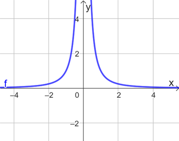
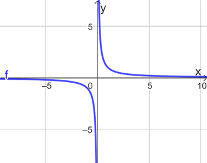
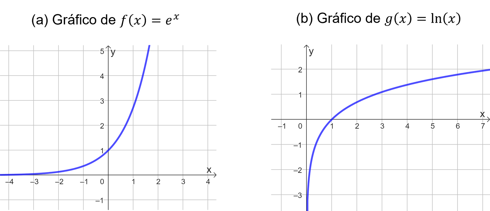

## Ponto de Partida

Estudante, desejamos a você boas-vindas! Nesta aula prosseguiremos no estudo dos limites de funções observando os limites infinitos e no infinito, bem como as estratégias de cálculo de limites.

No estudo dos limites de funções, exploramos situações em que a função assume valores crescentes ou decrescentes à medida que nos aproximamos de um valor fixo no domínio, como na função tangente próxima de 𝑥 =𝜋/2, por exemplo. Também investigamos o comportamento de funções para valores muito grandes ou pequenos, como na análise da corrente elétrica em um circuito ao longo do tempo. Ambos os casos exigem conhecimentos sobre o infinito, que contribui tanto para estudos teóricos quanto para a interpretação de problemas reais modelados matematicamente.

> Para complementar o estudo da temática em questão, sejam as seguintes funções reais:
>
> - 𝑓⁡(𝑥) =3⁢cos⁡(𝑥+𝜋) quando 𝑥 tende a valores muito grandes.
> - 𝑔⁡(𝑥) =tg⁡(𝑥)/𝑥 quando 𝑥 tende a zero.
> - ℎ⁡(𝑥) =(3⁢𝑥4−5)/(2⁢𝑥+3) quando 𝑥 tende a valores muito grandes.
>
> Que conclusões você pode obter a partir do estudo das funções apresentadas, nos pontos ou intervalos associados, tendo em vista o conceito de limite?

Prossiga em seus estudos e confira os conceitos essenciais para solucionar a problemática apresentada.

---

## Vamos Começar!

No estudo do conceito de limite temos por objetivo, entre outras possibilidades, estudar o comportamento de uma função em torno de um ponto, especialmente quando ele não pertence ao domínio da função. Assim, se 𝐿 é o limite de uma função 𝑓, quando 𝑥 tende a um valor 𝑎, então podemos dizer que 𝑓⁡(𝑥) aproxima-se suficientemente de 𝐿 sempre que 𝑥 aproximar-se de 𝑎, com 𝑥 ≠𝑎. Nesse caso, usamos a notação lim 𝑥→𝑎 ⁡𝑓⁡(𝑥) =𝐿. Além de empregar esse estudo ao limite bilateral, também podemos ajustar a definição de modo a aplicá-la aos limites laterais.

Quando calculamos os limites laterais de uma função em um ponto 𝑎 e os limites existem e são iguais, podemos dizer que a 𝑓 tem limite em 𝑎. No entanto, se eles limites laterais forem diferentes ou não existirem, diremos que 𝑓 não tem limite no ponto 𝑎. A não existência de limite pode estar associado, por exemplo, a crescimentos ou decrescimentos indefinidos em torno do ponto, o que está associado aos limites infinitos, que são apresentados a seguir.

### Limites infinitos

Vamos analisar as características da função 𝑓 :ℝ* →ℝ definida por 𝑓⁡(𝑥) =1/𝑥2, presente na Figura 1.

*Figura 1 | Gráfico da função 𝑓⁡(𝑥) =1/𝑥2*

Ao tomar valores de 𝑥 cada vez mais próximos de zero, tanto à esquerda quanto à direita, os valores correspondentes de 𝑓⁡(𝑥) =1/𝑥2 serão cada vez maiores. Podemos observar esse fato com mais detalhes a partir da Tabela 1, quando observamos valores de 𝑥 >0.

| 𝑥 | 𝑓⁡(𝑥) |
|---|---|
| 1 | 1 |
| 0,5 | 4 |
| 0,1 | 100 |
| 0,01 | 10000 |
| 0,001 | 1000000 |

*Tabela 1 | Possíveis valores obtidos a partir da função 𝑓⁡(𝑥) =1/𝑥2*

Tanto pela Tabela 1 quanto pelo gráfico da Figura 1 podemos inferir que, quanto menor o valor assumido por 𝑥, com 𝑥 >0, maior será sua imagem 𝑓⁡(𝑥). Nesse caso, aparentemente os valores de 𝑓 podem tornar-se arbitrariamente grande quando tomamos valores de 𝑥 suficientemente próximos de zero, tanto à esquerda quanto à direita. Logo, quando 𝑥 →0, a função 𝑓 não tende a um número específico, mas cresce indefinidamente, o que podemos representar como lim 𝑥→0+ ⁡𝑓⁡(𝑥) =∞, porque a função assume valores cada vez maiores, tendendo ao infinito. A notação apresentada significa dizer que não existe o limite da função 𝑓 quando 𝑥 tende a zero. Podemos fazer um estudo análogo para 𝑥 <0 e mostrar que lim 𝑥→0− ⁡𝑓⁡(𝑥) =∞ e, sendo assim, lim 𝑥→0 ⁡𝑓⁡(𝑥) =∞.

As notações +∞ e −∞ não representam números, mas noções que indicam que estamos trabalhando com valores muito grandes e pequenos, respectivamente. Nesse sentido, a notação lim 𝑥→𝑎 ⁡𝑓⁡(𝑥) =+∞ ou lim 𝑥→𝑎 ⁡𝑓⁡(𝑥) =∞ indica que o limite da função 𝑓 quando 𝑥 tende ao valor 𝑎 não existe, mas que os valores de 𝑓 tornam-se cada vez maiores quando 𝑥 aproxima-se de 𝑎. Por outro lado, a notação lim 𝑥→𝑎 ⁡𝑓⁡(𝑥) =−∞ indica que o limite da função 𝑓 quando 𝑥 tende ao valor 𝑎 não existe, e que os valores de 𝑓 tornam-se cada vez menores quando 𝑥 aproxima-se de a. Entenda por “menores” os números negativos com maiores valores absolutos.

Nesse contexto, por definição, para uma função 𝑓 definida em ambos os lados de um valor 𝑎, exceto possivelmente no ponto 𝑎, dizemos que lim 𝑥→𝑎 ⁡𝑓⁡(𝑥) =∞ se for possível tornar os valores de 𝑓 tão grandes quanto quisermos tomando 𝑥 suficientemente próximo de 𝑎, mas diferente dele, enquanto lim 𝑥→𝑎 ⁡𝑓⁡(𝑥) =−∞ indica que podemos tornar os valores de 𝑓 tão pequenos quanto quisermos tomando 𝑥 suficientemente próximo de 𝑎, e diferente dele. Em ambos os casos estamos lidando com os chamados limites infinitos.

Apesar da definição anterior ser apesentada com limites bilaterais, podemos adaptá-la de modo a envolver os limites laterais, ocasionando em uma das seguintes situações: lim 𝑥→𝑎− ⁡𝑓⁡(𝑥) =∞, lim 𝑥→𝑎− ⁡𝑓⁡(𝑥) =−∞, lim 𝑥→𝑎+ ⁡𝑓⁡(𝑥) =∞ ou lim 𝑥→𝑎+ ⁡𝑓⁡(𝑥) =−∞.

Seja a função 𝑓 :ℝ* →ℝ dada por 𝑓⁡(𝑥) =1/𝑥, cujo gráfico é indicado na Figura 2.

*Figura 2 | Gráfico da função 𝑓⁡(𝑥) =1/𝑥*

Analisando o comportamento de 𝑓 em torno de 𝑥 =0 podemos observar que lim 𝑥→0− ⁡𝑓⁡(𝑥) =−∞ e lim 𝑥→0+ ⁡𝑓⁡(𝑥) =+∞. Assim, em torno de zero a função tende a infinito. Considerando valores de 𝑥 >0, note que ao tomar valores de 𝑥 tendendo a zero, conforme o gráfico da Figura 2, a função está cada vez mais próxima da reta 𝑥 =0 (eixo y), apesar de nunca a interceptar. O mesmo ocorre para valores 𝑥 <0. Por essa propriedade, temos que a reta 𝑥 =0 pode ser caracterizada como uma assíntota vertical do gráfico da 𝑓.

Dizemos que a reta 𝑥 =𝑎 é denominada assíntota vertical da curva 𝑦 =𝑓⁡(𝑥) se uma das seguintes condições for verificada: lim 𝑥→𝑎 ⁡𝑓⁡(𝑥) =∞, lim 𝑥→𝑎 ⁡𝑓⁡(𝑥) =−∞, lim 𝑥→𝑎− ⁡𝑓⁡(𝑥) =∞, lim 𝑥→𝑎− ⁡𝑓⁡(𝑥) =−∞, lim 𝑥→𝑎+ ⁡𝑓⁡(𝑥) =∞ ou lim 𝑥→𝑎+ ⁡𝑓⁡(𝑥) =−∞. Quando uma função 𝑓 apresenta limite infinito para 𝑥 tendendo a algum valor real 𝑎, então a reta 𝑥 =𝑎 configura-se como assíntota vertical para 𝑦 =𝑓⁡(𝑥).

Além de analisar os limites infinitos, podemos também explorar o comportamento das funções quando se aproxima de valores extremamente grandes ou pequenos, um assunto que abordaremos adiante.

### Limites no infinito

Retornemos à função 𝑓⁡(𝑥) =1/𝑥2, com gráfico indicado na Figura 1. Note que, tomando valores de 𝑥 muito grandes, podemos obter valores de 𝑓⁡(𝑥) próximos de zero, o que também ocorre para 𝑥 assumindo valores muito pequenos. Nesse caso, estamos diante de estudo de limites no infinito.

Nesse contexto, seja 𝑓 uma função definida em um intervalo (𝑎,+∞), então afirmar que lim 𝑥→+∞ ⁡𝑓⁡(𝑥) =𝐿 implica dizer que os valores de 𝑓⁡(𝑥) aproximam-se de 𝐿 à medida que tomamos valores de 𝑥 suficientemente grandes. Por outro lado, para 𝑓 definida em (−∞,𝑎), afirmar que lim 𝑥→−∞ ⁡𝑓⁡(𝑥) =𝐿 corresponde a dizer que os valores de 𝑓⁡(𝑥) aproximam-se de 𝐿 à medida que tomamos valores de 𝑥 suficientemente pequenos. Usualmente, lê-se o trecho “𝑥 →+∞” como “𝑥 tendendo a mais infinito”, e o correlato “𝑥 →−∞” como “𝑥 tendendo a menos infinito”.

Para o caso de 𝑓⁡(𝑥) =1/𝑥2 temos lim 𝑥→−∞ ⁡𝑓⁡(𝑥) = lim 𝑥→+∞ ⁡𝑓⁡(𝑥) =0. Ainda, devido a esse valor do limite, podemos dizer que 𝑦 =0 (eixo 𝑥) consiste na assíntota horizontal da função 𝑓.

Logo, a reta 𝑦 =𝐿 é caracterizada como uma assíntota horizontal da curva 𝑦 =𝑓⁡(𝑥) quando lim 𝑥→+∞ ⁡𝑓⁡(𝑥) =𝐿 ou lim 𝑥→−∞ ⁡𝑓⁡(𝑥) =𝐿.

A partir desse resultado, e empregando as operações envolvendo funções, no limite, podemos investigar os limites de outras funções, como é o caso das polinomiais e racionais. Vejamos algumas estratégias para o cálculo de limites de funções.

---

## Siga em Frente...

### Calculando limites

Além das propriedades operatórias envolvendo os limites, existem outros recursos que podemos empregar para calcular o limite de uma função.

Seja a função 𝑓⁡(𝑥) =(5⁢𝑥+1)/(2⁢𝑥3−1), em que o polinômio do denominador tem grau maior que o polinômio do numerador. Note que ao avaliar a função para 𝑥 tendendo ao infinito, tanto o polinômio do numerador quanto do denominador tendem ao infinito, o que ocasionaria em uma indeterminação do tipo ∞/∞, cujo valor não pode ser avaliado. Por isso, para calcular o limite dessa função quando 𝑥 tende ao infinito empregaremos as propriedades dos limites e manipulações algébricas. Assim, vamos utilizar a informação de que lim 𝑥→∞ ⁡1/𝑥2 = lim 𝑥→∞ ⁡1/𝑥3 =0 e também a divisão de todos os termos do numerador e denominador pelo monômio de mais alto grau entre os termos dos dois polinômios, no caso o do denominador (𝑥3), obtendo assim:

> lim 𝑥→∞ ⁡((5⁢𝑥+1)/(2⁢𝑥3−1)) = lim 𝑥→∞ ⁡((5⁢𝑥/𝑥3 +1/𝑥3) / (2⁢𝑥3/𝑥3 −1/𝑥3)) = lim 𝑥→∞ ⁡((5⋅1/𝑥2 +1/𝑥3) / (2−1/𝑥3)) = (5⋅0+0)/(2−0) = 0/2 =0

Logo, lim 𝑥→∞ ⁡𝑓⁡(𝑥) =0. Assim, quando trabalhamos com funções racionais em que o grau do polinômio presente no denominador é maior ou igual do que o grau do polinômio presente no numerador, podemos utilizar uma estratégia análoga em conjunto com informações a respeito das funções na forma 𝑓⁡(𝑥) =1/𝑥𝑛, com 𝑛 inteiro positivo.

Vejamos agora outras funções. Seja a função exponencial 𝑓⁡(𝑥) =𝑒𝑥. Tomando valores de 𝑥 suficientemente grandes temos que 𝑓⁡(𝑥) tende ao infinito, sendo esse fato denotado por lim 𝑥→+∞ ⁡𝑒𝑥 =∞, isto é, temos um limite no infinito que é infinito, possibilitando afirmar que 𝑓⁡(𝑥) tende ao infinito quando 𝑥 tende ao infinito. Por outro lado, quando analisamos 𝑥 tendendo a valores muito pequenos, observamos que os valores de 𝑓⁡(𝑥) aproximam-se de zero, o que indica que lim 𝑥→−∞ ⁡𝑒𝑥 =0. Podemos analisar essas informações também a partir do gráfico presente na Figura 3(a).

*Figura 3 | Gráficos de funções exponenciais e logarítmicas*

Agora, analisemos a função logarítmica 𝑔⁡(𝑥) =ln⁡(𝑥), presente na Figura 3(b). Tomando valores de 𝑥 suficientemente grandes, percebemos que 𝑔⁡(𝑥) tende ao infinito, ou seja, lim 𝑥→+∞ ⁡ln⁡(𝑥) =∞. Como a função logarítmica é avaliada somente para valores de 𝑥 positivos, podemos avaliar apenas o limite à direita de zero, o qual é dado por lim 𝑥→0+ ⁡ln⁡(𝑥) =−∞.

Um outro limite importante e que tem relação com o número de Euler, e, consiste em lim 𝑥→+∞ ⁡(1+1/𝑥)𝑥 = lim 𝑥→−∞ ⁡(1+1/𝑥)𝑥 =𝑒, sendo a reta 𝑦 =𝑒 como assíntota horizontal do gráfico dessa função.

Quanto às funções trigonométricas, como o seno e o cosseno, seus valores oscilam entre 1 e -1. Quando x tende a valores extremamente grandes ou pequenos, é impossível determinar um limite. Portanto, não existem os limites lim 𝑥→−∞ ⁡sen⁡(𝑥), lim 𝑥→+∞ ⁡sen⁡(𝑥), lim 𝑥→−∞ ⁡cos⁡(𝑥) e lim 𝑥→+∞ ⁡cos⁡(𝑥). A respeito da função tangente, temos a possibilidade, por exemplo, de avaliar os limites laterais em torno dos números reais nos quais ela não está definida, os quais também são dados por limites infinitos.

No caso das funções seno e cosseno, o limite também não existe, assim como ocorre com a função exponencial 𝑓⁡(𝑥) =𝑒𝑥, por exemplo. Porém, como o comportamento dessas funções trigonométricas, para valores muito grandes de 𝑥, é oscilante, não podemos indicar na notação que o limite é “igual a infinito”.

Dos principais limites envolvendo funções trigonométricas, temos o limite fundamental, o qual é dado por lim 𝑥→0 ⁡sen⁡(𝑥)/𝑥 =1. Para justificar esse limite, podemos empregar o teorema do confronto considerando a limitação cos⁡(𝑥) ≤sen⁡(𝑥)/𝑥 ≤1 para −𝜋/2 ≤𝑥 ≤𝜋/2 e 𝑥 ≠0.

É importante ressaltar que apesar de utilizarmos as notações ∞ ou −∞, quando afirmamos que o limite de uma função, em um ponto dado ou quando 𝑥 tende a valores muito pequenos ou grandes, é igual a “infinito” ou a “menos infinito”, estamos dizendo que o limite não existe, porque o limite só existe quando for igual a um número real. Assim, a igualdade envolvendo limite e infinito apenas indica um comportamento da função cujo limite não existe.

Na avaliação de limites, podemos nos deparar com situações que estejam associadas às indeterminações ∞ −∞, ∞/∞, 0/0, 0 ⋅∞, cujos valores não podem ser avaliadas. Por isso, a necessidade de empregar estratégias adequadas no cálculo de limites, principalmente aos que estejam envolvidos com a noção de infinito.

Compreender os limites é crucial para discernir informações sobre diversas funções, seja mediante estudos teóricos ou práticos. Isso facilita a solução de uma ampla gama de problemas, tanto de natureza matemática quanto ligados a fenômenos do mundo real.

---

## Vamos Exercitar?

Analisando as funções apresentadas, obtemos as seguintes informações.

**𝑓⁡(𝑥) =3⁢cos⁡(𝑥+𝜋) quando 𝑥 tende a valores muito grandes:**

Nesse caso, devemos calcular lim 𝑥→∞ ⁡𝑓⁡(𝑥) = lim 𝑥→∞ ⁡[3⁢cos⁡(𝑥+𝜋)]. A função cos⁡(𝑥+𝜋) tem suas imagens variando entre -1 e 1, porque corresponde à função cosseno. Sendo assim, 𝑓⁡(𝑥) =3⁢cos⁡(𝑥+𝜋) tem suas imagens variando de -3 a 3, isto é, a função f tem seus valores oscilando entre -3 e 3, semelhante ao que ocorre com a função cosseno, o que indica que lim 𝑥→∞ ⁡𝑓⁡(𝑥) não existe.

**𝑔⁡(𝑥) =tg⁡(𝑥)/𝑥 quando 𝑥 tende a zero:**

Devemos calcular lim 𝑥→0 ⁡tg⁡(𝑥)/𝑥. Sabemos, pelo limite fundamental, que lim 𝑥→0 ⁡sen⁡(𝑥)/𝑥 =1. Comparando a função 𝑔 com o limite fundamental podemos obter:

> tg⁡(𝑥)/𝑥 = (sen⁡(𝑥)/cos⁡(𝑥))/𝑥 = sen⁡(𝑥)/cos⁡(𝑥) ⋅1/𝑥 = sen⁡(𝑥)/𝑥 ⋅1/cos⁡(𝑥)

Como lim 𝑥→0 ⁡cos⁡(𝑥) =1 então:

> lim 𝑥→0 ⁡tg⁡(𝑥)/𝑥 = lim 𝑥→0 ⁡(sen⁡(𝑥)/𝑥 ⋅1/cos⁡(𝑥)) =1 ⋅1 =1

Sendo assim, lim 𝑥→0 ⁡tg⁡(𝑥)/𝑥 =1.

**ℎ⁡(𝑥) =(3⁢𝑥4−5)/(2⁢𝑥+3) quando 𝑥 tende a valores muito grandes:**

O objetivo é calcular lim 𝑥→∞ ⁡ℎ⁡(𝑥) = lim 𝑥→∞ ⁡((3⁢𝑥4−5)/(2⁢𝑥+3)). Por se tratar de uma função racional, em que ambas as funções que compõem numerador e denominador de ℎ tendem ao infinito quando 𝑥 assume valores muito grandes, a avaliação direta de ℎ resultaria em uma indeterminação do tipo ∞/∞. Vamos utilizar uma abordagem apropriada para examinar o limite dessa função. Começaremos analisando os graus dos polinômios no numerador e no denominador. Observa-se que o polinômio no numerador tem grau 4, enquanto no denominador, tem grau 1. Consequentemente, o grau do polinômio no numerador é superior ao do polinômio no denominador. Devido a essa discrepância, os termos dominantes de cada polinômio determinarão o comportamento da função racional para valores extremamente grandes de 𝑥, ou seja, os termos dos polinômios que contêm as potências de maior grau de 𝑥. Nesse sentido, note que:

> lim 𝑥→∞ ⁡ℎ⁡(𝑥) = lim 𝑥→∞ ⁡((3⁢𝑥4−5)/(2⁢𝑥+3)) = lim 𝑥→∞ ⁡(3⁢𝑥4/2⁢𝑥) = lim 𝑥→∞ ⁡(3/2⁢𝑥3) =∞

**Assim, nos casos em que o grau do polinômio do numerador é maior que o grau do polinômio do denominador, temos funções racionais cujos limites no infinito são infinitos**, o que conclui o estudo das funções apresentadas.
