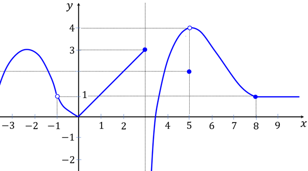
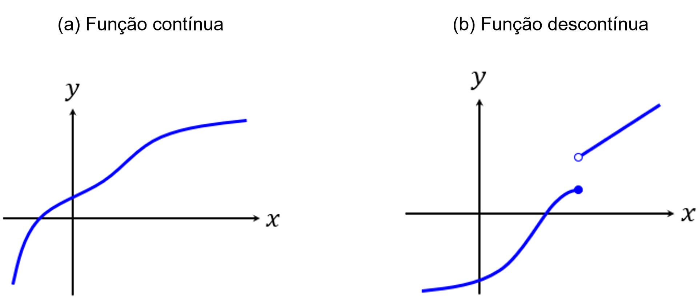
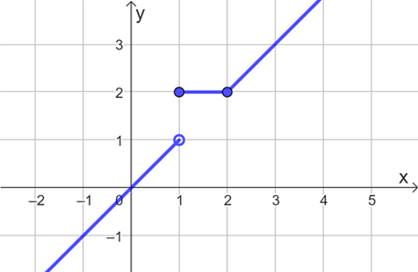
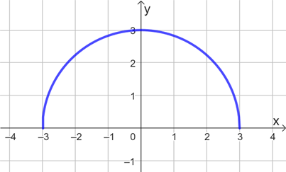
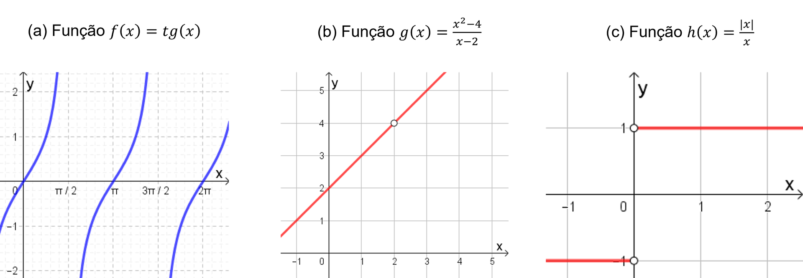
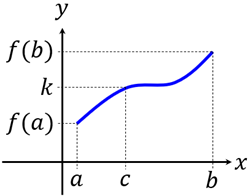

## Ponto de Partida

Estudante, desejamos a você boas-vindas! Nesta aula investigaremos a propriedade da continuidade de funções, com base no conceito de limite.

O estudo dos limites de funções tem diversas aplicações, incluindo a avaliação da continuidade das funções. A continuidade é uma propriedade intuitiva que indica a ausência de interrupções nos gráficos das funções. Quando uma função é classificada como contínua em seu domínio, podemos avaliar derivadas e integrais em todos os pontos, além de empregar estratégias para identificar raízes. Por outro lado, quando as funções são descontínuas, podemos realizar estudos específicos para essa classificação. Portanto, o conceito de continuidade de funções contribui para resolver problemas ao avaliar as propriedades dos modelos matemáticos associados.

> Para contribuir com o estudo da temática em questão, analise as funções definidas como segue:
>
> - Função 𝑓 com lei de formação: 𝑓⁡(𝑥) ={ (𝑥2−𝑥−2)/(𝑥−2), 𝑠⁢𝑒⁢𝑥≠2
>   { 3, 𝑠⁢𝑒⁢𝑥=2
> - Função 𝑔 definida a partir de seu gráfico, ilustrado na Figura 1.

*Figura 1 | Representação gráfica para a função*

Como você avaliaria cada função com base no conceito de continuidade? E no caso de serem descontínuas, qual tipo de descontinuidade poderá ser encontrada?

Prossiga em seus estudos e confira os conceitos necessários para cumprir essa tarefa!

---

## Vamos Começar!

O estudo do limite de uma função pode ser realizado em torno de um ponto específico, que pode ou não fazer parte do domínio da função em análise. No entanto, ao avaliar a continuidade de uma função, é crucial considerar que o ponto em questão pertença ao domínio da função, pois isso nos permite comparar os valores obtidos por meio do cálculo de limites com as imagens dos pontos determinados pela função. A seguir, vamos explorar os critérios essenciais para a construção de funções contínuas.

### Funções contínuas

De forma intuitiva, a continuidade de uma função está associada à ideia de não haver lacunas, saltos ou interrupções em seu gráfico. A partir dessa observação, podemos inferir que a função retratada na Figura 2(a) seria considerada contínua, ao passo que a função mostrada na Figura 2(b) seria classificada como descontínua. No entanto, é importante entender como podemos justificar essa distinção de maneira teórica.

*Figura 2 | Funções contínuas e descontínuas*

Para a definição de função contínua considere uma função real 𝑓 e um valor 𝑎 de seu domínio. Dizemos que a função 𝑓 é contínua em 𝑥 =𝑎quando lim 𝑥→𝑎 ⁡𝑓⁡(𝑥) =𝑓⁡(𝑎). Note que a definição de continuidade de uma função envolve a ocorrência de três condições:

- 𝑓 está definida em 𝑎, ou 𝑓⁡(𝑎) está definida;
- lim 𝑥→𝑎 ⁡𝑓⁡(𝑥) existe; e
- lim 𝑥→𝑎 ⁡𝑓⁡(𝑥) =𝑓⁡(𝑎).

Vejamos o exemplo da função 𝑓⁡(𝑥) =3⁢𝑥 −2. Essa função está definida em 𝑥 =1 e é tal que:

> 𝑓⁡(1) =3 ⋅1 −2 =3 −2 =1

Além disso, o limite bilateral de 𝑓 existe em 𝑥 =1 de modo que:

> lim 𝑥→1 ⁡𝑓⁡(𝑥) = lim 𝑥→1 ⁡(3⁢𝑥−2) =3 ⋅1 −2 =3 −2 =1 =𝑓⁡(1)

Portanto, a função 𝑓 é contínua em 𝑥 =1, pois lim 𝑥→1 ⁡𝑓⁡(𝑥) =𝑓⁡(1). Além do ponto indicado, a função 𝑓 é contínua em todos os pontos do seu domínio, ou seja, é contínua em todo o conjunto dos números reais. Sendo assim, podemos afirmar que 𝑓 é contínua em ℝ.

Dessa forma, dizemos que 𝑓 é uma função contínua em um intervalo do tipo (𝑎,𝑏), com 𝑎,𝑏 ∈ℝ, se 𝑓 for contínua em todos os números do intervalo. No caso do exemplo anterior, tomamos o intervalo como sendo o conjunto de números reais.

Das funções contínuas, podemos destacar como exemplos as funções afim, quadráticas, exponenciais, logarítmicas, seno e cosseno. Além disso, por meio das operações de adição, multiplicação e composição podemos partir de funções contínuas de modo a construir outras funções que também apresentam essa mesma característica. Já no caso das funções racionais, a continuidade ocorre para os intervalos nos quais os denominadores não se anulam, conforme o seguinte exemplo.

Considere a função real cuja lei de formação é 𝑓⁡(𝑥) =(𝑥2−4)/(𝑥+2). Note que a função 𝑓 está definida para todos os números reais diferentes de -2, ou seja, seu domínio é descrito por 𝐷⁡(𝑓) ={𝑥∈ℝ;𝑥≠−2}. Logo, a função 𝑓 será contínua em todo o seu domínio, ou seja, para todos os reais diferentes de -2. Por exemplo, tomando o número 𝑥 =3 ∈𝐷⁡(𝑓) temos que:

> 𝑓⁡(3) =(32−4)/(3+4) = (9−4)/(3+4) = 5/7
>
> lim 𝑥→3 ⁡𝑓⁡(𝑥) = lim 𝑥→3 ⁡((𝑥2−4)/(𝑥+2)) =(32−4)/(3+4) = (9−4)/(3+4) = 5/7

Logo, como lim 𝑥→3 ⁡𝑓⁡(𝑥) =𝑓⁡(3), podemos concluir que 𝑓 é contínua em 𝑥 =3. Um argumento análogo pode ser empregado para provar que 𝑓 será contínua em cada um dos pontos de seu domínio 𝐷⁡(𝑓).

A continuidade também pode ser avaliada à esquerda ou à direita em um ponto 𝑎, de modo análogo às relações existentes entre limites bilaterais e limites laterais. Nesse caso, 𝑓 é contínua à direta em um valor 𝑎 quando lim 𝑥→𝑎+ ⁡𝑓⁡(𝑥) =𝑓⁡(𝑎), sendo contínua à esquerda de 𝑎 no caso em que lim 𝑥→𝑎− ⁡𝑓⁡(𝑥) =𝑓⁡(𝑎).

Seja agora a função 𝑓, definida por partes, a qual é apresentada a seguir e ilustrada no gráfico da Figura 3.

> 𝑓⁡(𝑥) ={ 𝑥, 𝑠⁢𝑒⁢𝑥<1
> { 2, 𝑠⁢𝑒⁢1≤𝑥≤2
> { 𝑥, 𝑠⁢𝑒⁢𝑥>2

*Figura 3 | Gráfico da função definida por partes*

Note que a função 𝑓 da Figura 3 foi construída a partir das funções afim 𝑔⁡(𝑥) =𝑥 e ℎ⁡(𝑥) =2, que são contínuas em seus domínios. Por isso, a função 𝑓 é contínua em seu domínio, exceto possivelmente nos pontos 𝑥 =1 e 𝑥 =2, onde ocorrem as mudanças na lei de formação. Por isso, vamos analisar o que ocorre nesses dois pontos.

Calculando os limites laterais em 𝑥 =1 podemos observar que lim 𝑥→1− ⁡𝑓⁡(𝑥) = lim 𝑥→1− ⁡𝑥 =1 e lim 𝑥→1+ ⁡𝑓⁡(𝑥) = lim 𝑥→1+ ⁡2 =2. Como os limites de 𝑓 em torno de 𝑥 =1 existem, mas são diferentes, então o limite de 𝑓 em 𝑥 =1 não existe, logo, 𝑓 não é contínua nesse ponto. Porém, como 𝑓⁡(1) =2 e lim 𝑥→1+ ⁡𝑓⁡(𝑥) =2 podemos dizer que 𝑓 é contínua à direita em 𝑥 =1.

Agora, para 𝑥 =2 segue que lim 𝑥→2− ⁡𝑓⁡(𝑥) = lim 𝑥→2− ⁡2 =2 e lim 𝑥→2+ ⁡𝑓⁡(𝑥) = lim 𝑥→2+ ⁡𝑥 =2. Sendo lim 𝑥→2− ⁡𝑓⁡(𝑥) = lim 𝑥→2+ ⁡𝑓⁡(𝑥) =2, então o limite de 𝑓 existe em 𝑥 =2 e, como 𝑓⁡(2) =2, podemos concluir que 𝑓 é contínua em 𝑥 =2. Portanto, 𝑓 é contínua em todo seu domínio, com exceção de 𝑥 =1.

Com a caracterização das continuidades à direita e à esquerda, podemos afirmar que uma função f será contínua em um intervalo fechado do tipo [𝑎,𝑏], com 𝑎,𝑏 ∈ℝ, quando 𝑓 for contínua no intervalo (𝑎,𝑏), contínua à direita em 𝑎 e contínua à esquerda em 𝑏.

Seja a função 𝑓⁡(𝑥) =√9−𝑥2 cujo domínio é descrito pelo intervalo fechado 𝐷⁡(𝑓) =[−3,3]. O gráfico dessa função é apresentado na Figura 4. Para analisar a continuidade de 𝑓 em seu domínio, devemos analisar a continuidade de 𝑓 no intervalo aberto (−3,3), além das continuidades nos dois extremos.

*Figura 4 | Gráfico da função*

Em relação ao intervalo (−3,3), note que se tomarmos qualquer número real 𝑐 ∈(−3,3) então:

> lim 𝑥→𝑐 ⁡𝑓⁡(𝑥) = lim 𝑥→𝑐 ⁡√9−𝑥2 =√lim 𝑥→𝑐 ⁡(9−𝑥2) =√9−𝑐2 =𝑓⁡(𝑐)

Logo, 𝑓 é contínua em todos os pontos do intervalo aberto (−3,3). Além disso, a continuidade nas extremidades 3 e -3 também são verificadas, pois:

> lim 𝑥→−3+ ⁡𝑓⁡(𝑥) = lim 𝑥→−3+ ⁡√9−𝑥2 =√lim 𝑥→−3+ ⁡(9−𝑥2) =√9−(−3)2 =0 =𝑓⁡(−3)
>
> lim 𝑥→3− ⁡𝑓⁡(𝑥) = lim 𝑥→3− ⁡√9−𝑥2 =√lim 𝑥→3− ⁡(9−𝑥2) =√9−32 =0 =𝑓⁡(3)

Portanto, 𝑓 é contínua no intervalo fechado, o que implica 𝑓 ser contínua em todo o seu domínio.

Ao analisar a continuidade das funções, é crucial determinar os pontos ou conjuntos em que esse comportamento será examinado. Geralmente, concentramos nossa análise nos domínios das funções mais comuns, como polinomiais, racionais, raízes, exponenciais, logarítmicas, trigonométricas e inversas. No entanto, é importante reconhecer que nem todas as funções são contínuas em todos os valores reais. Por isso, é fundamental compreender o conceito de função descontínua e os diversos tipos de descontinuidades, como estudaremos a seguir.

---

## Siga em Frente...

### Funções descontínuas e tipos de descontinuidades

Dada uma função real e um ponto fixado , pertencente ou não ao domínio de . Dizemos que é descontínua em , ou tem descontinuidade em , quando não for contínua em . Das possíveis descontinuidades que podem ocorrer temos as removíveis, as de salto e as infinitas. Vejamos alguns exemplos de funções e suas descontinuidades, tomando como referência os gráficos presentes na Figura 5.

*Figura 5 | Funções descontínuas*

Seja a função tangente 𝑓⁡(𝑥) =tg⁡(𝑥), ilustrada na Figura 5(a). Note, por exemplo, que 𝑥 =𝜋/2 não pertence ao domínio de 𝑓, pois a tangente não está definida para esse valor. Logo, a função tangente não é contínua em 𝑥 =𝜋/2. Nesse sentido, a função tangente apresenta uma descontinuidade em 𝑥 =𝜋/2, a qual é caracterizada como uma descontinuidade infinita, porque ao calcular os limites laterais nesse ponto temos lim 𝑥→(𝜋/2)− ⁡tg⁡(𝑥) =+∞ e lim 𝑥→(𝜋/2)+ ⁡tg⁡(𝑥) =−∞, ou seja, limites infinitos.

Considere agora a função 𝑔⁡(𝑥) =(𝑥2−4)/(𝑥−2), com gráfico presente na Figura 5(b). Note que 𝑔 é descontínua em 𝑥 =2 porque 𝑔⁡(2) não está definida. No entanto, avaliando o limite de 𝑔 em 𝑥 =2, e sabendo que 𝑥2 −4 =(𝑥+2)⁢(𝑥−2) obtemos:

> lim 𝑥→2 ⁡𝑔⁡(𝑥) = lim 𝑥→2 ⁡((𝑥2−4)/(𝑥−2)) = lim 𝑥→2 ⁡[(𝑥+2)⁢(𝑥−2)/(𝑥−2)] = lim 𝑥→2 ⁡(𝑥+2) =2 +2 =4

Assim, apesar de 𝑔 não estar definida em 𝑥 =2, o limite de em torno desse ponto existe. Construindo uma nova função 𝑝⁡(𝑥) ={ 𝑔⁡(𝑥), 𝑠⁢𝑒⁢𝑥≠2 ; 4, 𝑠⁢𝑒⁢𝑥=2 , então 𝑝⁡(𝑥)será contínua. Desse modo, ao estender a função 𝑔, podemos construir uma nova função que será contínua em todo o ℝ por meio do preenchimento do “buraco” presente no gráfico de 𝑔. Esse é um exemplo de uma descontinuidade removível. Observe que nesse tipo de descontinuidade temos um ponto, no qual a função não está definida, mas em torno do qual o limite bilateral da função existe, de modo que ao completar a definição da função adequadamente podemos torná-la em uma função contínua.

A terceira situação possível corresponde à descontinuidade do tipo salto. Nesse caso, podemos destacar, por exemplo, a função ℎ⁡(𝑥) =|𝑥|/𝑥, com 𝑥 ≠0, com gráfico presente na Figura 5(c). Temos que ℎ é descontínua em 𝑥 =0, porque não está definida nesse ponto, porém, podemos estudar os limites laterais em torno dele: lim 𝑥→0− ⁡ℎ⁡(𝑥) = lim 𝑥→0− ⁡(−𝑥/𝑥) =−1 e lim 𝑥→0+ ⁡ℎ⁡(𝑥) = lim 𝑥→0+ ⁡(𝑥/𝑥) =1. Assim, para ℎ, os limites laterais em torno de 𝑥 =0 existem, mas são diferentes. Neste caso, a função não possui uma descontinuidade removível, pois não é possível ajustar a definição de ℎ para torná-la contínua, devido aos limites laterais serem diferentes. Portanto, uma descontinuidade do tipo salto ocorre quando a função apresenta limites laterais distintos em um ponto específico, o que impede a sua transformação em uma função contínua.

Relacionado ao estudo das funções contínuas, um dos principais resultados associados a essa temática é o teorema do valor intermediário, cujo enunciado é apresentado a seguir.

> **Teorema do valor intermediário:** se 𝑓 é uma função contínua em um intervalo fechado [𝑎,𝑏], com 𝑎,𝑏 ∈ℝ, e 𝑘 é um número real qualquer entre 𝑓⁡(𝑎) e 𝑓⁡(𝑏), então existe no mínimo um número 𝑐 ∈[𝑎,𝑏] tal que 𝑓⁡(𝑐) =𝑘.

Na Figura 6 é apresentado um gráfico que ilustra uma situação na qual o teorema do valor intermediário é verificado, sendo necessariamente a função 𝑓 contínua.

*Figura 6 | Ilustração para o teorema do valor intermediário*

A continuidade é um conceito essencial no estudo das funções, contribuindo para a obtenção de informações a respeito da função ao longo de seu domínio, propiciando, por exemplo, a representação de fenômenos por meio de funções adequadas às suas características e que possam ser estudadas com base nas mais variadas ferramentas desenvolvidas pela Matemática, contribuindo, assim, para a resolução de problemas reais.

---

## Vamos Exercitar?

Vamos analisar as funções apresentadas com base no conceito de continuidade e nas classificações dos pontos de descontinuidade.

**Função 𝑓 com lei de formação: 𝑓⁡(𝑥) ={(𝑥2−𝑥−2)/(𝑥−2), 𝑠⁢𝑒⁢𝑥≠2 ; 3, 𝑠⁢𝑒⁢𝑥=2}:**

No estudo da função 𝑓 quanto à continuidade, analisemos inicialmente a sua definição para 𝑥 ∈ℝ e 𝑥 ≠2. Note que a razão (𝑥2−𝑥−2)/(𝑥−2) é tal que seu denominador não se anula para valores reais 𝑥 ≠2, logo, a função 𝑓 é contínua para os intervalos (−∞,2) e (2,+∞), por se tratar de uma função racional.

Analisemos agora o caso 𝑥 =2. Por um lado, pela definição, temos que 𝑓⁡(2) =3. Por outro lado, calculando os limites laterais em torno desse ponto, e sabendo que 𝑥2 −𝑥 −2 =(𝑥+1)⁢(𝑥−2), obtemos:

> lim 𝑥→2− ⁡𝑓⁡(𝑥) = lim 𝑥→2− ⁡((𝑥2−𝑥−2)/(𝑥−2)) = lim 𝑥→2− ⁡((𝑥+1)⁢(𝑥−2)/(𝑥−2)) = lim 𝑥→2− ⁡(𝑥+1) =3
>
> lim 𝑥→2+ ⁡𝑓⁡(𝑥) = lim 𝑥→2+ ⁡((𝑥2−𝑥−2)/(𝑥−2)) = lim 𝑥→2+ ⁡((𝑥+1)⁢(𝑥−2)/(𝑥−2)) = lim 𝑥→2+ ⁡(𝑥+1) =3

Como os limites laterais existem e são iguais entre si, além de coincidirem com a imagem de 𝑓 em 𝑥 =2, podemos concluir que a 𝑓 é contínua nesse ponto. Dessa forma, podemos concluir que a função 𝑓 é contínua em todo o seu domínio 𝐷⁡(𝑓) =ℝ.

**Função 𝑔 definida a partir de seu gráfico, ilustrado na Figura 1:**

Conforme verificado no gráfico da função 𝑔, presente na Figura 1, a função 𝑔 é descontínua, considerando seu domínio descrito por ℝ. Pontos de descontinuidades podem ser observados para 𝑥 =−1, 𝑥 =3 e 𝑥 =5. Vejamos a seguir as características apresentadas por 𝑔 em torno de cada um desses pontos.

Em 𝑥 =−1, os limites laterais de 𝑔 existem e são iguais, sendo lim 𝑥→−1− ⁡𝑔⁡(𝑥) = lim 𝑥→−1+ ⁡𝑔⁡(𝑥) =1, no entanto, 𝑔 não está definida em -1. Assim, temos uma descontinuidade removível, visto que a função admite limites laterais em torno desse ponto iguais, apesar de não estar definida no ponto. Para se tornar contínua em 𝑥 =−1 basta complementar a definição com 𝑔⁡(−1) =1.

No caso de 𝑥 =3 temos uma descontinuidade infinita, pois lim 𝑥→3+ ⁡𝑔⁡(𝑥) =−∞. No entanto, como lim 𝑥→3− ⁡𝑔⁡(𝑥) =3 e 𝑔⁡(3) =3, temos continuidade à esquerda de 𝑥 =3.

Por fim, em 𝑥 =5 temos outra descontinuidade removível, porque os limites laterais de 𝑔 nesse ponto existem e são iguais, sendo lim 𝑥→5− ⁡𝑔⁡(𝑥) = lim 𝑥→5+ ⁡𝑔⁡(𝑥) =4, mas 𝑔⁡(5) =2.

**Portanto, a função 𝑔 é contínua nos intervalos (−∞,−1), (−1,3), (3,5) e (5,+∞)**, o que conclui esse estudo.
