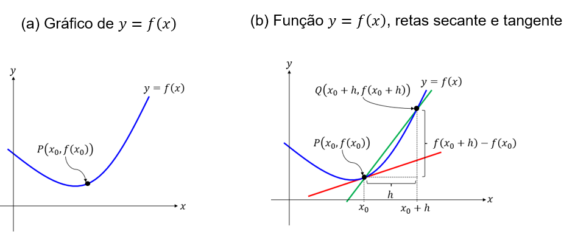
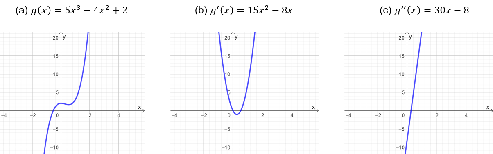
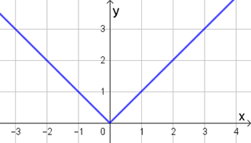

## Ponto de Partida

No âmbito do Cálculo Diferencial e Integral, um dos conceitos de destaque é a derivada, cuja relevância se estende para diversas áreas, incluindo Engenharia, Física, Biologia, Geografia, Economia, entre outras. Sua aplicação primordial reside na descrição de fenômenos relacionados a taxas de variação. Nesse contexto, exploraremos a definição de derivada, fundamentada nos conceitos de função e limite, devido à sua importância tanto na caracterização de uma derivada em um ponto específico quanto na concepção da derivada enquanto função.

> Para complementar os estudos acerca do conceito de derivada, suponha que uma empresa esteja fazendo uma análise a respeito dos lucros obtidos com a fabricação de um produto específico. Após a coleta de dados inicial, foi identificado que o custo 𝐶 da indústria, com a fabricação e venda de 𝑥 unidades do produto em questão, pode ser descrito a partir da função 𝐶⁡(𝑥) =−0,4⁢𝑥2 +400⁢𝑥, e a receita 𝑅 obtida na fabricação e venda de 𝑥 unidades desse mesmo produto pode ser calculada por meio da função 𝑅⁡(𝑥) =80⁢𝑥 +15⁢000.
>
> De posse dessas informações, qual é o lucro obtido na fabricação e venda desse produto? Como podemos interpretar e analisar o lucro marginal associado, tendo em vista os conceitos de limite e derivada?

Prossiga em seus estudos e confira os fundamentos necessários para a solução dessa problemática.

---

## Vamos Começar!

Um dos conceitos fundamentais do Cálculo Diferencial e Integral é a derivada, que é utilizada para avaliar taxas de variação. Um dos problemas iniciais que envolvem esse conceito é a determinação da reta tangente a uma curva em um ponto específico, sendo que esses conceitos foram introduzidos pelos matemáticos Newton e Leibniz no século XVIII.

### O problema da reta tangente

Seja uma função 𝑦 =𝑓⁡(𝑥) com gráfico dado na Figura 1(a), e um ponto 𝑃⁡(𝑥0,𝑓⁡(𝑥0)) fixado e pertencente ao gráfico de 𝑓. Vamos determinar a inclinação da reta tangente ao gráfico de 𝑓 passando por 𝑃 a partir de aproximações obtidas por meio das retas secantes que interceptam o gráfico de 𝑓 em dois pontos, sendo um deles necessariamente 𝑃, de tal forma que esses pontos estejam cada vez mais próximos entre si, conforme a Figura 1(b).

*Figura 1 | O problema da reta tangente*

Da Figura 1(b), seja a reta, em verde, secante ao gráfico de 𝑓 contendo os pontos 𝑃 e 𝑄⁡(𝑥0+ℎ,𝑓⁡(𝑥0+ℎ)), com ℎ uma constante real. O coeficiente angular, ou ainda, a inclinação 𝑎 da reta secante que contém 𝑃 e 𝑄 é dada por:

> 𝑎 =(𝑓⁡(𝑥0+ℎ)−𝑓⁡(𝑥0))/((𝑥0+ℎ)−𝑥0) = (𝑓⁡(𝑥0+ℎ)−𝑓⁡(𝑥0))/ℎ

Aproximando o ponto 𝑄 de 𝑃, o que é possível tomando valores de ℎ cada vez mais próximos de zero, estaremos nos aproximando da reta tangente. Assim, a partir de 𝑎, calculando o limite quando ℎ →0 obtemos:

> 𝑚 = lim ℎ→0 ⁡𝑎 = lim ℎ→0 ⁡(𝑓⁡(𝑥0+ℎ)−𝑓⁡(𝑥0))/((𝑥0+ℎ)−𝑥0)

sendo 𝑚 a inclinação da reta tangente, ou coeficiente angular da reta tangente, ao gráfico de 𝑓 em 𝑃, desde que o limite exista. Consequentemente, a reta tangente consiste na reta que contém 𝑃 e cuja inclinação é dada por 𝑚. Nesse caso, podemos entender a derivada da função 𝑓 em 𝑥 =𝑥0, denotada por 𝑓'⁡(𝑥0), como a inclinação da reta tangente ao gráfico de 𝑓 no ponto 𝑃, desde que o limite envolvido exista.

Além do problema mencionado, o conceito de derivada é aplicado em situações práticas, como a análise da velocidade instantânea. Por exemplo, ao dirigir um veículo, o velocímetro fornece continuamente a velocidade atual, que pode variar conforme o acionamento dos pedais. No entanto, para determinar a velocidade em um instante específico, como se fotografássemos o veículo, a derivada é essencial. Utilizando a derivada, podemos calcular a velocidade instantânea mesmo com a imagem congelada, o que nos permite exibi-la no velocímetro.

### Taxas de variação e velocidade instantânea

Suponha que um veículo se mova sobre uma reta conforme a equação 𝑠 =𝑓⁡(𝑡), sendo 𝑠 o deslocamento do objeto no instante 𝑡. A função 𝑓 é chamada de função posição do objeto. Como desejamos calcular a velocidade instantânea do automóvel, queremos determinar a taxa de variação da função posição no tempo. Para isso, iniciemos pelo estudo da velocidade média.

Tomando um intervalo de tempo entre 𝑡0 e 𝑡0 +ℎ, a variação de posição será de 𝑓⁡(𝑡0) a 𝑓⁡(𝑡0+ℎ), então a velocidade média atingida por esse automóvel nesse intervalo será de:

> velocidade⁢média = deslocamento/tempo = (𝑓⁡(𝑡0+ℎ)−𝑓⁡(𝑡0))/((𝑡0+ℎ)−𝑡0) = (𝑓⁡(𝑡0+ℎ)−𝑓⁡(𝑡0))/ℎ

Para calcular a velocidade instantânea, desejamos que o intervalo de tempo seja tão pequeno quanto se queira, o que pode ser obtido ao tomar ℎ cada vez mais próximo de zero, ou ℎ →0. Dessa forma, calculando o limite da velocidade média, quando ℎ tende a zero, teremos a velocidade instantânea 𝑣⁡(𝑡0), avaliada em 𝑡 =𝑡0 e dada por:

> 𝑣⁡(𝑡0) = lim ℎ→0 ⁡(𝑓⁡(𝑡0+ℎ)−𝑓⁡(𝑡0))/ℎ

Comparando essa informação com o estudo realizado anteriormente a respeito da reta tangente, observe que a velocidade instantânea do automóvel em um instante 𝑡 =𝑡0 pode ser interpretada como a inclinação da reta tangente ao gráfico de 𝑠 =𝑓⁡(𝑡) no ponto 𝑇⁡(𝑡0,𝑓⁡(𝑡0)), ou como a derivada da função 𝑠 =𝑓⁡(𝑡) em 𝑡 =𝑡0. Considerando essas aplicações, vejamos a seguir como podemos definir a derivada em um ponto.

### Derivada de uma função em um ponto

Dada uma função 𝑓 e um número 𝑥 =𝑎, a derivada de 𝑓 em 𝑎 é dada por:

> 𝑓'⁡(𝑎) = lim ℎ→𝑎 ⁡(𝑓⁡(𝑎+ℎ)−𝑓⁡(𝑎))/ℎ

se o limite existir. A derivada também pode ser escrita como 𝑓'⁡(𝑎) = lim 𝑥→𝑎 ⁡(𝑓⁡(𝑥)−𝑓⁡(𝑎))/(𝑥−𝑎), pois se 𝑥 =𝑎 +ℎ, então ℎ →0 implica 𝑥 →𝑎, permitindo uma equivalência entre as duas expressões.

Além de calcular as derivadas em pontos específicos, podemos interpretar a derivada como uma função. Assim, a derivada é definida em termos de um limite, permitindo avaliar todos os valores de 𝑥 em seu domínio.

---

## Siga em Frente...

### Derivada como função

A derivada de uma função 𝑓, em relação à variável 𝑥, correspondente à função:

> 𝑓'⁡(𝑥) = lim ℎ→𝑎 ⁡(𝑓⁡(𝑥+ℎ)−𝑓⁡(𝑥))/ℎ

desde que o limite exista. Nesse sentido, o domínio da função derivada é composto por todos os valores de 𝑥 para os quais o limite anterior existe.

Se uma função 𝑓 admite uma derivada em um ponto 𝑥, dizemos que 𝑓 é derivável ou diferenciável em 𝑥. Se 𝑓' existe em cada ponto do domínio de 𝑓, tem-se que 𝑓 é derivável ou diferenciável. Por outro lado, quando o limite não existe em 𝑥, temos que a função 𝑓 não é derivável em 𝑥, ou não é diferenciável em 𝑥.

Se a função 𝑦 =𝑓⁡(𝑥) é derivável, além da notação 𝑓'⁡(𝑥) para a derivada, podemos empregar as seguintes notações: 𝐷𝑥⁢𝑓⁡(𝑥), 𝐷𝑥⁢𝑦 ou 𝑑⁢𝑦/𝑑⁢𝑥. Se denotarmos por 𝐴 o conjunto dos valores 𝑥 do domínio de 𝑓 nos quais a função é derivável, então a função derivada, ou simplesmente derivada de 𝑓, pode ser representada como 𝑓' :𝐴 →ℝ dada por 𝑦 =𝑓 ′(𝑥).

A derivada 𝑓' pode ainda ser denominada derivada de 1ª ordem de 𝑓. Essas denominações e notações são importantes porque podemos construir derivadas de ordens mais altas para funções, desde que os limites envolvidos existam.

A derivada da função 𝑓' consiste na derivada de 2ª ordem e pode ser representada por 𝑓 ′ ′, de modo que a relação (𝑓')' =𝑓'' é válida. Logo, na determinação da lei de formação da derivada de 2ª ordem, nos pontos nos quais ela exista, podemos empregar, por exemplo, o estudo do seguinte limite:

> 𝑓''⁡(𝑥) = lim ℎ→𝑎 ⁡(𝑓'(𝑥+ℎ)−𝑓'(𝑥))/ℎ

De modo análogo, podemos estender essa caracterização ao estudo das derivadas de ordens superiores a 2, desde que os limites característicos existam nos pontos em estudo.

A definição de derivada por meio de limites é empregada para verificar a diferenciabilidade de uma função em determinados pontos de seu domínio. No entanto, em muitos casos, podemos utilizar as regras de derivação, que são resultados conhecidos e aplicáveis quando sabemos que a função é derivável. Isso nos permite determinar a expressão para a derivada sem recorrer diretamente à definição por limites.

### Regras de derivação

Algumas regras de derivação que podem ser aplicadas na determinação de derivadas de funções são as seguintes:

- **Regra da constante:** 𝑑/𝑑⁢𝑥⁢(𝑐) =0, para 𝑐 ∈ℝ.
- **Regra para x:** 𝑑/𝑑⁢𝑥⁢(𝑥) =1.
- **Regra da potência:** 𝑑/𝑑⁢𝑥⁢(𝑥𝑛) =𝑛⁢𝑥𝑛−1.
- **Regras da linearidade:** para funções 𝑓 e 𝑔 deriváveis temos:
  - a. Multiplicação por constante: 𝑑/𝑑⁢𝑥⁢(𝑐⁢𝑓⁡(𝑥)) =𝑐⁢𝑑/𝑑⁢𝑥⁢(𝑓⁡(𝑥)), para 𝑐 ∈ℝ.
  - b. Soma de funções: 𝑑/𝑑⁢𝑥⁢(𝑓⁡(𝑥)+𝑔⁡(𝑥)) =𝑑/𝑑⁢𝑥⁢(𝑓⁡(𝑥)) +𝑑/𝑑⁢𝑥⁢(𝑔⁡(𝑥)).

Vejamos alguns exemplos de aplicação dessas regras.

**a.** Calculando a derivada de 𝑓⁡(𝑥) =2⁢𝑥3 +4⁢𝑥2 −𝑥 +4 obtemos:

> 𝑓'⁡(𝑥) =𝑑/𝑑⁢𝑥⁢(2⁢𝑥3+4⁢𝑥2−𝑥+4) =𝑑/𝑑⁢𝑥⁢(2⁢𝑥3) +𝑑/𝑑⁢𝑥⁢(4⁢𝑥2) +𝑑/𝑑⁢𝑥⁢(−𝑥) +𝑑/𝑑⁢𝑥⁢(4)=2 ⋅𝑑/𝑑⁢𝑥⁢(𝑥3) +4 ⋅𝑑/𝑑⁢𝑥⁢(𝑥2) −𝑑/𝑑⁢𝑥⁢(𝑥) +𝑑/𝑑⁢𝑥⁢(4) =2 ⋅(3⁢𝑥2) +4 ⋅(2⁢𝑥) −1 +0=6⁢𝑥2 +8⁢𝑥 −1

Assim, a derivada de 1ª ordem de 𝑓 é 𝑓'⁡(𝑥) =6⁢𝑥2 +8⁢𝑥 −1.

**b.** Dada a função 𝑔⁡(𝑥) =5⁢𝑥3 −4⁢𝑥2 +2, sua derivada de 1ª ordem é 𝑔'(𝑥) =15⁢𝑥2 −8⁢𝑥. Desse modo, sua derivada de 2ª ordem será:

> 𝑔''⁡(𝑥) =𝑑/𝑑⁢𝑥⁢(𝑓'⁡(𝑥)) =𝑑/𝑑⁢𝑥⁢(15⁢𝑥2−8⁢𝑥) =𝑑/𝑑⁢𝑥⁢(15⁢𝑥2) +𝑑/𝑑⁢𝑥⁢(−8⁢𝑥) =15 ⋅𝑑/𝑑⁢𝑥⁢(𝑥2) −8 ⋅𝑑/𝑑⁢𝑥⁢(𝑥)=15 ⋅(2⁢𝑥) −8 ⋅1 =30⁢𝑥 −8

Logo, a derivada de 2ª ordem de 𝑔 é dada por 𝑔''⁡(𝑥) =30⁢𝑥 −8.

Observe na Figura 2 os gráficos das funções 𝑔, 𝑔' e 𝑔'' apresentadas no exemplo (b) anterior. Note que à medida que aumentamos a ordem da derivada, por se tratar de uma função polinomial, temos a redução no grau do polinômio.

*Figura 2 | Função 𝑔⁡(𝑥) =5⁢𝑥3 −4⁢𝑥2 +2 e suas duas primeiras derivadas*

Uma relação importante que precisamos analisar consiste em associar os conceitos de derivada e continuidade entre si, observando as implicações que podem ser estabelecidas.

### Funções deriváveis e continuidade

Vamos iniciar avaliando o comportamento da função módulo, dada por 𝑓⁡(𝑥) =|𝑥|, cujo gráfico é apresentado na Figura 3.

*Figura 3 | Gráfico de 𝑓⁡(𝑥) =|𝑥|*

A função módulo é contínua em todo o seu domínio, pois lim 𝑥→𝑎 ⁡𝑓⁡(𝑥) =|𝑎| =𝑓⁡(𝑎) para todo 𝑎 ∈ℝ. Em relação à diferenciabilidade, perceba que nos intervalos (−∞,0) e (0,+∞) 𝑓 comporta-se, respectivamente, como as funções 𝑔⁡(𝑥) =−𝑥 e ℎ⁡(𝑥) =𝑥, ambas deriváveis nos intervalos indicados. Em relação a 𝑥 =0, observe que:

> lim 𝑥→0− ⁡(𝑓⁡(𝑥)−𝑓⁡(0))/(𝑥−0) = lim 𝑥→0− ⁡|𝑥|/𝑥 =−1
>
> lim 𝑥→0+ ⁡(𝑓⁡(𝑥)−𝑓⁡(0))/(𝑥−0) = lim 𝑥→0+ ⁡|𝑥|/𝑥 =1

Os limites laterais existem e são diferentes, então o limite não existe quando 𝑥 →0. Por isso, a função módulo não é derivável em 𝑥 =0, apesar de ser contínua nesse ponto. Observe que o “bico” presente no gráfico da função módulo corresponde a um indicativo de que a função não é derivável nesse ponto

Observe que, como no exemplo anterior, existem funções que não são deriváveis em todo o seu domínio, como é o caso da função módulo. No entanto, como lim 𝑥→0− ⁡(𝑓⁡(𝑥)−𝑓⁡(0))/(𝑥−0) e lim 𝑥→0+ ⁡(𝑓⁡(𝑥)−𝑓⁡(0))/(𝑥−0) existem, podemos dizer que a função módulo apresenta derivadas laterais em torno de zero. Assim, podemos ajustar a definição de derivada via limites de modo a determinar derivadas laterais. Nesse caso, ao invés de calcular limites bilaterais, utilizamos os limites laterais para determinar derivadas laterais à direita ou à esquerda, especificamente quando se trata de derivada no ponto.

Ainda a respeito do exemplo anterior, observe que não podemos garantir que toda função contínua será derivável, isto é, a continuidade não implica derivabilidade. Porém, temos o seguinte teorema, o qual permite relacionar esses conceitos entre si.

> **Teorema 1:** Se f é uma função derivável em 𝑥 =𝑎 então f é contínua nesse ponto.

A demonstração completa para esse teorema pode ser consultada no livro *Um Curso de Cálculo: Volume 1*, de Hamilton Luiz Guidorizzi, página 150, seção 7.6.

A relação entre função contínua e função derivável possibilita a identificação de padrões e conclusões sobre o comportamento das funções. Em resumo, a derivabilidade implica continuidade.

O conceito de derivada, junto com a caracterização de funções deriváveis, oferece estratégias e ferramentas matemáticas para interpretar e resolver uma variedade de problemas, especialmente relacionados ao estudo de taxas de variação e inclinações de retas tangentes.

---

## Vamos Exercitar?

Para a solução do problema proposto, consideremos que o custo seja dado por 𝐶⁡(𝑥) =0,4⁢𝑥2 +400⁢𝑥, enquanto a receita seja descrita por 𝑅⁡(𝑥) =80⁢𝑥 +15⁢000, sendo 𝑥 o número de unidades produzidas e vendidas do item em questão.

Como o lucro 𝐿⁡(𝑥) pode ser calculado por 𝐿⁡(𝑥) =𝑅⁡(𝑥) −𝐶⁡(𝑥), então:

> 𝐿⁡(𝑥) =(80⁢𝑥−15⁢000) −(0,4⁢𝑥2+400⁢𝑥) =−0,4⁢𝑥2 −320⁢𝑥 +15⁢000

O lucro marginal pode ser definido como a taxa de variação do lucro em relação à quantidade de unidades fabricadas e vendidas, por isso, o lucro marginal pode ser entendido como a derivada da função lucro, isto é, 𝐿'⁡(𝑥) ou 𝑑⁢𝐿/𝑑⁢𝑥. Em relação à interpretação, podemos entender o lucro marginal como o lucro adicional que pode ser obtido ao aumentar ou reduzir a produção, sendo ele positivo ou negativo.

Vamos determinar o lucro marginal a partir das regras de derivação:

> 𝐿'⁡(𝑥) =𝑑/𝑑⁢𝑥⁢(−0,4⁢𝑥2−320⁢𝑥+15⁢000) =𝑑/𝑑⁢𝑥⁢(−0,4⁢𝑥2) +𝑑/𝑑⁢𝑥⁢(−320⁢𝑥) +𝑑/𝑑⁢𝑥⁢(15⁢000)=−0,4 ⋅𝑑/𝑑⁢𝑥⁢(𝑥2) −320 ⋅𝑑/𝑑⁢𝑥⁢(𝑥) +𝑑/𝑑⁢𝑥⁢(15⁢000) =−0,4 ⋅(2⁢𝑥) −320 ⋅1 +0=−0,8⁢𝑥 −320

**Portanto, o lucro marginal é dado por 𝐿'⁡(𝑥) =−0,8⁢𝑥 −320**, o que conclui a solução do problema.
