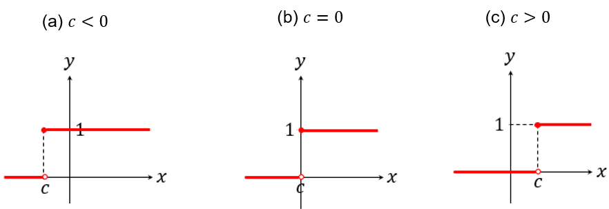
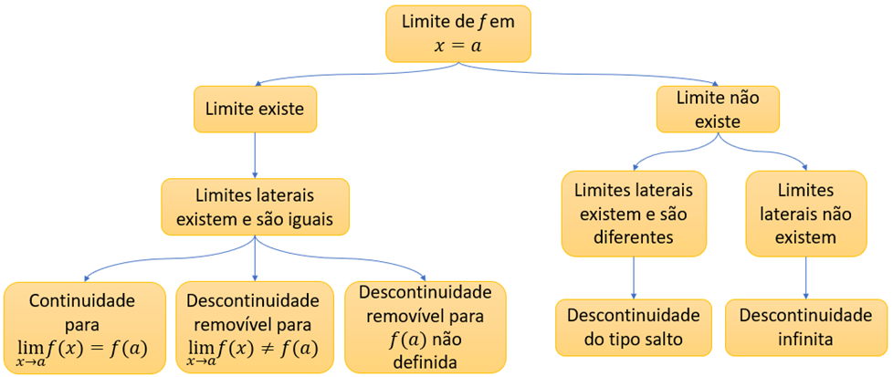

## Ponto de Chegada

A competência desta unidade consiste em compreender os conceitos relacionados a limites e derivadas, bem como reconhecer os tipos de problemas nos quais esses conceitos podem ser aplicados. Para desenvolver essa competência você precisa, inicialmente, conhecer o conceito de limite de função, com suas propriedades e abordagens possíveis.

Os limites de funções são um dos conceitos centrais do cálculo e têm uma ampla aplicação em diversas áreas da Matemática e Ciências. Eles descrevem o comportamento de uma função à medida que a variável independente se aproxima de um determinado valor ou quando consideramos valores muito grandes ou pequenos, quando direcionamos nossos estudos sobre os limites no infinito e limites infinitos. Essa noção é fundamental para entender a continuidade das funções, identificar assíntotas, entre outros. Além disso, os limites são essenciais na definição de conceitos importantes, como as derivadas, que são um dos pilares do cálculo diferencial e integral.

As derivadas podem ser empregadas no estudo das taxas de variação de funções em relação às suas variáveis independentes em um ponto específico. Essa noção é essencial para entender uma variedade de fenômenos naturais e artificiais, desde a velocidade de um objeto em movimento até a taxa de crescimento de populações em biologia. Devido às suas propriedades, as derivadas são uma ferramenta poderosa e versátil na análise e modelagem de fenômenos em várias áreas do conhecimento.

> **Reflita**
> - Quais estratégias podem ser empregadas no cálculo do limite de uma função?
> - Como podemos diferenciar funções contínuas e descontínuas?
> - Quais são as interpretações possíveis para a derivada de uma função?

---

## É Hora de Praticar!

Na modelagem e resolução de problemas reais, em muitos momentos nos deparamos com funções diferentes das convencionais, mas construídas a partir delas. Uma função que podemos destacar na prática é a função de Heaviside, conhecida também como função degrau unitário, cuja lei de formação é dada na forma:

> 𝐻𝑐⁡(𝑥) ={ 0, 𝑠⁢𝑒⁢𝑥<𝑐
> { 1, 𝑠⁢𝑒⁢𝑥≥𝑐

em que 𝑐 representa um número real, ajustado conforme o contexto. Essa função é muito utilizada no campo das ciências exatas e engenharias, por contribuir para a descrição de diversos fenômenos, dos quais podemos citar, por exemplo, a passagem de correntes elétricas em circuitos submetidos a chaves que são ligadas e desligadas mediante determinadas condições.

Considere que, durante o estudo de um problema, você deparou-se com essa função e precisa obter algumas conclusões a partir de seu comportamento. Para isso, construa o gráfico da função de Heaviside e, utilizando os conhecimentos a respeito de limites e continuidade, determine onde a função de Heaviside é contínua, justificando sua resposta.

> **Reflita**
> Como você resolveria esse desafio?

### Resolução do Estudo de Caso

A função de Heaviside possui domínio descrito pelo conjunto ℝ e lei de formação no formato:

> 𝐻𝑐⁡(𝑥) ={ 0, 𝑠⁢𝑒⁢𝑥<𝑐
> { 1, 𝑠⁢𝑒⁢𝑥≥𝑐 , 𝑐 ∈ℝ

Assim, essa função é definida por partes. Como 𝑐 pode assumir valores positivos, negativos ou nulo, o gráfico da função de Heaviside pode assumir uma das formas ilustradas na Figura 1.

*Figura 1 | Possibilidades para o gráfico da função de Heaviside*

Apesar das diferentes possibilidades de 𝑐, podemos caracterizar 𝑥 =𝑐 como um ponto de descontinuidade do tipo salto. Com efeito, vamos analisar os limites laterais dessa função em 𝑐:

> lim 𝑥→𝑐− ⁡𝐻𝑐⁡(𝑥) =0
>
> lim 𝑥→𝑐+ ⁡𝐻𝑐⁡(𝑥) =1

Como os limites laterais existem, mas são diferentes, então não existe o limite da função em 𝑥 =𝑐. Além disso, temos que 𝐻𝑐⁡(𝑐) =1, donde segue que a função é contínua à direita de 𝑥 =𝑐.

Nesse sentido, a função de Heaviside está definida em 𝑐, mas como os limites laterais existem e são diferentes, então a função é descontínua em 𝑥 =𝑐 com uma descontinuidade do tipo salto. **Portanto, a continuidade da função se dá nos intervalos (−∞,𝑐) e (𝑐,+∞), ou seja, em todos os números reais diferentes de 𝑐, ou em ℝ −{𝑐}, mas com continuidade à direita em 𝑥 =𝑐**, o que conclui o desafio proposto.

### Assimile

A partir do conceito de limite de função podemos construir outros conceitos direcionados à investigação de uma função, especialmente a continuidade. Diante desse tema, ao calcular o limite de uma função em um ponto podemos obter diferentes possibilidades de resultados e interpretações, por isso, o mapa apresentado a seguir destaca informações essenciais acerca das propriedades das funções a partir do resultado do limite. Como sugestão para estudo, indicamos a complementação desse mapa com informações acerca dos limites no infinito, noções envolvendo derivadas, bem como outras observações que você julgar relevantes.

### Referências

ANTON, H. et al. Cálculo. v. 1. 10. ed. Porto Alegre: Bookman, 2014.

ÁVILA, G. S. de S.; ARAÚJO, L. C. L. de. Cálculo: ilustrado, prático e descomplicado. Rio de Janeiro: LTC, 2012.

GUIDORIZZI, H. L. Um curso de cálculo. v. 1. 6. ed. Rio de Janeiro: LTC, 2018.

ROGAWSKI, J.; ADAMS, C. Cálculo. v. 1. 3 ed. Porto Alegre: Bookman, 2018.

STEWART, J.; CLEGG, D.; WATSON, S. Cálculo. v. 1. São Paulo: Cengage Learning Brasil, 2021.
