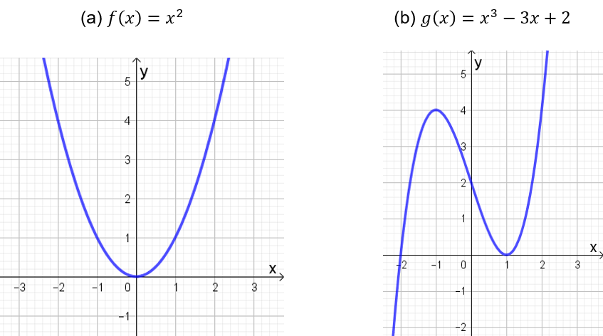
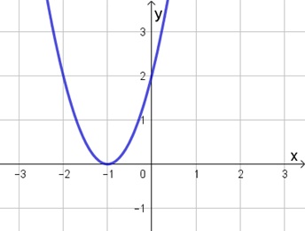
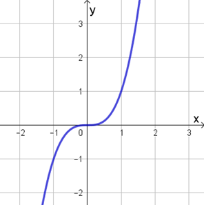

## Ponto de Partida

Estudante, desejamos a você boas-vindas! Prosseguindo no estudo das derivadas, um tema bastante estudado é o das aplicações das derivadas no estudo de problemas de otimização, os quais podem estar vinculados a diversas áreas do conhecimento.

Quando avaliamos uma função em conjunto, especialmente, com suas duas primeiras derivadas, desde que a função seja diferenciável, podemos obter, a partir dessas derivadas, informações importantes acerca da função, como é o caso do reconhecimento dos valores máximos e mínimos da função em uma região ou em seu domínio.

> Diante desse tema, e para aprofundamento dos conhecimentos sobre ele, suponha que uma indústria deseja fabricar um reservatório no formato de um cilindro circular reto de tal maneira que sua área total seja igual a 180⁢𝜋⁢cm2. Ainda, deseja-se que esse reservatório tenha volume máximo.
>
> Analisando as condições de produção, os técnicos da empresa fizeram um estudo prévio e identificaram que o volume 𝑉 desse reservatório pode ser relacionado com o raio 𝑟 de sua base a partir da função 𝑉⁡(𝑟) =90⁢𝜋⁢𝑟 −𝜋⁢𝑟3. Com base nessas informações, qual deve ser o valor assumido por 𝑟 para que o volume desse reservatório seja máximo?

Quais os conceitos necessários para a solução desse problema? Dê continuidade em seus estudos, aprofundando-se na temática das derivadas.

---

## Vamos Começar!

Problemas que envolvem a melhor utilização dos recursos disponíveis podem ser incluídos em uma categoria denominada problemas de otimização. Nesses casos, geralmente a solução do problema se encontra nos valores máximos ou mínimos que a função assume em seu domínio. Assim, vejamos de que forma as derivadas podem contribuir para o estudo e para a resolução desses tipos de problemas.

### Máximos e mínimos de funções reais

Considere uma função real 𝑓 e um ponto 𝑐 em seu domínio. Dizemos que 𝑓⁡(𝑐) é um valor máximo local da função 𝑓 se 𝑓⁡(𝑐) ≥𝑓⁡(𝑥) para valores 𝑥 suficientemente próximos de 𝑐. Por outro lado, 𝑓⁡(𝑐) é um valor mínimo local de 𝑓 quando 𝑓⁡(𝑐) ≤𝑓⁡(𝑥) para valores de 𝑥 suficientemente próximos de 𝑐. Assim, os pontos de máximo local e mínimo local são identificados quando eles assumem, respectivamente, o maior e o menor valor da função em intervalos abertos em torno desses pontos.

Se 𝑐 é tal que 𝑓⁡(𝑐) ≥𝑓⁡(𝑥) para todos os pontos 𝑥 do domínio da função 𝑓, então podemos afirmar que 𝑓⁡(𝑐) é um valor máximo global (ou valor máximo absoluto) de 𝑓. E se o ponto 𝑐 é tal que 𝑓⁡(𝑐) ≤𝑓⁡(𝑥) para todo 𝑥 no domínio de 𝑓, então 𝑓⁡(𝑐) corresponde ao valor mínimo global (ou valor mínimo absoluto) de 𝑓. Em ambos os casos, 𝑓⁡(𝑐) consiste em um valor extremo da função 𝑓.

Diante desses conceitos, vamos comparar as funções 𝑓 :ℝ →ℝ dada por 𝑓⁡(𝑥) =𝑥2, com gráfico apresentado na Figura 1(a), e 𝑔 :ℝ →ℝ definida por 𝑔⁡(𝑥) =𝑥3 −3⁢𝑥 +2, cujo gráfico é indicado na Figura 1(b).

*Figura 1 | Gráficos das funções polinomiais*

Observando o gráfico de 𝑓⁡(𝑥) =𝑥2, podemos observar que 𝑥 =0 corresponde a um ponto no qual a função atinge um valor mínimo, indicado por 𝑓⁡(0) =0. Note que 𝑓⁡(0) corresponde a um valor mínimo global, visto que 𝑓⁡(𝑥) ≥𝑓⁡(0) para todos os pontos 𝑥 no domínio da função. Já no caso da função 𝑔⁡(𝑥) =𝑥3 −3⁢𝑥 +2, a função admite 𝑓⁡(1) como um valor mínimo local, mas não global, porque 𝑓⁡(𝑥) ≥𝑓⁡(1) apenas em pontos 𝑥 próximos do valor 1, visto que 𝑓⁡(𝑥) →−∞ quando 𝑥 →−∞. Também temos que 𝑓 assume um valor máximo local no ponto 𝑥 =−1, pois 𝑓⁡(𝑥) ≤𝑓⁡(−1) em pontos suficientemente próximos de 𝑥 =−1.

Para identificar quais funções assumem valores máximos ou mínimos absolutos podemos empregar o resultado a seguir, referente às funções contínuas.

> **Teorema do valor extremo:** Se 𝑓 for contínua em um intervalo fechado [𝑎,𝑏], então 𝑓 assume um valor máximo absoluto 𝑓⁡(𝑐) e um valor mínimo absoluto em 𝑓⁡(𝑑), com 𝑐,𝑑 ∈[𝑎,𝑏].

Por exemplo, seja a função 𝑓 :[0,1] →ℝ dada por 𝑓⁡(𝑥) =5⁢𝑥4 −1, assim, conforme o teorema do valor extremo, 𝑓 admite valor máximo e mínimo absolutos nesse intervalo, por ser uma função contínua definida em um intervalo fechado do tipo [𝑎,𝑏]. No entanto, como podemos reconhecer os pontos em que a função pode assumir valores máximos ou mínimos? Para isso, podemos analisar o comportamento da derivada da função 𝑓, a qual é diferenciável no intervalo (𝑎,𝑏).

Um número ou ponto crítico de uma função 𝑓 é um número 𝑐 pertencente ao domínio da função no qual 𝑓'⁡(𝑐) =0 ou 𝑓'⁡(𝑐) não existe.

Retomemos o caso da função 𝑓⁡(𝑥) =𝑥2, indicada na Figura 1(a). Note que 𝑓'⁡(𝑥) =2⁢𝑥, assim, 𝑓'⁡(0) =0, então 𝑥 =0 é um ponto crítico de 𝑓. Ainda, 𝑓⁡(0) corresponde a um valor mínimo de 𝑓. Nesse caso, a função admite um único ponto crítico, mas outras funções podem admitir uma quantidade maior de pontos dessa natureza.

Em resumo, se 𝑓 tiver um máximo ou um mínimo local em um ponto 𝑐 então 𝑐 corresponde a um ponto crítico de 𝑓. Assim, podemos estudar os pontos críticos de uma função de tal forma a identificar os valores máximos e mínimos e, se possível, determinar quais desses pontos correspondem aos valores máximo e mínimo globais da função.

Vejamos o procedimento para identificação de máximos e mínimos de funções. Seja a função 𝑓 :[−5,0] →ℝ definida por 𝑓⁡(𝑥) =𝑥3 +6⁢𝑥2 +9⁢𝑥 +4. Vamos iniciar com o estudo dos pontos críticos, determinando a derivada e igualando-a a zero:

> 𝑓'⁡(𝑥) =3⁢𝑥2 +12⁢𝑥 +9
>
> 𝑓'⁡(𝑥) =0 ⇒3⁢𝑥2 +12⁢𝑥 +9 =0 ⇒𝑥2 +4⁢𝑥 +3 =0

Resolvendo a equação quadrática obtida teremos as soluções 𝑥 =−3 e 𝑥 =−1, que correspondem aos pontos críticos da função 𝑓. Calculando as imagens desses pontos pela 𝑓 obtemos:

> 𝑓⁡(−3) =(−3)3 +6⁢(−3)2 +9⁢(−3) +4 =4
>
> 𝑓⁡(−1) =(−1)3 +6⁢(−1)2 +9⁢(−1) +4 =0

Nesse sentido, 𝑥 =−3 está associado a um valor máximo local, e 𝑥 =−1 está ligado a um valor mínimo local.

Quando estamos diante de uma função cujo domínio é um intervalo fechado, podemos comparar os pontos críticos com os extremos visando reconhecer os máximos e mínimos globais. No caso do exemplo anterior, vejamos o que ocorre com a função em 𝑥 =−5e 𝑥 =0:

> 𝑓⁡(−5) =(−5)3 +6⁢(−5)2 +9⁢(−5) +4 =−16
>
> 𝑓⁡(0) =𝑜3 +6 ⋅02 +9 ⋅0 +4 =4

Veja que 𝑓⁡(−5) <𝑓⁡(−1), então 𝑥 =−5 está associado a um valor mínimo global da função 𝑓. Por outro lado, em 𝑥 =−3 e 𝑥 =0 temos valores máximos globais porque a função assume a mesma imagem em ambos os pontos.

Em resumo, para identificar os valores máximos ou mínimos globais de uma função definida em um intervalo fechado da forma [𝑎,𝑏] devemos, inicialmente, determinar os pontos críticos da função em (𝑎,𝑏) e comparar os valores da função nos pontos críticos e nos extremos do intervalo [𝑎,𝑏] de tal forma a identificar quais desses pontos correspondem aos valores máximo e mínimo globais da função.

O estudo das derivadas de uma função diferenciável, principalmente de 1ª e 2ª ordens, pode fornecer informações importantes a respeito do comportamento da função em seu domínio, como a respeito da presença de pontos críticos, de pontos de máximo e de mínimo, entre outras. Vejamos a seguir dois teoremas importantes a respeito das relações entre uma função e suas derivadas de 1ª ordem.

---

## Siga em Frente...

### Testes para derivadas

A primeira avaliação que podemos fazer em uma função com base em sua derivada de 1ª ordem é a respeito do crescimento e decrescimento em intervalos específicos de seu domínio.

> **Teste de crescimento/decrescimento:** Sendo 𝑓 uma função diferenciável, se 𝑓'⁡(𝑥) >0 em um intervalo 𝐼 então 𝑓 será crescente em 𝐼, e se 𝑓′⁡(𝑥) <0 então 𝑓 será decrescente em 𝐼.

Por exemplo, a função 𝑓⁡(𝑥) =𝑥2 é diferenciável com 𝑓'⁡(𝑥) =2⁢𝑥. Para 𝑥 >0 temos que 𝑓'⁡(𝑥) <0, isto é, f é decrescente em (−∞,0). Por outro lado, para 𝑥 >0 temos 𝑓′⁡(𝑥) >0 então 𝑓 é crescente em (0,+∞).

Outra análise que pode ser feita em relação a uma função é sua concavidade.

Podemos classificar uma função 𝑓 diferenciável como côncava para cima em um intervalo 𝐼 quando 𝑓' for crescente em 𝐼, e côncava para baixo em 𝐼 para 𝑓' decrescente em 𝐼.

Podemos afirmar que 𝑓⁡(𝑥) =𝑥2 é côncava para cima porque sua derivada 𝑓'⁡(𝑥) =2⁢𝑥 é crescente em todo o seu domínio. Por outro lado, 𝑔⁡(𝑥) =−𝑥2 é côncava para baixo porque sua derivada 𝑔'⁡(𝑥) =−2⁢𝑥 é decrescente em todo o seu domínio.

Vejamos agora dois testes para investigação do comportamento da função a partir de suas derivadas de 1ª e 2ª ordem.

> **Teste da primeira derivada:** Se 𝑐 é um ponto crítico de uma função 𝑓 contínua, então:
>
> - 𝑓⁡(𝑐)é um valor máximo local de 𝑓 se o sinal de 𝑓' mudar de positivo para negativo em 𝑐.
> - 𝑓⁡(𝑐) é um valor mínimo local de 𝑓 se o sinal de 𝑓' mudar de negativo para positivo em 𝑐.
> - Se 𝑓' mantém o sinal em torno de 𝑐, então 𝑓 não tem máximo ou mínimo locais quando 𝑥 =𝑐.

Ao analisar o comportamento de 𝑓⁡(𝑥) =𝑥2 note que 𝑥 =0 é um ponto crítico porque 𝑓'⁡(0) =0. Em torno desse ponto o sinal da derivada 𝑓'⁡(𝑥) =2⁢𝑥 muda de negativo para positivo, logo, 𝑥 =0 corresponde a um mínimo local.

Porém, além dessa estratégia para estudo dos pontos de máximo e mínimo, quando uma função é diferenciável e admite até a derivada de 2ª ordem, podemos complementar essa análise por meio do estudo da derivada de 2ª ordem com base no seguinte teste.

> **Teste da segunda derivada:** Suponha que 𝑓'' seja contínua na proximidade de 𝑐, o qual é ponto crítico de 𝑓. Se 𝑓''⁡(𝑐) >0 então 𝑓 assume um valor mínimo local quando 𝑥 =𝑐, e se 𝑓''⁡(𝑐) <0 então 𝑓 admite um valor máximo local quando 𝑥 =𝑐.

No exemplo a seguir vamos conferir como podemos aliar os testes da primeira e da segunda derivadas para estudar os máximos e mínimos associados a uma função.

Seja a função 𝑔 :ℝ →ℝ definida por ℎ⁡(𝑥) =2⁢(𝑥+1)2. Vamos inicialmente determinar os pontos críticos de 𝑔, caso existam. Para isso, precisamos identificar as raízes de sua derivada de 1ª ordem.

Pela regra da cadeia obtemos 𝑔'⁡(𝑥) =4⁢(𝑥+1). Se 𝑔'⁡(𝑥) =0 então 𝑥 =−1, que consiste no ponto crítico de 𝑔. Para analisar o comportamento de 𝑔 em 𝑥 =−1, então podemos aplicar o teste da primeira derivada. Note que 𝑔'⁡(−2) =−4 <0 e 𝑔'⁡(0) =4 >0, isto é, o sinal da derivada de 1ª ordem passa de negativo a positivo em torno de −1, o que implica 𝑥 =−1 ser um mínimo local de 𝑔.

Pelo teste da segunda derivada note que 𝑔''⁡(𝑥) =4, a qual é positiva em todo o seu domínio, particularmente em 𝑥 =−1, portanto, 𝑔 tem um mínimo local nesse ponto. Na Figura 2 temos a representação gráfica da função 𝑔, a qual permite visualizar o comportamento dessa função em 𝑥 =−1.

*Figura 2 | Gráfico de 𝑔⁡(𝑥) =2⁢(𝑥+1)2*

Os testes da primeira e segunda derivadas permitem um estudo a respeito dos pontos críticos de uma função diferenciável por meio da avaliação do comportamento das derivadas de 1ª e 2ª ordens da função.

No entanto, considere agora a função ℎ⁡(𝑥) =𝑥3. Note que 𝑥 =0 é um ponto crítico de ℎ. Porém, ao aplicar o teste da primeira derivada temos que ℎ'⁡(𝑥) =3⁢𝑥2 não sofre mudança de sinal em torno de 𝑥 =0, mantendo-se positiva. Além disso, do teste da segunda derivada temos que 𝑝''⁡(𝑥) =6⁢𝑥 se anula em 𝑥 =0, o que impossibilita a classificação desse ponto como máximo ou mínimo. Esse ponto, apesar de ser crítico, não corresponde a um ponto de máximo nem de mínimo, mas a um ponto de inflexão.

Um ponto 𝑥 =𝑐 é classificado como ponto de inflexão de uma função 𝑓 se 𝑓 for contínua em 𝑐 e houver mudança de concavidade em torno de 𝑐. Analisando graficamente o comportamento da função ℎ⁡(𝑥) =𝑥3 em torno de 𝑥 =0, conforme observado na Figura 3, temos que ℎ sofre uma mudança de concavidade, a qual é voltada para baixo em valores 𝑥 <0 e para cima em valores 𝑥 >0.

*Figura 3 | Gráfico para a função ℎ⁡(𝑥) =𝑥3*

Porém, para garantir que ocorre a mudança de concavidade em torno desse ponto podemos empregar um teste, o qual envolve o estudo da derivada de 2ª ordem para a função em questão.

> **Teste da concavidade:** Para uma função 𝑓 diferenciável, se 𝑓''⁡(𝑥) >0 para todo 𝑥 em um intervalo 𝐼 de seu domínio então o gráfico de 𝑓 é côncavo para cima em 𝐼. Por outro lado, se 𝑓''⁡(𝑥) <0 para todo 𝑥 em um intervalo 𝐼 de seu domínio então o gráfico de 𝑓 é côncavo para baixo em 𝐼.

Por exemplo, se ℎ⁡(𝑥) =𝑥3 então ℎ'⁡(𝑥) =3⁢𝑥2 e ℎ''⁡(𝑥) =6⁢𝑥. Como 𝑝''⁡(𝑥) <0 para 𝑥 <0, então ℎ tem concavidade voltada para baixo em (−∞,0), e sendo ℎ''⁡(𝑥) >0 para 𝑥 >0 então ℎ tem concavidade voltada para cima em (0,+∞). Devido a essa mudança de concavidade, então podemos concluir que 𝑥 =0 é um ponto de inflexão para a função ℎ. Observe também que ℎ''⁡(0) =0, ou seja, a derivada de 2ª ordem se anula no ponto de inflexão.

A partir desses estudos, em conjunto com outras análises que podem ser realizadas a partir das raízes de uma função, seus limites e derivadas, entre outros, podemos identificar informações importantes que nos permitem a compreensão do comportamento da função em seu domínio para solucionar problemas, possibilitando inclusive a construção de esboço para seu gráfico sem a necessidade de recorrer a softwares ou outras ferramentas.

---

## Vamos Exercitar?

Para solucionar o problema do reservatório de água, vamos organizar as informações que possuímos acerca do formato desse produto:

- O reservatório deve ter o formato de um cilindro circular reto, com raio da base descrito por 𝑟 e volume por 𝑉.
- O volume desse reservatório pode ser escrito em função da medida do raio da base por meio da função 𝑉⁡(𝑟) =90⁢𝜋⁢𝑟 −𝜋⁢𝑟3.
- O volume desse reservatório deve ser o maior possível.
- Para solucionar o problema precisamos determinar o ponto de máximo da função 𝑉⁡(𝑟).

Sabemos que se a função 𝑉 admitir valores máximos ou mínimos, eles ocorrem em seu ponto crítico. Assim, vamos determinar as raízes da derivada de 𝑉, isto é, os valores de 𝑟 para os quais 𝑉'⁡(𝑟) =0:

> 𝑉'⁡(𝑟) =90⁢𝜋 −3⁢𝜋⁢𝑟2 =0 ⇒30 −𝑟2 =0 ⇒𝑟2 =30 ⇒𝑟 =√30

Assim, o ponto crítico de 𝑉 é 𝑟 =√30. Perceba que, nesse caso, consideramos apenas a raiz positiva da equação porque ela representa uma medida, a qual não pode ser negativa.

Determinando as raízes de 𝑉 encontramos, para 𝑟 ≥0, os valores 𝑟 =0 e 𝑟 =√90 =3⁢√10. Como a medida do raio pode variar no intervalo [0,3⁢√10], que são as raízes da função 𝑉, e em ambos os pontos temos que o volume será nulo, logo, o ponto crítico corresponde ao ponto de máximo da função 𝑉.

Analisando o comportamento da função nesse ponto e em valores próximos podemos também observar que 𝑉⁡(4) ≈929,9, 𝑉⁡(√30) ≈1032,4 e 𝑉⁡(6) ≈1017,9, sendo o valor máximo identificado em 𝑟 =√30. Esse fato também pode ser avaliado por meio dos testes para derivadas, especialmente o da segunda derivada. Nesse caso, veja que 𝑉''⁡(𝑟) =−6⁢𝜋⁢𝑟 e 𝑉''⁡(√30) <0, logo, 𝑉 atinge um máximo em 𝑟 =√30.

**Portanto, podemos concluir que o reservatório terá volume máximo quando a medida do raio da base for de √30 u.m.**, o que conclui a solução do problema.
