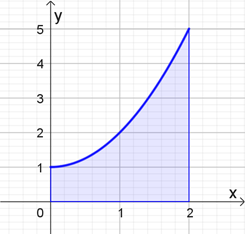
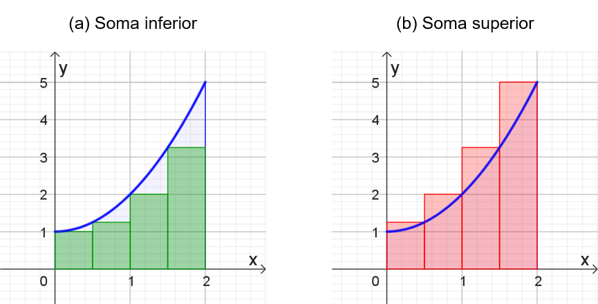
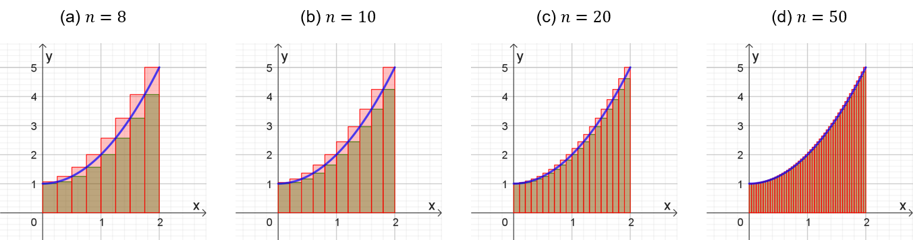

## Ponto de Partida

Estudante, desejamos a você boas-vindas ao estudo de mais um tópico vinculado ao Cálculo Diferencial e Integral! Nesta aula vamos explorar o conceito de integral, sendo uma das principais noções estudadas na área em questão.

Quando iniciamos os estudos acerca desse tema, observamos que o primeiro exemplo consiste no cálculo de área sob curvas. Esse recurso é adotado por favorecer a compreensão da definição formal de integral, via limites, além de ser uma das principais aplicações desse conceito. Com base nessa definição, vamos explorar as estratégias de cálculo das integrais, bem como um dos principais resultados da área em questão, chamado de Teorema Fundamental do Cálculo, e que permite uma articulação entre derivada e integral.

> Nesse sentido, para o aprofundamento nos estudos desse tema, vamos resolver a seguinte situação. Suponha que o lucro marginal de uma empresa, obtido a partir da fabricação e venda de furadeiras, seja descrito por:
>
> 𝑑⁢𝑓/𝑑⁢𝑥 = 1/(2⁢√𝑥)
>
> sendo 𝑓 dado em milhares de reais e 𝑥 em milhares de unidades. Qual lucro essa companhia deve obter com a produção de 𝑥 =4 mil furadeiras? Que conceitos são necessários para solucionar esse problema?

Dê continuidade aos seus estudos e conheça mais esse conceito matemático com suas propriedades.

---

## Vamos Começar!

Uma das motivações para o estudo das integrais é o cálculo de áreas de formatos diversos, mas que possam ser associadas ao gráfico de funções. Quando temos uma região com formato triangular, retangular ou algum outro formato cuja fórmula de área é conhecida, não temos dificuldade para efetuar o cálculo. Porém, quando temos outro tipo de região, o cálculo pode se tornar mais complexo. Por isso, o cálculo de integrais surge como uma estratégia para favorecer nesses e em outros tipos de contextos.

### Soma de Riemann e integrais definidas

Em nosso estudo, vamos considerar a função 𝑓 :[0,2] →ℝ definida por 𝑓⁡(𝑥) =𝑥2 +1, cujo gráfico é apresentado na Figura 1. Queremos estimar a área abaixo do gráfico da função 𝑓, acima do eixo 𝑥, limitada no intervalo [0,2], conforme região hachurada na Figura 1.

*Figura 1 | Gráfico da função 𝑓⁡(𝑥) =𝑥2 +1*

Para calcular a área em questão vamos utilizar o recurso de dividir a região em retângulos, de tal forma a obter uma aproximação para essa área. Assim, vamos dividir o intervalo [0,2] em quatro partes, com 𝑛 =4. Em cada parte, vamos aproximar a área por um retângulo por meio de dois casos diferentes:

- **𝐿𝑛:** as alturas são calculadas a partir do menor valor da função em cada intervalo. Por exemplo, a altura do retângulo no intervalo [0,1/2] será calculada como 𝑓⁡(0). Quando somamos as áreas desses retângulos obtemos um valor chamado de soma inferior. Veja a configuração presente na Figura 2(a).
- **𝑆𝑛:** as alturas são calculadas a partir do maior valor da função em cada intervalo. Por exemplo, a altura do retângulo no intervalo [0,1/2] será calculada como 𝑓⁡(1/2). Quando somamos as áreas desses retângulos obtemos um valor chamado de soma superior. Esse caso é apresentado na Figura 2(b).

*Figura 2 | Aproximação da área abaixo da função 𝑓⁡(𝑥) =𝑥2 +1*

Analisando a Figura 2(a), podemos observar que a soma inferior corresponde a um valor menor do que o valor correto da área, porque os retângulos não contemplam toda a área. Por outro lado, pela Figura 2(b), temos que a soma superior corresponde a um valor maior do que o valor exato da área, pois os retângulos contemplam uma área que supera a área real.

Como na Figura 2 foram contemplados apenas quatro retângulos para dividir a área, vejamos na Figura 3 a seguir o que acontece com a soma inferior (região em verde) e a soma superior (região em vermelho) quando aumentamos a quantidade de retângulos.

*Figura 3 | Cálculo da área limitada pela função 𝑓⁡(𝑥) =𝑥2 +1 utilizando retângulos*

Analisando a Figura 3, podemos observar que à medida que aumentamos a quantidade de retângulos, as somas inferior e superior se aproximam entre si e, consequentemente, do valor exato da área. Sendo assim, analisando do ponto de vista dos limites, quando fazemos 𝑛 →∞, isto é, aumentamos muito a quantidade de retângulos, então as somas inferior e superior tendem ao valor exato da área.

Com isso, podemos definir que a área da região 𝑆 que está abaixo do gráfico de uma função contínua 𝑓 é o limite das somas das áreas dos retângulos utilizados na aproximação, dado por 𝐴 = lim 𝑛→∞ ⁡∑[𝑖=1,𝑛] 𝑓⁡(𝑥𝑖)⁢Δ⁢𝑥. Nesse caso, Δ⁢𝑥 representa a medida da base e 𝑓⁡(𝑥𝑖) a altura de cada retângulo utilizado na subdivisão da área, já o somatório ∑[𝑖=1,𝑛] 𝑓⁡(𝑥𝑖)⁢Δ⁢𝑥 expressa a soma das áreas de todos os retângulos. Essa expressão caracteriza a integral definida da função 𝑓 no intervalo em que está definida.

Dessa forma, a integral definida de uma função contínua 𝑓, definida num intervalo [𝑎,𝑏], é dada por ∫[𝑎,𝑏] 𝑓⁡(𝑥)𝑑𝑥 = lim 𝑛→∞ ⁡∑[𝑖=1,𝑛] 𝑓⁡(𝑥𝑖)⁢Δ⁢𝑥, quando o limite existir. E se isso ocorrer, dizemos que 𝑓 é integrável em [𝑎,𝑏]. A notação ∫[𝑎,𝑏] 𝑓⁡(𝑥)𝑑𝑥 indica o cálculo da integral definida da função 𝑓 em relação à variável 𝑥 (por isso o termo 𝑑⁢𝑥) quando 𝑥 varia de 𝑎 até 𝑏. Esses valores 𝑎 e 𝑏 são chamados de limites de integração, enquanto 𝑓⁡(𝑥) representa o integrando dessa integral.

Quando definimos uma integral ∫[𝑎,𝑏] 𝑓⁡(𝑥)𝑑𝑥, estamos assumindo que 𝑎 <𝑏, mas podemos também identificar a seguinte propriedade: ∫[𝑎,𝑏] 𝑓⁡(𝑥)𝑑𝑥 =−∫[𝑏,𝑎] 𝑓⁡(𝑥)𝑑𝑥.

A integral definida de uma função, pela possibilidade de ser associada a uma área, por exemplo, indica que seu resultado deve ser numérico. Porém, na prática, para o cálculo de uma integral definida, não recorremos ao limite, mas a propriedades que são verificadas. Vejamos algumas delas:

- ∫[𝑎,𝑏] 𝑐 𝑑𝑥 =𝑐⁢(𝑏−𝑎), com 𝑐 ∈ℝ.
- ∫[𝑎,𝑏] 𝑐⁢𝑓⁡(𝑥)𝑑𝑥 =𝑐⁢∫[𝑎,𝑏] 𝑓⁡(𝑥)𝑑𝑥, com 𝑐 ∈ℝ.
- ∫[𝑎,𝑏] [𝑓⁡(𝑥)+𝑔⁡(𝑥)]𝑑𝑥 =∫[𝑎,𝑏] 𝑓⁡(𝑥)𝑑𝑥 +∫[𝑎,𝑏] 𝑔⁡(𝑥)𝑑𝑥.
- ∫[𝑎,𝑏] [𝑓⁡(𝑥)−𝑔⁡(𝑥)]𝑑𝑥 =∫[𝑎,𝑏] 𝑓⁡(𝑥)𝑑𝑥 −∫[𝑎,𝑏] 𝑔⁡(𝑥)𝑑𝑥.

O principal recurso que utilizamos no cálculo de integrais definidas é o teorema fundamental do cálculo, o qual veremos adiante.

---

## Siga em Frente...

### Teorema Fundamental do Cálculo

O Teorema Fundamental do Cálculo é um importante resultado que possibilita o cálculo de integrais definidas, além de possibilitar uma conexão entre os conceitos de derivada e integral, centrais no campo do Cálculo Diferencial e Integral. Esse resultado é apresentado em duas partes, vejamos a primeira delas a seguir.

> **Teorema Fundamental do Cálculo – Parte 1:** Se 𝑓 é uma função contínua em [𝑎,𝑏], então a função 𝑔 definida como 𝑔'⁡(𝑥) =∫[𝑎,𝑥] 𝑓⁡(𝑡)𝑑𝑡, com 𝑎 ≤𝑥 ≤𝑏, é contínua em [𝑎,𝑏], derivável em (𝑎,𝑏) e 𝑔'⁡(𝑥) =𝑓⁡(𝑥).

Assim, a primeira parte do teorema discute a existência de uma outra função além da 𝑓 em estudo. Essa função 𝑔⁡(𝑥), cuja derivada faz parte do teorema, é chamada de antiderivada ou primitiva da função 𝑓. Note que essa função é tal que sua derivada coincide com a função 𝑓.

Por exemplo, note que a função 𝑔⁡(𝑥) =𝑥3 é uma primitiva ou antiderivada de (𝑥) =3⁢𝑥2, porque 𝑔'⁡(𝑥) =3⁢𝑥2 =𝑓⁡(𝑥). Com isso, podemos estabelecer uma associação entre as derivadas e as integrais.

Prossigamos agora para a parte 2 do teorema em discussão.

> **Teorema Fundamental do Cálculo – Parte 2:** Se 𝑓 é uma função contínua em [𝑎,𝑏], então ∫[𝑎,𝑏] 𝑓⁡(𝑥)𝑑𝑥 =𝐹⁡(𝑏) −𝐹⁡(𝑎), onde 𝐹 é qualquer primitiva de 𝑓, ou seja, uma função tal que 𝐹' =𝑓.

Perceba que o cálculo da integral definida de uma função depende da primitiva associada a ela, mais especificamente das imagens da primitiva nos extremos do intervalo que representa os limites de integração.

Por exemplo, queremos calcular a integral ∫[0,1] 3⁢𝑥2𝑑𝑥. Como uma primitiva de 𝑓 é a função 𝐹⁡(𝑥) =𝑥3 então pela parte 2 do Teorema Fundamental do Cálculo temos que:

> ∫[0,1] 3⁢𝑥2𝑑𝑥 =𝑥3|[0,1] =13 −03 =1

A expressão 𝑥3|[0,1] no cálculo da integral representa, de forma sintetizada, que precisamos calcular 𝐹⁡(1) −𝐹⁡(0) quando 𝐹⁡(𝑥) =𝑥3. Observe também que o resultado da integral é um número, porque estamos tratando de uma integral definida. Podemos interpretar esse valor como a área sob o gráfico de 𝑓⁡(𝑥) =3⁢𝑥2, acima do eixo 𝑥 e no intervalo [0,1].

Para simplificar os cálculos envolvendo as primitivas, podemos empregar uma notação chamada de integral indefinida. A integral indefinida de 𝑓 é denotada por ∫𝑓⁡(𝑥)𝑑𝑥 e representa a primitiva da função 𝑓. Nesse caso, ∫𝑓⁡(𝑥)𝑑𝑥 =𝐹⁡(𝑥) implica dizer que 𝐹'⁡(𝑥) =𝑓⁡(𝑥). No caso do exemplo anterior, podemos escrever:

> ∫3⁢𝑥2𝑑𝑥 =𝑥3 +𝐶, porque 𝑑/𝑑⁢𝑥⁢(𝑥3+𝐶) =3⁢𝑥2

A integral indefinida representa uma família de funções que são primitivas da função em estudo, diferenciando-se umas das outras por uma constante 𝐶.

Assim, a integral definida ∫[𝑎,𝑏] 𝑓⁡(𝑥)𝑑𝑥 é dada por um número, enquanto a integral indefinida ∫𝑓⁡(𝑥)𝑑𝑥 representa uma família de funções. Por isso, sempre que calculamos uma integral indefinida de uma função, devemos acrescentar uma constante 𝐶 qualquer à expressão para considerar todas as várias funções da família em estudo.

Vejamos um outro exemplo. Queremos calcular a integral ∫[0,𝜋] 𝑠⁢𝑒⁢𝑛⁡(𝑥)𝑑𝑥. Assim, pelo Teorema Fundamental do Cálculo, precisamos determinar uma primitiva de 𝑓⁡(𝑥) =𝑠⁢𝑒⁢𝑛⁡(𝑥), que corresponde a uma função cuja derivada é 𝑓. Nesse caso, temos que se 𝑔⁡(𝑥) =−cos⁡(𝑥) então 𝑔'⁡(𝑥) =−(−𝑠⁢𝑒⁢𝑛⁡(𝑥)) =𝑠⁢𝑒⁢𝑛⁡(𝑥). Logo,

> ∫[0,𝜋] 𝑠⁢𝑒⁢𝑛⁡(𝑥)𝑑𝑥 =−cos⁡(𝑥)|[0,𝜋] =−cos⁡(𝜋) −[−cos⁡(0)] =−(−1) +1 =1 +1 =2

Dessa forma, perceba que o conhecimento das funções e suas derivadas é importante para o estudo das integrais, pela associação estabelecida a partir do Teorema Fundamental do Cálculo.

Confira na Tabela 1 a seguir algumas fórmulas de integração, sabendo que elas provêm da relação com a primitiva correspondente.

| | |
|---|---|
| ∫1𝑑𝑥 =𝑥 +𝐶 | ∫𝑥𝑟𝑑𝑥 =𝑥𝑟+1/(𝑟+1) +𝐶, 𝑟 ≠−1 |
| ∫1/𝑥 =ln⁡\|𝑥\| +𝐶 | ∫𝑒𝑥𝑑𝑥 =𝑒𝑥 +𝐶 |
| ∫𝑏𝑥𝑑𝑥 =𝑏𝑥/ln⁡𝑏 +𝐶, 𝑏 >0 e 𝑏 ≠1 | ∫𝑠⁢𝑒⁢𝑛⁡(𝑥)𝑑𝑥 =−cos⁡(𝑥) +𝐶 |
| ∫cos⁡(𝑥)𝑑𝑥 =𝑠⁢𝑒⁢𝑛⁡(𝑥) +𝐶 | ∫sec2⁡(𝑥)𝑑𝑥 =𝑡⁢𝑔⁡(𝑥) +𝐶 |
| ∫𝑐⁡𝑜⁢𝑠⁢𝑠⁢𝑒⁢𝑐2⁡(𝑥)𝑑𝑥 =−𝑐⁡𝑜⁢𝑡⁢𝑔⁡(𝑥) +𝐶 | ∫sec⁡(𝑥)⁢𝑡⁢𝑔⁡(𝑥)𝑑𝑥 =sec⁡(𝑥) +𝐶 |

*Tabela 1 | Fórmulas de integração. Fonte: Stewart, Clegg e Watson (2021, p. 324).*

Podemos ainda adotar as seguintes simplificações:

> ∫1𝑑𝑥 =∫𝑑𝑥 e ∫1/𝑥 𝑑𝑥 =∫𝑑𝑥/𝑥

A Tabela 1 apresenta alguns dos principais resultados envolvendo as integrais, mas existem vários outros que podem ser estudados, inclusive utilizando as propriedades já apresentadas para as integrais definidas, e que também podem ser adaptadas para o caso das indefinidas.

Veja alguns exemplos de aplicações dos resultados da Tabela 1.

> ∫𝑥2𝑑𝑥 =𝑥3/3 +𝐶
>
> ∫2/𝑥5 𝑑𝑥 =2⁢∫1/𝑥5 𝑑𝑥 =2⁢∫𝑥−5𝑑𝑥 =2⁢𝑥−5+1/(−5+1) +𝐶 =2⁢𝑥−4/(−4) +𝐶 =−1/2⁢𝑥−4 +𝐶 =−1/(2⁢𝑥4) +𝐶
>
> ∫[𝑠⁢𝑒⁢𝑛⁡(𝑥)−2⁢cos⁡(𝑥)]𝑑𝑥 =∫𝑠⁢𝑒⁢𝑛⁡(𝑥)𝑑𝑥 −∫2⁢cos⁡(𝑥)𝑑𝑥 =∫𝑠⁢𝑒⁢𝑛⁡(𝑥)𝑑𝑥 −2⁢∫cos⁡(𝑥)𝑑𝑥=[−cos⁡(𝑥)+𝐶1] +[2⁢𝑠⁢𝑒⁢𝑛⁡(𝑥)+𝐶] =−cos⁡(𝑥) +2⁢𝑠⁢𝑒⁢𝑛⁡(𝑥) +𝐶

Na expressão anterior, note que apesar de dividirmos a integral em outras duas, gerando constantes 𝐶1 e 𝐶2, podemos unificá-las em uma constante 𝐶 única. Assim, mesmo que façamos a divisão do cálculo da integral em partes, podemos identificar uma única constante 𝐶 ao final.

O estudo das integrais envolve, além de suas características e propriedades específicas, conceitos relativos a derivadas, devido à relação estabelecida entre esses conceitos por intermédio do Teorema Fundamental do Cálculo. Por isso, é essencial estabelecer uma correspondência entre esses conceitos para que seja possível aplicá-los na resolução de problemas práticos.

---

## Vamos Exercitar?

Retornemos ao problema da empresa fabricante de furadeiras. Sabemos que o lucro marginal de uma empresa, obtido a partir da fabricação e venda do produto é dado por:

> 𝑑⁢𝑓/𝑑⁢𝑥 = 1/(2⁢√𝑥)

O lucro marginal corresponde à taxa de variação do lucro em relação à produtividade. Mas nosso objetivo está direcionado ao lucro, e não ao lucro marginal. Por isso, não podemos utilizar essa função diretamente, mas precisamos resgatar a função lucro a partir da função dada.

Temos que derivação e integração são operadores inversos um do outro. Além disso, quando calculamos a integral de 𝑑⁢𝑓/𝑑⁢𝑥, com 𝑥 variando de 0 a 3, poderemos determinar o lucro obtido com a produção de 3 mil unidades.

Dessa forma,

> ∫[0,3] 𝑑⁢𝑓/𝑑⁢𝑥 𝑑𝑥 =∫[0,3] 1/(2⁢√𝑥) 𝑑𝑥 =1/2⁢∫[0,3] 𝑥−1/2 𝑑𝑥 =1/2⁢[𝑥−1/2+1/(−1/2+1)]|[0,3] =1/2⁢[𝑥1/2/(1/2)]|[0,3] =[√𝑥]|[0,3] =√3 −√0 ≈1,73

**Portanto, o lucro obtido com a produção de 3 mil unidades será de aproximadamente 1730 reais.**
