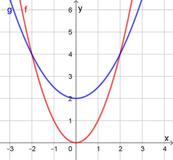
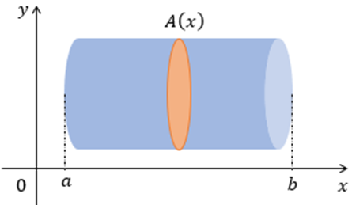
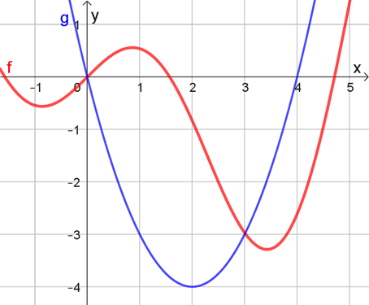

## Ponto de Partida

Desejamos a você boas-vindas! Nesta aula concluiremos o estudo das integrais de funções de uma variável real explorando técnicas de integração e algumas aplicações.

As integrais e as derivadas podem ser associadas entre si principalmente por meio do Teorema Fundamental do Cálculo. Algumas integrais podem ser calculadas de forma imediata, desde que seja possível reconhecer sua primitiva a priori, enquanto outras exigem uma análise mais aprofundada. Por isso, existem algumas técnicas que podem contribuir quando observamos a ocorrência da segunda situação.

> Nesse sentido, com o intuito de aplicar os conhecimentos estudados, considere as funções reais 𝑓⁡(𝑥) =𝑥 ⋅cos⁡(𝑥) e 𝑔⁡(𝑥) =𝑥2 −4⁢𝑥. Avaliando o comportamento dessas duas funções, podemos afirmar que elas possuem pontos de interseção quando 𝑥 =0 e 𝑥 =3, aproximadamente.
>
> Diante dessas informações, como podemos calcular a área da região limitada entre os gráficos dessas duas funções? Que conceitos são necessários para solucionar esse problema?

Prossiga em seus estudos para que possa identificar a solução para essa problemática.

---

## Vamos Começar!

Uma integral definida é dada, por definição, a partir do limite de somas de Riemann, cuja interpretação pode ser dada como uma estratégia para o cálculo da área de sob gráficos de funções utilizando aproximações via área de retângulos. Em conjunto com as derivadas, as integrais fazem parte de conceitos centrais do Cálculo Diferencial e Integral.

Mesmo que a principal motivação para a construção do conceito de integrais seja o cálculo de áreas, existem outras aplicações para esse conceito, possibilitando seu emprego na resolução de problemas de diversas áreas do conhecimento.

Existem algumas funções cujas integrais são calculadas diretamente, por serem funções tabeladas, dizemos que são integrais imediatas. Outras podem ser calculadas por meio de propriedades, associadas às integrais imediatas. Porém, em alguns casos precisamos empregar técnicas específicas, dentre as quais podemos destacar a integração por substituição e a integração por partes. Confira os detalhes dessas técnicas a seguir.

### Integração por substituição

Suponha que você precisa calcular uma integral que possa ser representada na forma:

> ∫𝑓⁡(𝑔⁡(𝑥))⁢𝑔'⁡(𝑥)𝑑𝑥

Perceba que no integrando temos uma função composta 𝑓⁡(𝑔⁡(𝑥)), além da derivada de 1ª ordem da função 𝑔⁡(𝑥). Para resolver essa integral podemos aplicar uma mudança de variável na forma 𝑢 =𝑔⁡(𝑥), então 𝑑⁢𝑢 =𝑔'⁡(𝑥)⁢𝑑⁢𝑥, donde segue que:

> ∫𝑓⁡(𝑔⁡(𝑥))⁢𝑔'⁡(𝑥)𝑑𝑥 é equivalente a ∫𝑓⁡(𝑢)𝑑𝑢 =𝐹⁡(𝑢) +𝐶

Essa estratégia é denominada método da substituição e vinculada à regra da cadeia para funções diferenciáveis e compostas.

Vejamos, por exemplo, a integral ∫(𝑥2+1)25⁢2⁢𝑥𝑑𝑥. Nesse caso, temos uma função composta no integrando: 𝑓⁡(𝑔⁡(𝑥)) =(𝑥2+1)25. Como 𝑔⁡(𝑥) =𝑥2 +1, perceba que 𝑔'⁡(𝑥) =2⁢𝑥, que também está presente no integrando. Dessa forma, aplicando a mudança de variável 𝑢 =𝑥2 +1, com 𝑑⁢𝑢 =2⁢𝑥⁢𝑑⁢𝑥, teremos:

> ∫(𝑥2+1)25⁢2⁢𝑥𝑑𝑥 =∫𝑢25𝑑𝑢 =𝑢26/26 +𝐶 =(𝑥2+1)26/26 +𝐶

A técnica da integração por substituição pode ser aplicada somente quando temos integrandos na forma 𝑓⁡(𝑔⁡(𝑥))⁢𝑔'⁡(𝑥), isto é, é necessária a presença da derivada de 𝑔⁡(𝑥). Ainda, ela pode ser empregada tanto em integrais definidas quanto indefinidas, mas no primeiro caso precisamos fazer ajustes nos limites de integração ou calcular a integral em duas etapas.

Vejamos o exemplo da integral dada por ∫[2,3] 1/(𝑥−1) 𝑑𝑥. Note que se 𝑢 =𝑥 −1 então 𝑑⁢𝑢 =1 ⋅𝑑⁢𝑥 =𝑑⁢𝑥, logo, podemos aplicar a técnica da integração por substituição. Porém, precisamos considerar alterações nos limites de integração. Nesse caso:

> 𝑥 =2 ⇒𝑢 =2 −1 =1
>
> 𝑥 =3 ⇒𝑢 =3 −1 =2

Sendo assim,

> ∫[2,3] 1/(𝑥−1) 𝑑𝑥 =∫[1,2] 1/𝑢 𝑑𝑢 =ln⁡|𝑢||[1,2] =ln⁡2 −ln⁡1 =ln⁡2

Podemos, ainda, ao invés de fazer as modificações nos limites de integração, efetuar o cálculo da integral indefinida associada, ∫1/(𝑥−1) 𝑑𝑥, obtendo uma primitiva, e utilizando-a no cálculo da integral definida. Nesse caso, como ∫1/(𝑥−1) 𝑑𝑥 =∫1/𝑢 𝑑𝑢 =ln⁡|𝑢| +𝐶 =ln⁡|𝑥−1| +𝐶, resolvida pelo método da substituição, podemos adotar a primitiva como a função ln⁡|𝑥−1|, considerando 𝐶 =0. Sendo assim,

> ∫[2,3] 1/(𝑥−1) 𝑑𝑥 =ln⁡|𝑥−1||[2,3] =ln⁡(3−1) −ln⁡(2−1) =ln⁡2 −ln⁡1 =ln⁡2

Em ambos os casos empregamos o processo de integração por substituição e podemos obter o mesmo resultado.

Confira a seguir o método da integração por partes, que consiste em outro método no cálculo de integrais não imediatas.

### Integração por partes

Existem algumas integrais nas quais não conseguimos aplicar a substituição, mas que também não podem ser calculadas diretamente. Quando percebemos um produto de funções no integrando, podemos explorar uma outra técnica de integração, denominada integração por partes.

Na integração por partes efetuamos o cálculo da integral por meio da uma expressão da seguinte forma:

> ∫𝑓'⁡(𝑥)⁢𝑔⁡(𝑥)𝑑𝑥 =𝑓⁡(𝑥) ⋅𝑔⁡(𝑥) −∫𝑓⁡(𝑥)⁢𝑔'⁡(𝑥)𝑑𝑥

De forma simplificada, podemos representar a fórmula anterior como:

> ∫𝑢𝑑𝑣 =𝑢 ⋅𝑣 −∫𝑣𝑑𝑢

A ideia central dessa técnica é converter a integral ∫𝑢𝑑𝑣 em uma integral ∫𝑣𝑑𝑢 que possa ser calculada de forma mais simples, seja de forma imediata ou utilizando alguma outra técnica.

Vamos aplicar essa estratégia para o cálculo de ∫𝑥⁢𝑒𝑥𝑑𝑥. Nesse caso, como queremos tornar essa integral em uma outra mais simples, vamos adotar 𝑣 =𝑥 e, assim, 𝑑⁢𝑣 =1 ⋅𝑑⁢𝑥 =𝑑⁢𝑥. Ainda, se 𝑑⁢𝑣 =𝑒𝑥⁢𝑑⁢𝑥 então 𝑣 =∫𝑒𝑥𝑑𝑥 =𝑒𝑥 +𝐶. Como desejamos uma primitiva apenas, vamos adotar 𝑣 =𝑒𝑥. Assim, pela integração por partes:

> ∫𝑥⁢𝑒𝑥𝑑𝑥 =𝑥 ⋅𝑒𝑥 −∫𝑒𝑥𝑑𝑥 =𝑥⁢𝑒𝑥 −𝑒𝑥 +𝐶

Perceba que o cálculo da integral ∫𝑒𝑥𝑑𝑥 é mais simples do que o de ∫𝑥⁢𝑒𝑥𝑑𝑥, por ser uma integral imediata.

Em algumas situações precisamos empregar a integração por partes repetidas vezes até obter o resultado da integral. Isso ocorre quando calculamos, por exemplo, a integral ∫𝑥2⁢𝑒𝑥𝑑𝑥. Quando aplicamos a técnica pela primeira vez obtemos:

> ∫𝑥2⁢𝑒𝑥𝑑𝑥 =𝑥2 ⋅𝑒𝑥 −∫𝑒𝑥⁢2⁢𝑥𝑑𝑥 =𝑥2⁢𝑒𝑥 −2⁢∫𝑥⁢𝑒𝑥𝑑𝑥

Para concluir o processo, devemos agora calcular a integral ∫𝑥⁢𝑒𝑥𝑑𝑥, que foi avaliada anteriormente e cujo resultado é 𝑥⁢𝑒𝑥 −𝑒𝑥 +𝐶. Assim,

> ∫𝑥2⁢𝑒𝑥𝑑𝑥 =𝑥2⁢𝑒𝑥 −2⁢(𝑥⁢𝑒𝑥−𝑒𝑥+𝐶) =𝑥2⁢𝑒𝑥 −2⁢𝑥⁢𝑒𝑥 +2⁢𝑒𝑥 −2⁢𝐶 =𝑥2⁢𝑒𝑥 −2⁢𝑥⁢𝑒𝑥 +2⁢𝑒𝑥 +𝐾

Podemos substituir a constante −2⁢𝐶 por uma outra representação 𝐾 para simplificar a escrita. Nesse caso, aplicando duas vezes a técnica de integração por partes podemos obter o resultado. Isso ocorre porque as duas integrais avaliadas podem ser encaixadas no perfil da técnica em questão.

Assim, articulando diferentes estratégias, podemos efetuar o cálculo das integrais definidas e indefinidas, adaptando para a estrutura de cada tipo de integral.

A seguir, vamos explorar o cálculo da área entre curvas via integrais.

---

## Siga em Frente...

### Área entre curvas

Considere as funções reais dadas por 𝑓⁡(𝑥) =𝑥2 e 𝑔⁡(𝑥) =1/2⁢𝑥2 +2, representadas na Figura 1 em um mesmo plano cartesiano. Nosso objetivo é calcular a área limitada entre os gráficos dessas duas funções, sendo a região acima do gráfico da função 𝑓 e abaixo do gráfico de 𝑔, tendo como referência as integrais e suas propriedades.

*Figura 1 | Gráficos das funções 𝑓⁡(𝑥) =𝑥2 e 𝑔⁡(𝑥) =1/2⁢𝑥2 +2*

Graficamente, podemos observar que os gráficos de 𝑓 e 𝑔 possuem interseção nos pontos 𝑥 =−2 e 𝑥 =2. Podemos obter essa relação por meio da igualdade entre suas leis de formação:

> 𝑥2 =1/2⁢𝑥2 +2 ⇒1/2⁢𝑥2 =2 ⇒𝑥2 =4 ⇒𝑥 =±2

Para o cálculo da área podemos utilizar a integral:

> 𝐴 =∫[−2,2] (𝑔⁡(𝑥)−𝑓⁡(𝑥))𝑑𝑥 =∫[−2,2] [(1/2⁢𝑥2+2)−𝑥2]𝑑𝑥 =∫[−2,2] (−1/2⁢𝑥2+2)𝑑𝑥 =[(−1/2)⁢𝑥3/3+2⁢𝑥]|[−2,2]=[−𝑥3/6+2⁢𝑥]|[−2,2] =−23/6 +2 ⋅2 −(−(−2)3/6+2⁢(−2)) =−8/6 +4 −8/6 +4 =−8/3 +8=16/3 ⁢u.a.

Assim, para o cálculo da integral associada à área entre curvas, no integrando devemos indicar a diferença entre as funções, e nos limites de integração os extremos da região que contempla a área a ser calculada.

Podemos encontrar, em algumas situações, funções 𝑓 e 𝑔 nas quais 𝑓⁡(𝑥) ≥𝑔⁡(𝑥) em algumas regiões e 𝑓⁡(𝑥) ≤𝑔⁡(𝑥) em outras regiões, como é o caso da Figura 2. Para contemplar essas regiões também, podemos definir a área entre as curvas 𝑓⁡(𝑥) e 𝑔⁡(𝑥), no intervalo 𝑥 =𝑎 a 𝑥 =𝑏, como:

> 𝐴 =∫[𝑎,𝑏] |𝑓⁡(𝑥)−𝑔⁡(𝑥)|𝑑𝑥

*Figura 2 | Área entre curvas com funções que se alternam*

Com a inclusão do módulo, podemos efetuar um único cálculo, mesmo que haja alternância entre as duas funções no intervalo em estudos.

Além do cálculo de áreas, vejamos outros exemplos de aplicações das integrais de funções de uma variável real.

### Outras aplicações

Uma outra aplicação do conceito de integral é o cálculo de volumes de sólidos de revolução. Para isso, seja um sólido que está entre 𝑥 =𝑎 e 𝑥 =𝑏. A partir da seção transversal desse sólido no plano 𝑃, perpendicular ao eixo 𝑥 e passando pelo ponto 𝑥, sabendo que 𝐴⁡(𝑥) é a área dessa seção transversal, com 𝐴 uma função contínua, então o volume desse sólido é:

> 𝑉 =∫[𝑎,𝑏] 𝐴⁡(𝑥)𝑑𝑥

Na Figura 3 a seguir temos uma ilustração associada ao cálculo de volume de sólido de revolução a partir de integrais. Nesse caso, temos o volume de um cilindro, mas pode ser um sólido qualquer, desde que seja possível fazer recortes no sólido, de forma perpendicular ao eixo 𝑥, e descrever a área da seção obtida por meio de uma função contínua 𝐴⁡(𝑥).

*Figura 3 | Volume de sólido de revolução*

Outra aplicação envolve o cálculo de trabalho vinculado a uma força. Nesse caso, o trabalho realizado por uma força para mover um objeto, ao longo do eixo 𝑥, de 𝑥 =𝑎 até 𝑥 =𝑏, sendo a magnitude da força dada por 𝐹⁡(𝑥), é dado por:

> 𝑊 =∫[𝑎,𝑏] 𝐹⁡(𝑥)𝑑𝑥

Esse conceito de força também pode ser avaliado no contexto dos fluidos, considerando a força do fluido sobre uma superfície horizontal. Ainda, podemos aplicar as integrais no estudo da relação entre deslocamento, velocidade e aceleração, bem como no reconhecimento de momentos, centros de gravidade e centroides, entre outros, além de favorecer o trabalho com as funções marginais e as funções originais correspondentes, vinculadas ao contexto econômico, devido à sua associação com as derivadas.

As integrais possuem algumas aplicações próprias, porém, também enriquece o trabalho com as derivadas, visto que podemos relacionar derivadas e integrais como operadores inversos, podendo ser associadas entre si com o intuito de resolver problemas oriundos dos mais variados contextos.

---

## Vamos Exercitar?

Vamos calcular a área definida entre os gráficos das funções reais 𝑓⁡(𝑥) =𝑥 ⋅cos⁡(𝑥) e 𝑔⁡(𝑥) =𝑥2 −4⁢𝑥. Confira o comportamento gráfico dessas duas funções na Figura 4.

*Figura 4 | Gráficos das funções reais 𝑓⁡(𝑥) =𝑥 ⋅cos⁡(𝑥) e 𝑔⁡(𝑥) =𝑥2 −4⁢𝑥*

Para determinar essa área, vamos calcular a integral a seguir, utilizando a propriedade da soma de integrais definidas:

> ∫[0,3] (𝑓⁡(𝑥)−𝑔⁡(𝑥))𝑑𝑥 =∫[0,3] [(𝑥⁢cos⁡(𝑥))−(𝑥2−4⁢𝑥)]𝑑𝑥 =∫[0,3] 𝑥⁢cos⁡(𝑥)𝑑𝑥 −∫[0,3] (𝑥2−4⁢𝑥)𝑑𝑥

Utilizando a integração por partes na primeira integral, considerando 𝑢 =𝑥 e 𝑑⁢𝑣 =cos⁡(𝑥)⁢𝑑⁢𝑥, então 𝑑⁢𝑢 =𝑑⁢𝑥 e 𝑣 =𝑠⁢𝑒⁢𝑛⁡(𝑥). Logo, da integral indefinida, segue que:

> ∫𝑥⁢cos⁡(𝑥)𝑑𝑥 =𝑥⁢𝑠⁢𝑒⁢𝑛⁡(𝑥) −∫𝑠⁢𝑒⁢𝑛⁡(𝑥)𝑑𝑥 =𝑥 ⋅𝑠⁢𝑒⁢𝑛⁡(𝑥) +cos⁡(𝑥) +𝐶

Ainda, sabemos que:

> ∫(𝑥2−4⁢𝑥)𝑑𝑥 =𝑥3/3 −4⁢𝑥2/2 +𝐾 =𝑥3/3 −2⁢𝑥2 +𝐾

Logo,

> ∫[0,3] 𝑥⁢cos⁡(𝑥)𝑑𝑥 −∫[0,3] (𝑥2−4⁢𝑥)𝑑𝑥 =[𝑥⋅𝑠⁢𝑒⁢𝑛⁡(𝑥)+cos⁡(𝑥)]|[0,3] −[𝑥3/3−2⁢𝑥2]|[0,3]=3 ⋅𝑠⁢𝑒⁢𝑛⁡(3) +cos⁡(3) −0 −cos⁡(0) −(33/3−2⋅32−0) ≈7,43

**Portanto, a área é de aproximadamente 7,43 unidades de área**, o que conclui a solução do problema.
