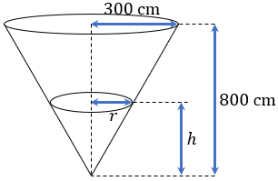
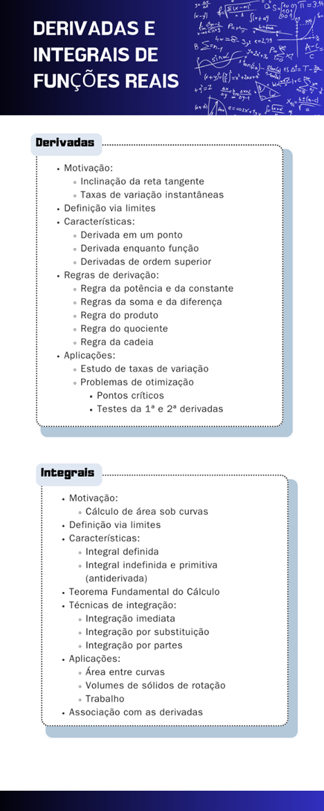

## Ponto de Chegada

Para desenvolver a competência desta Unidade, que é compreender os conceitos relacionados a derivadas e integrais, bem como reconhecer situações que podem ser interpretadas e analisadas por meio desses conceitos, você deverá reconhecer basicamente os conceitos de derivada e integral de funções reais, bem como as especificidades de cada um.

A derivada de uma função, que pode ser entendida do ponto de vista de valor real ou de função, pode ser entendida como uma taxa de variação da função, noção esta que pode ser aplicada em diferentes situações, desde problemas envolvendo retas até contextos econômicos. Assim, uma derivada é definida por meio de um limite, no entanto, para aplicação prática, usualmente recorremos às regras de derivação para o cálculo das derivadas de funções, sejam as de 1ª ordem ou de ordem superior.

Associado a esse tema, temos a aplicação das derivadas no estudo de problemas de otimização, os quais são usualmente associados a problemas que envolvem a identificação das melhores soluções em cada contexto. Nesse caso, partindo de um modelo matemático, descrito na forma de função, podemos, por intermédio de suas derivadas, identificar propriedades das funções que podem responder ao problema real correspondente.

Em relação ao conceito de integral, é importante destacar que ele é definido a partir de um limite, no entanto, o seu cálculo, na prática, é feito com base em integrais conhecidas previamente, chamadas de integrais imediatas, ou em técnicas de integração. Quando estamos diante de integrais definidas, recorremos ao Teorema Fundamental do Cálculo, e quando se trata de integrais indefinidas, o cálculo é feito visando a identificação de uma primitiva para a função em estudo. No estudo das integrais, precisamos reconhecer a associação com o conceito de derivada, pois é a partir dele que podemos identificar as primitivas e, assim, efetuar o cálculo das integrais corretamente.

> **Reflita**
> - Quando devemos aplicar cada uma das regras de derivação na determinação da derivada de uma função?
> - Quais são os conceitos envolvendo derivadas que permitem a resolução de problemas de otimização?
> - Como podemos efetuar o cálculo de uma integral definida e de uma integral indefinida?

---

## É Hora de Praticar!

Sabemos que as derivadas podem ser associadas, entre outros, ao estudo de taxas de variação de funções em diferentes contextos. Ainda, nesse caso, quando precisamos determinar as derivadas, é necessário empregar as regras corretamente.

Nesse sentido, considere que um reservatório de água possui o formato de um cone circular reto invertido com 8 metros de altura e o diâmetro no topo corresponde a 6 metros.

Está escoando água desse reservatório a uma taxa de 10 000 cm³/min a partir de uma torneira localizada em sua parte inferior. Além disso, ao mesmo tempo, a água está sendo bombeada para dentro desse reservatório a uma taxa constante.

Para que o nível da água suba a uma taxa de 20 cm/min quando a altura for 2 m, qual deve ser a taxa segundo a qual a água está sendo bombeada para dentro desse reservatório?

> **Reflita**
> De que forma o conceito de derivada pode contribuir para a solução dessa problemática?

### Resolução do Estudo de Caso

Vamos elencar algumas informações importantes acerca do problema:

- O reservatório tem o formato de um cone circular reto invertido com 8 m de altura, ou 800 cm, e 3 m, ou 300 cm, de raio da base localizada na parte superior.
- O vazamento de água do reservatório ocorre a uma taxa de 10 000 cm³/min.
- Água está sendo bombeada para o interior do reservatório a uma taxa constante.
- A taxa de variação do nível, ou altura, da água no reservatório é de 20 cm/min.
- A incógnita corresponde à taxa segundo a qual a água está sendo bombeada para dentro desse reservatório quando a altura é de 2 m, ou 200 cm.

Podemos também representar as seguintes variáveis como: 𝑉 é o volume da água no reservatório, ℎ é a altura da água no reservatório, 𝑟 é o raio da base da água no reservatório e 𝑇 é a taxa segundo a qual a água está sendo bombeada para dentro do reservatório.

Se a água assume o formato, dentro do reservatório, de um cone circular reto de altura ℎ e raio 𝑟, então o volume de água pode ser dado por 𝑉 =1/3⁢𝜋⁢𝑟2⁢ℎ. Na Figura 1 é apresentado um esboço para o formato do reservatório e, a partir da semelhança entre triângulos, temos 300/𝑟 = 800/ℎ, ou ainda, 𝑟 =3⁢ℎ/8. Substituindo essa relação na expressão do volume do cone então:

> 𝑉 =1/3⁢𝜋⁡(3⁢ℎ/8)2⁢ℎ =1/3⁢𝜋⁡(9⁢ℎ2/64)⁢ℎ =3/64⁢𝜋⁡ℎ3

Assim, o volume do cone será dado em função da altura como 𝑉 =3/64⁢𝜋⁢ℎ3.

*Figura 1 | Esboço para o reservatório de água*

Pela regra da cadeia temos que:

> 𝑑⁢𝑉/𝑑⁢𝑡 = 𝑑⁢𝑉/𝑑⁢ℎ ⋅𝑑⁢ℎ/𝑑⁢𝑡 = 3/64⁢𝜋⁡(3⁢ℎ2)⁢𝑑⁢ℎ/𝑑⁢𝑡 = 9/64⁢𝜋⁡ℎ2⁡𝑑⁢ℎ/𝑑⁢𝑡

Do problema sabemos que 𝑑⁢ℎ⁡/𝑑⁢𝑡 =20 cm/min e queremos a taxa de variação para ℎ =200, sendo assim:

> 𝑑⁢𝑉/𝑑⁢𝑡 = 9/64⁢𝜋⁢ℎ2⁡𝑑⁢ℎ/𝑑⁢𝑡 ⇒𝑑⁢𝑉/𝑑⁢𝑡 = 9/64⁢𝜋⁢(200)2 ⋅20 =112500⁢𝜋

Assim, a taxa de variação do volume é de 112⁢500⁢𝜋 cm³/min. Como a taxa de variação do volume consiste na diferença entre a taxa de água que está sendo bombeada para dentro do reservatório e o volume que escapa pela torneira então:

> 112⁢500⁢𝜋 =𝑇 −10⁢000 ⇒𝑇 =112⁢500⁢𝜋 +10⁢000 ≈363⁢429,17

**Portanto, a taxa segundo a qual a água está sendo bombeada para dentro do reservatório é de aproximadamente 363 429,17 cm³/min.**

### Assimile

Dos principais conceitos do campo do Cálculo Diferencial e Integral, podemos destacar as derivadas e as integrais de funções de uma variável real. Cada um desses conceitos está vinculado a propriedades específicas, bem como técnicas de cálculo e aplicações, porém, eles estão intimamente ligados porque podem ser considerados como operadores inversos um do outro. Assim, no infográfico a seguir você poderá encontrar os principais tópicos de estudo associados a cada um desses conceitos, sendo um referencial no estudo dessa parte da disciplina. Complemente esse infográfico com as principais fórmulas, conceitos e exemplos, reconhecendo as especificidades de cada conceito, bem como as relações existentes entre eles.

### Referências

ANTON, H. et al. Cálculo. v. 1. 10. ed. Porto Alegre: Bookman, 2014.

ÁVILA, G. S. de S.; ARAÚJO, L. C. L. de. Cálculo: ilustrado, prático e descomplicado. Rio de Janeiro: LTC, 2012.

GUIDORIZZI, H. L. Um curso de cálculo. v. 1. 6. ed. Rio de Janeiro: LTC, 2018.

ROGAWSKI, J.; ADAMS, C. Cálculo. v. 1. 3. ed. Porto Alegre: Bookman, 2018.

STEWART, J.; CLEGG, D.; WATSON, S. Cálculo. v. 1. São Paulo: Cengage Learning Brasil, 2021.
