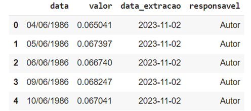

# Exercícios de Revisão — Unidade 3

## Questão 1 ✅

Observe o exemplo:

```python
import pandas as pd

dados = {
    'Produto': ['A', 'B', 'C'],
    'qtde_vendida': [33, 50, 45]
    }

df = pd.DataFrame(dados)
df.plot(x='Produto', y='qtde_vendida', kind='!!!')
```

**Pergunta:** No exemplo fornecido, se eu desejo um gráfico de barras, qual parâmetro devo utilizar no lugar do "!!!"?

**Resposta assinalada:** `bar` ✅

**Comentário:**
- A: Errada: o parâmetro "barras" não existe no Pandas.
- B: Errada: `pie` é o parâmetro para gráfico de pizza.
- C: Errada: `line` é o parâmetro para gráfico de linhas.
- **D: `bar` é o parâmetro correto para o gráfico de barras.**
- E: Errada: "pizza" não é parâmetro no Pandas.

## Questão 2 ✅

Os métodos de leitura de dados estruturados no pandas têm em comum o prefixo "pd.read_XXXX", sendo "pd" o alias frequentemente utilizado ao importar a biblioteca e "XXXX" a parte restante da sintaxe específica de cada método.

**Pergunta:** Qual dos métodos do Pandas é usado para ler dados a partir de um arquivo no formato JSON?

**Resposta assinalada:** `read_json` ✅

**Comentário:**
- A: Errada. O método `read_csv` é usado para ler dados a partir de um arquivo no formato CSV.
- B: Errada. O método `read_fwf` é usado para ler dados a partir de arquivos de texto com campos de largura fixa.
- **C: O método do Pandas usado para ler dados a partir de um arquivo no formato JSON é `read_json`. O formato JSON é amplamente utilizado para representar dados estruturados, e o Pandas fornece uma maneira conveniente de lê-los em um DataFrame usando esse método.**
- D: Errada. O método `read_excel` é usado para ler dados a partir de arquivos no formato MS Excel.
- E: Errada. O método `read_html` é usado para ler tabelas de uma página da web.

## Questão 3 ✅

Observe o exemplo:

```python
import pandas as pd

dados = {
    'Produto': ['A', 'B', 'C'],
    'qtde_vendida': [33, 50, 45]
    }

df = pd.DataFrame(dados)
df.plot(x='Produto', y='qtde_vendida', kind='bar')
df.plot(x='Produto', y='qtde_vendida', kind='pie')
df.plot(x='Produto', y='qtde_vendida', kind='line')
```

**Pergunta:** No exemplo fornecido, qual método é usado para criar visualizações gráficas com base nos dados em um DataFrame do Pandas?

**Resposta assinalada:** `plot()` ✅

**Comentário:**
- A: Errada. Não é o método correto para criar gráficos no Pandas.
- **B: No exemplo fornecido, o método usado para criar visualizações gráficas com base nos dados em um DataFrame do Pandas é o método `plot()`. É o método padrão para criar diferentes tipos de gráficos a partir dos dados contidos no DataFrame.**
- C: Errada. Não é o método correto para criar gráficos no Pandas.
- D: Errada. Não é o método correto para criar gráficos no Pandas.
- E: Errada. Não é o método correto para criar gráficos no Pandas.

## Questão 4 ✅

O SQLite é um mecanismo de banco de dados SQL que oferece uma abordagem diferente em relação à maioria dos sistemas de gerenciamento de bancos de dados SQL.

**Pergunta:** Qual é uma característica fundamental que distingue o SQLite da maioria dos outros RDBMS?

**Resposta assinalada:** Opera sem a necessidade de um servidor separado. ✅

**Comentário:**
- A: Incorreta. O SQLite não requer um servidor separado para operar, ao contrário da maioria dos RDBMS.
- B: Incorreta. O SQLite armazena bancos de dados em um único arquivo no sistema de arquivos, não em vários arquivos.
- C: Incorreta. O suporte a múltiplos idiomas de programação é uma característica comum em muitos RDBMS, não uma característica distintiva do SQLite.
- **D: Correta. O SQLite opera sem a necessidade de um servidor separado, lendo e escrevendo diretamente em arquivos de disco.**
- E: Incorreta. O SQLite utiliza uma linguagem de consulta SQL padrão, não uma linguagem de consulta proprietária.

## Questão 5 ✅

Observe as primeiras cinco linhas do DataFrame `df_selic`:



**Pergunta:** Como você pode acessar as informações do DataFrame `df_selic` para os valores de "data" e "valor" da primeira linha usando a função `loc`?

**Resposta assinalada:** `df_selic.loc[0]['data']` e `df_selic.loc[0]['valor']` ✅

**Comentário:**
- **A: No exemplo apresentado, para acessar as informações do DataFrame `df_selic` para os valores de "data" e "valor" da primeira linha usando a função `loc`, você deve usar a sintaxe `df_selic.loc[0]['data']` para acessar a coluna "data" da primeira linha e `df_selic.loc[0]['valor']` para acessar a coluna "valor" da primeira linha.**
- B: Errada. A sintaxe `df_selic.loc['data'][0]` e `df_selic.loc['valor'][0]` não é correta para acessar as informações da primeira linha.
- C: Errada. A sintaxe `df_selic.loc['data', 0]` e `df_selic.loc['valor', 0]` não é correta para acessar as informações da primeira linha.
- D: Errada. A sintaxe `df_selic['data'][0]` e `df_selic['valor'][0]` não usa a função `loc` para acessar as informações da primeira linha.
- E: Errada. A sintaxe `df_selic[0]['data']` e `df_selic[0]['valor']` não é correta para acessar as informações da primeira linha.
