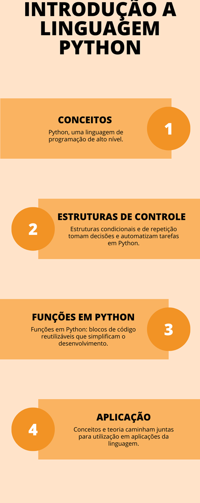

# Aula 5 — Funções e Resolução de Problemas em Python

## Ponto de Chegada

Olá, estudante! Para desenvolver a competência associada a esta unidade de aprendizagem, que é "Desenvolver o pensamento lógico para a resolução de problemas a partir da programação utilizando a linguagem Python", devemos, antes de tudo, conhecer os conceitos fundamentais da linguagem Python.

Isso inclui compreender sua sintaxe, as variáveis, os tipos de dados e as estruturas de controle. Tais conceitos servirão como alicerce para o aprimoramento de sua capacidade de resolver problemas por meio da programação (Manzano; Oliveira, 2019).

Ao longo desta etapa de estudos, foi possível relacionar esses conceitos básicos com a construção de scripts. Você também aprendeu a utilizar **estruturas condicionais** para tomar decisões em seus programas, o que é essencial para criar soluções flexíveis. Além disso, exploramos as **estruturas de repetição** para automatizar tarefas repetitivas e criar programas mais eficientes.

Uma parte crucial para o desenvolvimento do pensamento lógico é a criação de **funções** em Python (Mueller, 2020). As funções são blocos de código reutilizáveis que permitem dividir problemas complexos em partes menores, tornando-os mais fáceis de se gerenciar e resolver.

Você não apenas aprendeu sobre os conceitos e técnicas relacionados a esse contexto, mas também se tornou capaz de aplicar esse conhecimento em situações práticas. Ao construir scripts e funções em Python, você desenvolveu a habilidade de analisar problemas, dividindo-os em etapas lógicas e elaborando soluções algorítmicas (Barry, 2018).

A competência desta unidade de aprendizagem permite que você se torne um solucionador de problemas com habilidades em Python, preparando-o para enfrentar desafios tecnológicos e computacionais.

## É Hora de Praticar!

> Para contextualizar sua aprendizagem, imagine a seguinte situação: você trabalha em uma loja de eletrodomésticos e precisa criar uma calculadora de desconto em Python para ajudar os vendedores a calcularem o valor final de uma compra com base no preço do produto e em um desconto percentual oferecido.

### Questões norteadoras

- Como você pode aplicar seus conhecimentos em programação em Python para criar uma calculadora de desconto?
- Que estruturas condicionais em Python você pode usar para verificar se o desconto está dentro de limites aceitáveis?

### Reflita

Para encerrar e consolidar seu aprendizado, reflita sobre as seguintes perguntas:

- Como as estruturas condicionais em Python podem ser usadas para tomar decisões em programas?
- Qual é a importância da reutilização de código por meio de funções na programação em Python?
- Como você pode aplicar o pensamento lógico para resolver problemas complexos usando Python em sua trajetória acadêmica e profissional?

Esses questionamentos ajudarão você a internalizar ainda mais os conhecimentos adquiridos e a perceber a amplitude de sua aplicação. Desejo sucesso em sua jornada de aprendizagem!

### Resolução do Estudo de Caso

Vamos resolver o desafio seguindo um passo a passo.

Nesse estudo de caso, desenvolveremos um programa em Python para calcular o valor final de uma compra com desconto. A principal competência é a aplicação do pensamento lógico para construir um programa funcional, que ajude os vendedores a calcularem o preço final.

Confira, a seguir, o código Python para criar a calculadora de desconto:

```python
# Solicita ao usuário que insira o valor do produto e o percentual de desconto
valor_produto = float(input())
percentual_desconto = float(input())

# Verifica se o percentual de desconto está dentro dos limites aceitáveis (0-100%)
if percentual_desconto < 0 or percentual_desconto > 100:
    print()
else:
    # Calcula o valor do desconto
    desconto = valor_produto * (percentual_desconto / 100)

    # Calcula o valor final da compra
    valor_final = valor_produto - desconto

    # Exibe o valor final da compra
    print(f{valor_final:.2f})
```

Um exemplo de resultado:

```text
Digite o valor do produto: R$ 150
Digite o percentual de desconto: 12.5
Valor com desconto: R$ 131.25
```

Nesse código, o programa solicita ao usuário que insira o valor do produto e o percentual de desconto. Em seguida, ele verifica se o percentual de desconto está dentro dos limites aceitáveis (entre 0% e 100%). Se estiver em conformidade, o programa calcula o valor do desconto e o valor final da compra, exibindo o resultado na tela.

### Assimile

O material visual a seguir esquematiza os principais tópicos abordados nesta unidade de aprendizagem, em que apresentamos uma introdução à linguagem Python. Este infográfico exibe uma percepção clara e sucinta de cada parte dessa etapa de estudos, enfatizando os conceitos e fundamentos necessários para uma boa compreensão dos saberes desenvolvidos.



*Figura 1 | Infográfico: introdução à linguagem Python. Fonte: elaborada pelo autor.*

## Referências

- BARRY, P. Use a Cabeça! Python. 2. ed. Rio de Janeiro: Alta Books, 2018. E-book. Disponível em: https://integrada.minhabiblioteca.com.br/#/books/9786555207842. Acesso em: 12 out. 2023.
- MANZANO, J. A. N. G.; OLIVEIRA, J. F. de. Algoritmos: lógica para desenvolvimento de programação de computadores. 29. ed. São Paulo: Érica, 2019.[Fd1]
- MUELLER, J. P. Começando a programar em Python para leigos. Rio de Janeiro: Alta Books, 2020. E-book. Disponível em: https://integrada.minhabiblioteca.com.br/#/books/9786555202298. Acesso em: 12 out. 2023.
