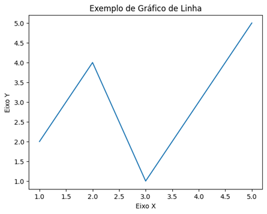
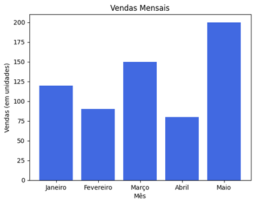

# Aula 4 — Módulos, Bibliotecas e Visualização de Dados com Matplotlib

## Ponto de Partida

Que a linguagem Python tem suas qualidades você já sabe, agora vamos começar a investigar conceitos e ferramentas que fazem da Python uma potência atual quando se trata de programação.

Você estudará sobre **módulos** e **biblioteca** em Python, que são componentes de código que servem como conjuntos de funções em Python, os quais facilitam a organização do código e a reutilização de funções em várias aplicações.

Esses módulos são classificados em três tipos: built-in, de terceiros e próprios. O primeiro módulo é "pronto" e já vem na instalação do Python. Os módulos de terceiros são produzidos por desenvolvedores e disponibilizados via PyPI. Por fim, os próprios consistem na construção de nós para resolver um determinado problema e podem ser reutilizados.

Também vamos examinar um módulo/biblioteca de terceiros: o **Matplotlib**, que é uma biblioteca de visualização, uma das mais populares em Python, vale ressaltar.

> Suponha que você precise visualizar a contagem de venda de um produto hipotético. Vamos usar os conhecimentos obtidos nesta aula para construir essa visualização?

## Vamos Começar!

### Módulos e biblioteca em Python

Existem duas abordagens principais para se organizar o código em Python: usando funções ou classes para encapsular funcionalidades; e dividindo o código em vários arquivos `.py` para modularizar a solução. O ideal é combinar essas técnicas, criando módulos separados em arquivos independentes. De acordo com a documentação oficial do Python, é recomendável separar funcionalidades que podem ser reutilizadas em módulos distintos. Essa abordagem de modularização ajuda a manter o código mais organizado e legível, facilitando a manutenção e a reutilização de componentes.

Mas, afinal, o que são módulos? São componentes de código que servem como bibliotecas ou conjuntos de funções em Python. Eles abrigam uma variedade de funcionalidades, incluindo operações matemáticas, interações com o sistema operacional e muitas outras atividades. Módulos representam uma maneira elegante e eficaz de reutilizar código em diferentes partes de um programa ou em projetos distintos.

Em Python, frequentemente ouvimos falar tanto de módulos quanto de bibliotecas. A relação entre esses elementos tem a ver com o fato de que, na prática, um módulo pode ser considerado uma biblioteca de códigos. Para ilustrar essa ideia, considere o módulo `math`, que oferece várias funções matemáticas, e o módulo `os`, que disponibiliza funções relacionadas ao sistema operacional, como obtenção do diretório de trabalho atual (`getcwd`), listagem de arquivos em um diretório (`listdir`), criação de pastas (`mkdir`), entre muitos outros recursos. Esses módulos são essencialmente bibliotecas de funções relacionadas a áreas específicas, como matemática e operações do sistema, viabilizando a reutilização eficiente e elegante de um código.

### Como utilizar um módulo?

```python
# primeiro modo
import math

math.sqrt(25)
math.log2(1024)
math.cos(45)


# segundo modo
import math as m

m.sqrt(25)
m.log2(1024)
m.cos(45)


# terceiro modo
from math import sqrt, log2, cos

sqrt(25)
log2(1024)
cos(45)

# resultado para todos: 0.5253219888177297
```

No primeiro modo, usamos a importação que carrega todas as funções na memória, trouxemos toda a funcionalidade de "math" e colocamos `math.sqrt`, por exemplo, para chamar a função `sqrt`.

No segundo modo, utilizamos a importação que carrega todas as funções na memória, mas, nesse caso, demos um apelido para o módulo. Utilizamos `m.sqrt`, por exemplo, para chamar a função `sqrt`.

No terceiro modo, usamos a importação que carrega funções específicas na memória, utilizando-a diretamente – `sqrt()`, por exemplo.

### Classificação dos módulos (built-in, de terceiros e próprios)

Podemos classificar os módulos (bibliotecas) em três categorias:

- **Módulos built-in**: embutidos no interpretador.
- **Módulos de terceiros**: criados por terceiros e disponibilizados via PyPI.
- **Módulos próprios**: criados pelo desenvolvedor.

Os módulos built-in fazem parte do núcleo da linguagem e estão disponíveis diretamente no interpretador, sem a necessidade de instalação adicional. São carregados automaticamente quando você inicia o interpretador Python e fornecem funcionalidades básicas que são comuns a muitos programas. Alguns exemplos de módulos built-in em Python são: `math`; `os`; `svs`; `Random`; `datetime`; `re`; `collections`.

Esses são apenas alguns exemplos dos muitos módulos built-in disponíveis em Python. Eles são amplamente utilizados em muitos programas Python e concedem funcionalidades essenciais para várias tarefas.

Os módulos de terceiros em Python são extensões de funcionalidade que não fazem parte da biblioteca-padrão do Python, mas são criados e mantidos por desenvolvedores externos à comunidade oficial do Python. Eles são frequentemente distribuídos por meio do **Python Package Index (PyPI)** e podem ser instalados no ambiente Python para adicionar funcionalidades extras aos seus programas. Confira, a seguir, alguns pontos importantes sobre módulos de terceiros:

- Ampliam a funcionalidade do Python em diversas áreas, como na manipulação de dados, gráficos, interfaces gráficas, integração com bancos de dados e aprendizado de máquina.
- A instalação é feita usando o gerenciador de pacotes padrão: `pip`. Exemplo: `pip install requests`.
- Gerenciar dependências é essencial à medida que projetos crescem. O uso de um arquivo `requirements.txt` facilita a instalação de todas as dependências em um único comando `pip`.
- Ambientes virtuais isolam projetos Python para evitar conflitos entre diferentes versões de módulos de terceiros.
- Conhecer as licenças dos módulos de terceiros é importante, pois eles podem variar de código aberto a proprietário, e a qualidade da manutenção pode mudar.
- Módulos de terceiros geralmente possuem comunidades ativas de desenvolvedores e documentação rica, fornecendo suporte e recursos valiosos.

Como exemplos de módulos de terceiros, podemos citar: **NumPy**, **pandas** e Matplotlib.

Já os módulos próprios, também conhecidos como módulos personalizados ou módulos definidos pelo usuário, são módulos em Python que você cria para organizar e reutilizar seu próprio código. Eles são uma parte importante da prática de desenvolvimento em Python, pois permitem dividir seu código em unidades lógicas, tornando-o mais legível, manutenível e reutilizável.

Vale destacar que os módulos próprios constituem-se como uma ferramenta poderosa para organizar, reutilizar e compartilhar códigos em Python. Eles permitem que você crie bibliotecas personalizadas para atender às necessidades específicas dos seus projetos e promovem a modularização, que é uma prática recomendada no desenvolvimento de software.

## Siga em Frente...

### Matplotlib

O Matplotlib é uma das bibliotecas de visualização mais populares em Python, já que oferece uma ampla gama de recursos para criar gráficos e visualizações de dados de maneira flexível e personalizável. É frequentemente usado para construir gráficos estáticos, interativos e até mesmo animações.

Para utilizar o Matplotlib, você normalmente precisa importar o módulo `pyplot`, que fornece uma interface de alto nível para criar gráficos de modo conveniente. Observe, a seguir, um exemplo simples de como elaborar um gráfico de linha usando o Matplotlib:

```python
import matplotlib.pyplot as plt

# Dados
x = [1, 2, 3, 4, 5]
y = [2, 4, 1, 3, 5]

# Criar um gráfico de linha
plt.plot(x, y)

# Adicionar rótulos aos eixos
plt.xlabel('Eixo X')
plt.ylabel('Eixo Y')

# Adicionar um título ao gráfico
plt.title('Exemplo de Gráfico de Linha')

# Mostrar o gráfico
plt.show()
```



*Figura 1 | Exemplo de gráfico de linha. Fonte: elaborada pelo autor.*

Nesse exemplo:

- Importamos o módulo `pyplot` do Matplotlib como `plt`.
- Definimos listas `x` e `y`, que representam os pontos do gráfico.
- Usamos `plt.plot(x, y)` para criar o gráfico de linha.
- Adicionamos rótulos aos eixos X e Y com `plt.xlabel()` e `plt.ylabel()`.
- Adicionamos um título ao gráfico com `plt.title()`.
- Por fim, usamos `plt.show()` para exibir o gráfico.

O código apresentado anteriormente cria um simples gráfico de linha com os pontos (1, 2), (2, 4), (3, 1), (4, 3) e (5, 5), rotulando os eixos e dando um título ao gráfico.

O Matplotlib disponibiliza uma variedade de opções de personalização para gráficos, permitindo que você ajuste cores, estilos de linha, marcadores e muitos outros aspectos. Trata-se de uma biblioteca eficiente para criar gráficos de alta qualidade em Python, sendo amplamente utilizada na análise e visualização de dados.

## Vamos Exercitar?

Para resolver o problema inicial, criaremos uma situação hipotética:

```python
import matplotlib.pyplot as plt

# Dados de exemplo
meses = ['Janeiro', 'Fevereiro', 'Março', 'Abril', 'Maio']
vendas = [120, 90, 150, 80, 200]

# Criar um gráfico de barras
plt.bar(meses, vendas, color='royalblue')

# Adicionar rótulos aos eixos
plt.xlabel('Mês')
plt.ylabel('Vendas (em unidades)')

# Adicionar um título ao gráfico
plt.title('Vendas Mensais')

# Mostrar o gráfico
plt.show()
```



*Figura 2 | Valores mensais. Fonte: elaborada pelo autor.*

Esse código cria um gráfico de barras que exibe as vendas por mês. Você pode personalizar ainda mais esse gráfico ajustando cores, estilos e outros parâmetros de acordo com suas necessidades. O Matplotlib concede muitas opções de customização para criar gráficos visualmente atraentes.

Por meio desse conhecimento, você se sentirá cada vez mais preparado para elaborar soluções criativas e aplicá-las a diversas realidades. Lembre-se de sempre praticar!

## Saiba mais

1. Para aprender mais detalhes sobre aplicações do Python, especialmente quanto ao Matplotlib, sugiro a leitura do artigo *Introdução à estilometria com Python*. Nesse texto, apresentam-se análises estilométricas, que dizem respeito ao estudo quantitativo do estilo literário por meio de métodos de leitura distante computacional. Para acessar o material sugerido, clique no link a seguir.
   > LARAMÉE, F. D. **Introdução à estilometria com Python**. Programming Historian, 21 abr. 2018.

2. Outra dica para estudo e aprofundamento sobre esse tema é o livro *Use a cabeça! Python*.
   > BARRY, P. **Use a cabeça! Python**. 2. ed. Rio de Janeiro: Alta Books, 2018. E-book.

3. Para entender como funciona a aplicação do Python em data science, sugiro a leitura do capítulo 3 do livro *Data science do zero*.
   > GRUS, J. **Data science do zero: primeiras regras com o Python**. Rio de Janeiro: Alta Books, 2021. E-book.

## Referências

- 6. MÓDULOS. Python 3.12.2 Documentation, [s. d.]. Disponível em: https://docs.python.org/pt-br/3/tutorial/modules.html. Acesso em: 25 out. 2023.
- BARRY, P. Use a cabeça! Python. 2. ed. Rio de Janeiro: Alta Books, 2018. E-book. Disponível em: https://integrada.minhabiblioteca.com.br/#/books/9786555207842. Acesso em: 12 out. 2023.
- GRUS, J. Data science do zero: primeiras regras com o Python. Rio de Janeiro: Alta Books, 2021. E-book. Disponível em: https://integrada.minhabiblioteca.com.br/#/books/9788550816463. Acesso em: 12 out. 2023.
- LARAMÉE, F. D. Introdução à estilometria com Python. Programming Historian, 21 abr. 2018. Disponível em https://programminghistorian.org/pt/licoes/introducao-estilometria-python. Acesso em: 12 out. 2023.
- MANZANO, J. A. N. G.; OLIVEIRA, J. F. de. Algoritmos: lógica para desenvolvimento de programação de computadores. 29. ed. São Paulo: Érica, 2019.
