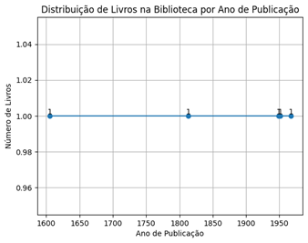
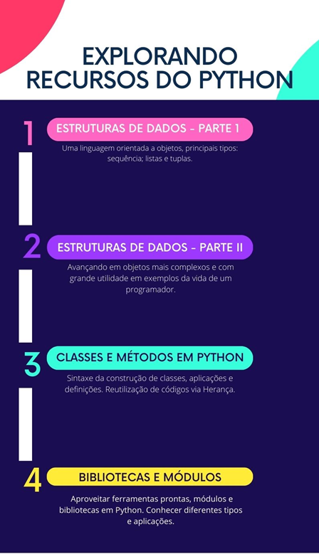

# Aula 5 — Revisão da Unidade e Estudo de Caso: Catalogação de Livros em Python

## Ponto de Chegada

Olá, estudante! Para desenvolver a competência associada a esta unidade de aprendizagem, que é "Identificar os pilares da orientação a objetos e sua utilização na linguagem de programação com Python", devemos, antes de tudo, conhecer os conceitos relacionados à estrutura dos dados em Python. Para isso, é necessário saber que a linguagem Python é baseada na orientação a objetos. Sendo assim, conhecer os tipos de objetos e suas especificidades é um ponto crucial nesse contexto.

Ao longo desta etapa de estudos, foi possível conectar esses conceitos fundamentais com a construção de scripts. Você também aprendeu a utilizar diferentes tipos de objeto para resolver problemas em diversas situações. Além disso, conhecemos o conceito de classe e sua importância para um código bem estruturado, o qual possa ser reutilizado e modificado para contextos distintos (Manzano; Oliveira, 2019).

Um ponto que merece destaque nesse cenário são as bibliotecas em Python, que podem surgir como "ferramentas" prontas (built-in ou de terceiros) ou criadas de modo personalizado. Existe uma grande variedade de bibliotecas, então a prática e a pesquisa para saber qual delas utilizar são aspectos essenciais para aumentar a gama de "ferramentas" disponíveis do Python.

Durante este processo de aprendizagem, você não apenas assimilou os conceitos e técnicas apresentados, mas também os colocou em prática por meio de situações do mundo real (Grus, 2021). A construção de scripts utilizando recursos como as bibliotecas Python, além de aprimorar seu conhecimento, desenvolve sua habilidade de decompor problemas complexos em etapas lógicas e de criar soluções algorítmicas para esses casos (Perkovic, 2016).

A competência desta unidade de aprendizagem permite que você se torne um solucionador de problemas com proficiência em Python, preparando-o para enfrentar desafios tecnológicos e computacionais de forma eficaz.

## É Hora de Praticar!

> Para contextualizar sua aprendizagem, imagine a seguinte situação: você está desenvolvendo um programa simples para gerenciar informações sobre livros em uma biblioteca e fazer uma contagem de livros por ano de publicação.

Questões norteadoras:

- Como você pode aplicar seus conhecimentos em programação em Python para gerenciar essas informações?
- Como é possível criar classes e utilizar bibliotecas para automatizar esse gerenciamento?

## Reflita

Para encerrar e consolidar seu aprendizado, reflita sobre as seguintes perguntas:

1. Como as estruturas de dados em Python podem ser usadas para tomar decisões em programas de forma correta?
2. Qual é a importância de reutilizar e modificar classes para otimizar códigos em Python?
3. Como você pode aplicar o conhecimento das estruturas dos dados e das bibliotecas do Python para resolver problemas complexos em sua trajetória acadêmica e profissional?

Essas considerações ajudarão você a incorporar de maneira mais profunda o conhecimento adquirido e a compreender o alcance de suas aplicações. Desejo a você muito sucesso em sua jornada de aprendizagem!

## Resolução do Estudo de Caso

Vamos resolver o desafio seguindo um passo a passo.

Nesse estudo de caso, usaremos estruturas de dados em Python, bibliotecas, orientação a objetos e classes para criar um sistema básico de catalogação de livros.

Confira, a seguir, o código Python para criar o sistema de catalogação:

```python
import matplotlib.pyplot as plt

# Classe para representar um livro
class Livro:
    def __init__(self, titulo, autor, ano_publicacao):
        self.titulo = titulo
        self.autor = autor
        self.ano_publicacao = ano_publicacao

    def __str__(self):
        return f{self.titulo} por {self.autor}, Publicado em {self.ano_publicacao}


# Criar uma lista de livros
biblioteca = []

# Função para adicionar um livro à biblioteca
def adicionar_livro(titulo, autor, ano_publicacao):
    novo_livro = Livro(titulo, autor, ano_publicacao)
    biblioteca.append(novo_livro)
    print(f{titulo}' foi adicionado à biblioteca.")

# Função para listar todos os livros na biblioteca
def listar_livros():
    print()
    for livro in biblioteca:
        print(livro)

# Adicionar alguns livros à biblioteca
adicionar_livro(, , 1605)
adicionar_livro(, , 1813)
adicionar_livro(, , 1949)
adicionar_livro(, , 1967)
adicionar_livro(, , 1951)


# Listar todos os livros na biblioteca
listar_livros()

# Criar um gráfico de livros por ano
anos = list(set(anos))# Remove duplicatas dos anos
anos.sort()


# Contagem de livros por ano
contagem_por_ano = [anos.count(ano) for ano in anos]


# Criar um gráfico de linha
plt.plot(anos, contagem_por_ano, marker='o', linestyle='-')
plt.xlabel('Ano de Publicação')
plt.ylabel('Número de Livros')
plt.title('Distribuição de Livros na Biblioteca por Ano de Publicação')


# Adicionar rótulos aos pontos de dados
for i, valor in enumerate(contagem_por_ano):
    plt.text(anos[i], valor, str(valor), ha='center', va='bottom')


plt.grid(True)


plt.show()
```

O resultado é:

```text
O livro 'Dom Quixote' foi adicionado à biblioteca.
O livro 'Orgulho e Preconceito' foi adicionado à biblioteca.
O livro '1984' foi adicionado à biblioteca.
O livro 'Cem Anos de Solidão' foi adicionado à biblioteca.
O livro 'Apanhador no Campo de Centeio' foi adicionado à biblioteca.

Livros na Biblioteca:
Dom Quixote por Miguel de Cervantes, Publicado em 1605
Orgulho e Preconceito por Jane Austen, Publicado em 1813
1984 por George Orwell, Publicado em 1949
Cem Anos de Solidão por Gabriel Garcia Marquez, Publicado em 1967
Apanhador no Campo de Centeio por J.D. Salinger, Publicado em 1951
```

Distribuição de livros na biblioteca por ano de publicação — Número de livros — Ano de publicação



*Figura 1 | Distribuição de livros na biblioteca por ano de publicação. Fonte: elaborada pelo autor.*

Esse exemplo demonstra como você pode aplicar os conceitos de classes, orientação a objetos e estruturas de dados em Python para criar um sistema simples de gerenciamento de livros em uma biblioteca. A utilização de bibliotecas Python adicionaria certas funcionalidades, como salvar e carregar informações de livros a partir de arquivos, bem como interfaces gráficas para a interação do usuário.

## Assimile

O material visual a seguir esquematiza os principais tópicos abordados nesta unidade de aprendizagem, na qual tratamos dos recursos da linguagem Python. Este infográfico exibe uma percepção clara e sucinta de cada parte desta etapa de estudos, enfatizando os conceitos e fundamentos necessários para uma boa compreensão dos saberes desenvolvidos.



*Figura 2 | Infográfico: explorando recursos do Python. Fonte: elaborada pelo autor.*

## Referências

- GRUS, J. Data science do zero: primeiras regras com o Python. Rio de Janeiro: Alta Books, 2021. E-book.
- MANZANO, J. A. N. G.; OLIVEIRA, J. F. de. Algoritmos: lógica para desenvolvimento de programação de computadores. 29. ed. São Paulo: Érica, 2019.
- PERKOVIC, L. Introdução à computação usando Python: um foco no desenvolvimento de aplicações. Rio de Janeiro: LTC, 2016.
