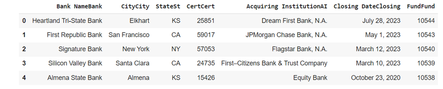

# Aula 2 — Introdução à Biblioteca pandas: Series e Leitura de Dados

## Ponto de Partida

Dando continuidade à nossa aprendizagem sobre Python, nesta aula vamos conhecer as principais vantagens da biblioteca `pandas`.

Para uma compreensão correta do conteúdo a ser estudado, o primeiro passo é entender o que é o **pandas**. Trata-se de uma biblioteca Python de alto desempenho e código aberto projetada para simplificar a manipulação e análise de dados organizados em tabelas e séries temporais. O pandas disponibiliza estruturas de dados poderosas, como **DataFrames** e **Series**, que possibilitam aos programadores uma abordagem mais intuitiva e eficiente para lidar com dados tabulares.

Na sequência, devemos entender sobre séries e aprender a criá-las utilizando o pandas. Com base nessa habilidade, teremos uma melhor noção do valor dessa biblioteca para diversos tipos de problemas.

Por fim, descobriremos como ler dados externos usando o pandas. Essa biblioteca contém muitas funcionalidades. Diante disso, para propiciar um estudo mais objetivo, trataremos do caso da leitura dos dados de um site, de forma que o exemplo mostrado o incentive a buscar mais conhecimento sobre o pandas.

> **Desafio da aula:** suponha que você esteja gerenciando o cadastro de uma loja cujos diretores precisam de uma orientação sobre o público em que devem investir. Os representantes da loja querem saber a idade média dos seus clientes.

## Vamos Começar!

### Introdução à biblioteca pandas

`pandas` é uma poderosa biblioteca de código aberto para a linguagem de programação Python criada para facilitar a manipulação e análise de dados tabulares e séries temporais. Ela fornece estruturas de dados flexíveis e eficientes, como `DataFrame`s e `Series`, que permitem aos desenvolvedores trabalhar com dados de forma mais intuitiva e produtiva. Algumas características notáveis do pandas incluem:

1. **DataFrames e Series**: o `DataFrame` é uma estrutura bidimensional semelhante a uma tabela, enquanto a `Series` é uma estrutura unidimensional semelhante a uma lista ou matriz. Ambas as estruturas são altamente flexíveis e podem acomodar diversos tipos de dados.
2. **Manipulação de dados**: o pandas oferece uma ampla gama de funções e métodos para realizar tarefas comuns de manipulação de dados, como filtragem, seleção, ordenação, agrupamento e agregação.
3. **Leitura e escrita de dados**: o pandas suporta a leitura e escrita de dados em vários formatos, incluindo CSV, Excel, SQL, HDF5 e muitos outros, tornando-se uma ferramenta versátil para lidar com dados de diferentes fontes.
4. **Tratamento de dados ausentes**: a biblioteca simplifica o tratamento de dados faltantes, permitindo que os desenvolvedores preencham ou removam valores ausentes de forma eficaz.
5. **Visualização de dados**: embora o pandas seja mais conhecido por sua capacidade de manipular dados, também pode ser integrado a outras bibliotecas de visualização, como Matplotlib e Seaborn, para criar gráficos e visualizações informativas.
6. **Integração com NumPy**: o pandas é construído sobre a biblioteca NumPy, o que significa que você pode facilmente combinar as capacidades de NumPy para cálculos numéricos com as funcionalidades do pandas para manipulação de dados.
7. **Comunidade ativa**: o pandas tem uma comunidade de usuários e desenvolvedores ativa, o que resulta em suporte contínuo e atualizações regulares.

O pandas é amplamente utilizado em análise de dados, ciência de dados e engenharia de dados. Ele oferece uma maneira eficiente e amigável de lidar com dados, fato que o torna uma escolha popular para profissionais que trabalham com informações estruturadas.

### Series

Para criar um objeto do tipo `Series` no pandas, utilizamos o método `Series()` com vários parâmetros opcionais. O principal parâmetro é "data", que pode conter um único valor, uma lista de valores ou um dicionário. Outros parâmetros, como "index", "dtype" e "name", têm valores-padrão predefinidos, tornando sua especificação opcional. A documentação oficial do pandas fornece detalhes completos sobre esses parâmetros. Saiba mais em: pandas.

**Exemplo 1: criar uma Series a partir de uma lista**

```python
import pandas as pd

# Criando uma lista de valores
data = [10, 20, 30, 40, 50]

# Criando uma Series a partir da lista
series1 = pd.Series(data)

print(series1)

# resultado
```

```text
0    10
1    20
2    30
3    40
4    50
dtype: int64
```

**Exemplo 2: criar uma Series a partir de um dicionário**

```python
import pandas as pd

# Criando um dicionário com pares chave-valor
data = {'A': 100, 'B': 200, 'C': 300, 'D': 400, 'E': 500}

# Criando uma Series a partir do dicionário
series2 = pd.Series(data)

print(series2)

# resultado
```

```text
A    100
B    200
C    300
D    400
E    500
dtype: int64
```

No primeiro exemplo, uma Series é criada a partir de uma lista de valores. Já no segundo, uma Series é criada a partir de um dicionário, de modo que as chaves se tornam os índices da Series e os valores são os dados correspondentes.

## Siga em Frente...

### Leitura de dados estruturados com a biblioteca pandas

Um recurso poderoso no pandas é a capacidade de ler dados estruturados e armazená-los em um `DataFrame`. A biblioteca oferece vários métodos de leitura de dados, identificados pelo padrão "read", como `pandas.read_XXXXX()`. Cada um desses métodos é projetado para ler diferentes tipos de fontes de dados.

Para exemplificar, vamos explorar o método `pandas.read_html()`, que é utilizado para extrair tabelas de uma página da web. Esse método procura automaticamente por elementos HTML `<table>` na estrutura da página e retorna uma lista de DataFrames que correspondem às tabelas encontradas. Os parâmetros, como "io", podem ser configurados para especificar a URL da página a ser lida, e outros parâmetros adicionais podem ser ajustados para lidar com formatação e tratamento de dados. Isso torna o pandas uma ferramenta versátil para a aquisição de dados de fontes externas, como páginas da web.

Na URL Lista de bancos com falha encontra-se uma tabela com bancos norte-americanos que faliram desde 1º de outubro de 2000. Nesse caso, cada linha representa um banco.

```python
import pandas as pd

url = 'https://www.fdic.gov/resources/resolutions/bank-failures/failed-bank-list/'
dfs = pd.read_html(url)

print(type(dfs))
print(len(dfs))

# resultado
```

```text
<class 'list'>
1
```

Portanto, temos nosso DataFrame com uma lista que contém apenas uma tabela.

```python
df_bancos = dfs[0]

print(df_bancos.shape)
print(df_bancos.dtypes)

df_bancos.head()

# resultado
```

```text
(567, 7)
Bank NameBank object
CityCity object
StateSt object
CertCert int64
Acquiring InstitutionAI object
Closing DateClosing object
FundFund int64
dtype: object
```



*Figura 1 | Cinco primeiras linhas do DataFrame. Fonte: elaborada pelo autor.*

Nesse exemplo, trouxemos o tipo de cada variável existente no DataFrame, além das cinco primeiras linhas como o comando `head()`. Com isso, mostramos quão rica é a biblioteca pandas e suas diversas aplicações.

## Vamos Exercitar?

Agora, vamos colocar em prática o que aprendemos nesta aula para resolver nosso problema inicial. Podemos usar a biblioteca pandas para descobrir em qual público a loja deve investir. Para tanto, devemos calcular a média de idade dos clientes.

```python
import pandas as pd

# Criar um dicionário com nomes e idades
dados = {
    'Nome': ['Alice', 'Bob', 'Carol', 'David', 'Eve'],
    'Idade': [25, 30, 22, 35, 28]
}

# Criar uma série a partir do dicionário
serie_idades = pd.Series(dados['Idade'], index=dados['Nome'])

# Exibir a série de idades
print('Série de Idades:')
print(serie_idades)

# Calcular a média das idades
media_idades = serie_idades.mean()
print('\nMédia de Idades:', media_idades)

# resultado
```

```text
Série de Idades:
Alice    25
Bob      30
Carol    22
David    35
Eve      28
dtype: int64

Média de Idades: 28.0
```

Começamos esse exercício criando um dicionário chamado `dados`, que contém os nomes e idades dos clientes. Em seguida, usamos o pandas para criar uma série chamada `serie_idades` a partir desse dicionário, de forma que os nomes são definidos como o índice da série.

Após criar a série, calculamos a média das idades usando o método `mean()` e a exibimos na saída.

A saída do código mostra a série de idades e a média das idades do grupo. Esse é um exemplo simples de como você pode usar o pandas para realizar cálculos em dados estruturados.

Gostou dessa solução? Espero que sim! Já estamos avançando bastante em nossa trajetória de estudos, desta vez utilizando o pandas, uma biblioteca do Python. Faça mudanças no código e pratique!

## Saiba mais

1. Para entender mais detalhes sobre o uso do pandas, sugiro que você visite a seguinte página: pandas. O site descreve a história e as funcionalidades dessa biblioteca.
2. Agora, para aprender mais sobre DataFrame, acesse o endereço a seguir: pandas.
3. Por fim, para exercitar os assuntos estudados nesta etapa de aprendizagem, faça a leitura do livro *Python 3: conceitos e aplicações: uma abordagem didática*.
   > BANIN, S. L. **Python 3: conceitos e aplicações: uma abordagem didática**. São Paulo: Érica, 2018. E-book.

## Referências

- ABOUT pandas. pandas, [s. d.]. Disponível em: https://pandas.pydata.org/about/. Acesso em: 31 out. 2023.
- BANIN, S. L. Python 3: conceitos e aplicações: uma abordagem didática. São Paulo: Érica, 2018. E-book. Disponível em: https://integrada.minhabiblioteca.com.br/books/9788536530253. Acesso em: 21 out. 2023.
- FAILED Bank List. The Federal Deposit Insurance Corporation, 3 nov. 2023. Disponível em: https://www.fdic.gov/resources/resolutions/bank-failures/failed-bank-list/. Acesso em: 31 jan. 2024.
- MANZANO, J. A. N. G.; OLIVEIRA, J. F. de. Algoritmos: lógica para desenvolvimento de programação de computadores. 29. ed. São Paulo: Érica, 2019.
- PANDAS.DATAFRAME. pandas, [s. d.]. Disponível em: https://pandas.pydata.org/pandas-docs/stable/reference/api/pandas.DataFrame.html. Acesso em: 31 out. 2023.
