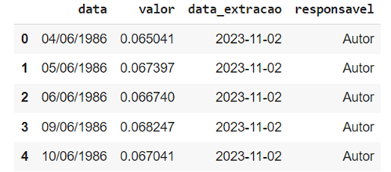

# Aula 3 — Leitura, Transformação e Extração de Dados com pandas

## Ponto de Partida

Para aprofundar nossos conhecimentos sobre o mundo da linguagem Python, devemos aprender a utilizar cada vez mais ferramentas que facilitem a preparação de nossos códigos. Já descobrimos que existem inúmeras bibliotecas que nos ajudam em diversas situações, dentre as quais se destaca a biblioteca `pandas`, que fornece muitas funcionalidades para o trabalho com dados.

Sendo assim, devemos conhecer os métodos para leitura e escrita da biblioteca pandas. Atualmente, os dados provêm de diversas fontes e de diferentes formatos de arquivo. Diante disso, é necessário saber lidar com cada um desses dados.

Nesse sentido, devemos entender como trabalhar com tais dados e, mais do que isso, como transformá-los, visto que a maioria deles não é passível de uso caso não passe por uma manipulação prévia.

Por fim, é preciso obter informações sobre os dados. Para tanto, conheceremos duas ferramentas: `loc` e testes booleanos.

> **Desafio da aula:** suponha que você trabalhe em uma loja que vende itens variados. Por conta de um erro no sistema de venda, o valor unitário dos itens vendidos não é exibido, e existem algumas duplicações de linhas. Você precisa mostrar itens com valores acima de R$50,00 para o planejamento da empresa em uma ação de marketing. Vamos, juntos, resolver esse caso?

## Vamos Começar!

### Métodos para leitura e escrita da biblioteca pandas

A biblioteca pandas tem como principal propósito a manipulação de dados estruturados, como aqueles organizados em tabelas com linhas e colunas.

Esses dados podem ser provenientes de diversas fontes, como arquivos, páginas web, APIs, outros softwares, serviços de armazenamento em nuvem e bancos de dados. A biblioteca oferece uma variedade de métodos que permitem a leitura e o carregamento desses dados em estruturas chamadas `DataFrame`s.

Os métodos de leitura de dados estruturados no pandas têm em comum o prefixo `pd.read_XXXX`, sendo `pd` um alias frequentemente utilizado ao importar a biblioteca e "XXX" a parte restante da sintaxe específica de cada método. Além da leitura, o pandas oferece diversos métodos para escrever os dados contidos em um DataFrame em arquivos, bancos de dados ou até mesmo para a área de transferência do sistema operacional. Isso torna o pandas uma ferramenta versátil para lidar com dados estruturados, independentemente de sua origem.

O Quadro 1, a seguir, mostra os métodos de leitura e escrita para os diferentes tipos de dados:

| Tipo de Dado | Descrição do Dado | Método para Leitura | Método para Escrita |
| --- | --- | --- | --- |
| Texto | CSV | `read_csv` | `to_csv` |
| Texto | Fixe-width texto file | `read_fwf` | — |
| Texto | JSON | `read_json` | `to_json` |
| Texto | HTML | `read_html` | `to_html` |
| Texto | Latex | — | `styler.to_latex` |
| Texto | XML | `read_xml` | `to_xml` |
| Texto | Local Clipboard | `read_clipboard` | `to_clipboard` |
| Binário | MS Excel | `read_excel` | `to_excel` |
| Binário | OpenDocument | `read_excel` | — |
| Binário | HDF5 Format | `read_hdf` | `to_hdf` |
| Binário | Feather Fomart | `read_feather` | `to_feather` |
| Binário | Parquet Format | `read_parquet` | `to_parquet` |
| Binário | ORC Format | `read_orc` | — |
| Binário | MsgPack | `read_msgpack` | `to_msgpack` |
| Binário | Stata | `read_stata` | `to_stata` |
| Binário | SAS | `read_sas` | — |
| Binário | SPSS | `read_spss` | — |
| Binário | Python Pickle Format | `read_pickle` | `to_picke` |
| SQL | SQL | `read_sql` | `to_sql` |
| SQL | Google BigQuery | `read_gbq` | `to_gbq` |

*Quadro 1 | Métodos de leitura e escrita. Fonte: adaptado de pandas ([s. d.]a).*

### Captura e transformação dos dados

A etapa de captura e transformação/padronização dos dados é uma parte crucial no processo de análise de dados e modelagem de machine learning, por exemplo. Nessa fase, você coleta os dados brutos de várias fontes, como arquivos CSV, bancos de dados, APIs, e os prepara para uma análise posterior. O pandas é uma biblioteca Python muito útil para realizar essas tarefas, pois fornece estruturas de dados flexíveis e ferramentas poderosas para manipular e transformar dados.

Vamos analisar um exemplo:

```python
import pandas as pd

df_selic = pd.read_json('https://api.bcb.gov.br/dados/serie/bcdata.sgs.11/dados?formato=json')

print(df_selic.info())

# resultado
```

```text
<class 'pandas.core.frame.DataFrame'>
RangeIndex: 9379 entries, 0 to 9378
Data columns (total 2 columns):
 #   Column  Non-Null Count  Dtype
---  ------  --------------  -----
 0   data    9379 non-null   object
 1   valor   9379 non-null   float64
dtypes: float64(1), object(1)
memory usage: 146.7+ KB
None
```

O primeiro passo para o desenvolvimento desse processo é importar o pandas. Em seguida, utilizamos o método para ler um arquivo JSON. Por fim, pedimos informações sobre esse DataFrame: existem 9.379 registros, 2 colunas, os índices são numéricos e variam de 0 a 9.378; não existem linhas faltantes, pois existem 9.379 registros não nulos; os dados são do tipo "object", ou são todos strings, ou há uma mistura desses tipos.

Já conhecemos nosso DataFrame. Agora, vamos verificar a duplicidade de linhas (um passo muito importante) utilizando a função `drop_duplicates()`. No nosso exemplo, usaremos: `df_selic.drop_duplicates(keep='last', inplace=True)`, que mantém o último registro (`keep='last'`) e, a partir do parâmetro `inplace=True`, faz com que a transformação seja salva do DataFrame. Na prática, estamos sobrescrevendo o objeto na memória. Nesse caso, não existem linhas duplicadas.

Outra ação que podemos efetuar é criar uma nova coluna no DataFrame. Para isso, a sintaxe é simples: `df['nova_coluna'] = dado`. No nosso caso, vamos inserir duas colunas, uma com a data da extração dos dados e outra com o responsável pela extração.

```python
from datetime import date
from datetime import datetime as dt

data_extracao = date.today()

df_selic['data_extracao'] = data_extracao
df_selic['responsavel'] = 'Autor'

print(df_selic.info())

df_selic.head()
```



*Figura 1 | Dados da extração. Fonte: elaborada pelo autor.*

Usamos os módulos `datetime`, classe `date` e o método `today()`. Ao criar a coluna, a biblioteca pandas "entende" que se deve colocar o valor em todas as linhas, isto é, tanto a data da extração quanto o responsável. A manipulação/transformação dos dados muda conforme as especificidades da situação e do problema envolvidos.

## Siga em Frente...

### Extração de informações

Depois de saber coletar os dados e transformá-los, devemos passar para o próximo passo, que é extrair informação deles. Nessa etapa, precisamos conhecer o que estamos procurando para tentar encontrar esse elemento nos dados. Existem inúmeras ferramentas e maneiras pelas quais podemos fazer isso, como por meio de filtros utilizando `loc`, filtros utilizando testes booleanos, entre outras medidas.

Veja, a seguir, como utilizar `loc`:

```python
df_selic.loc[0]
```

```text
data              04/06/1986
valor                0.065041
data_extracao       2023-11-02
responsavel                Autor
Name: 0, dtype: object
```

```python
df_selic.loc[[0, 20, 70]]
```

```text
Data valor data_extraçao responsável
0 - 04/06/1986 - 0.065041 - 2023-11-02 - Autor
20 - 02/07/1986 - 0.068301 - 2023-11-02 - Autor
70 - 10/09/1986 - 0.131315 - 2023-11-02 - Autor
```

Há muitas maneiras de usar `loc` de forma eficaz. Para saber mais detalhes sobre esse assunto, acesse: pandas.

Confira, agora, um exemplo no qual se utiliza o teste booleano:

```python
teste = df_selic['valor'] < 0.01

print(type(teste))

# resultado
```

```text
<class 'pandas.core.series.Series'>
```

Como resultado, esse teste traz duas saídas para cada valor: true ou false. Testes booleanos são de grande importância para diversas situações.

## Vamos Exercitar?

Agora que já aprendemos mais detalhes sobre o pandas e algumas de suas funcionalidades, vamos resolver o problema apresentado no início desta aula. Para isso, traremos dados fictícios, os quais podem ser alterados para que você pratique cada vez mais.

```python
import pandas as pd

# Criando um DataFrame com 5 linhas de dados
data = {
    'nome': ['Produto A', 'Produto B', 'Produto C', 'Produto A', 'Produto E'],
    'quantidade de itens comprados': [3, 1, 4, 3, 2],
    'tipo de item': ['Eletrônico', 'Vestuário', 'Alimento', 'Eletrônico', 'Alimento'],
    'receita total': [120, 80, 60, 120, 90]
}

df = pd.DataFrame(data)

# Duplicando uma linha
df.drop_duplicates(keep='last', inplace=True)

# Calculando a coluna 'preço do item'
df['preço do item'] = df['receita total'] / df['quantidade de itens comprados']

# Selecionando preço do item acima de 50 reais
itens_acima_de_50 = df[df['preço do item'] > 50]

print('Itens acima de 50 reais:')
print(itens_acima_de_50)

# resultado
```

```text
Itens acima de 50 reais:
        nome  quantidade de itens comprados tipo de item  receita total
1  Produto B                               1    Vestuário             80

   preço do item
1           80.0
```

Criamos um DataFrame com dados fictícios. Observe que temos duas linhas duplicadas e, depois de excluir uma delas, ficamos com quatro itens, sendo que somente o produto B do vestuário tem valor acima de R$50,00.

Faça mudanças e descubra outras possibilidades para solucionar o problema. Lembre-se de que a prática é importante para aprender cada vez mais.

## Saiba mais

1. O livro *Introdução à computação usando Python: um foco no desenvolvimento de aplicações* apresenta uma introdução à programação, ao desenvolvimento de aplicações de computador e à ciência da computação. Logo, para você, que está iniciando seu aprendizado em Python, a leitura desse texto é muito relevante. Para acessar o material sugerido, clique no link a seguir.
   > PERKOVIC, L. **Introdução à computação usando Python: um foco no desenvolvimento de aplicações**. Rio de Janeiro: LTC, 2016.

2. Uma leitura interessante para quem está começando a programar em Python é a do livro *Começando a programar em Python para leigos*.
   > MUELLER, J. P. **Começando a programar em Python para leigos**. Rio de Janeiro: Alta Books, 2020. E-book.

3. Outra dica para que você aprofunde seu entendimento sobre a aplicação da linguagem Python em situações reais é a leitura do artigo *Aplicação de técnicas de aprendizado de máquina e estatística na previsão da demanda de biocombustíveis*.
   > PAULA, J. de S. et al. **Aplicação de técnicas de aprendizado de máquina e estatística na previsão da demanda de biocombustíveis**. Revista de Gestão e Secretariado, São Paulo, v. 13, n. 4, ed. esp., p. 2559-2572, 2022.

## Referências

- GOOGLE COLAB. Página inicial, [s. d.]. Disponível em: https://colab.research.google.com/. Acesso em: 12 out. 2023.
- IO tools (text, CSV, HDF5, …). pandas, [s. d.]a. Disponível em: https://pandas.pydata.org/pandas-docs/stable/user_guide/io.html . Acesso em: 2 nov. 2023.
- MANZANO, J. A. N. G.; OLIVEIRA, J. F. de. Algoritmos: lógica para desenvolvimento de programação de computadores. 29. ed. São Paulo: Érica, 2019.
- MUELLER, J. P. Começando a programar em Python para leigos. Rio de Janeiro: Alta Books, 2020. E-book. Disponível em: https://integrada.minhabiblioteca.com.br/#/books/9786555202298. Acesso em: 12 out. 2023.
- PANDAS.DATAFRAME.LOC. pandas, [s. d.]b. Disponível em: https://pandas.pydata.org/pandas-docs/stable/reference/api/pandas.DataFrame.loc.html. Acesso em: 2 nov. 2023.
- PAULA, J. de S. et al. Aplicação de técnicas de aprendizado de máquina e estatística na previsão da demanda de biocombustíveis. Revista de Gestão e Secretariado, São Paulo, v. 13, n. 4, ed. esp., p. 2559-2572, 2022. Disponível em: https://ojs.revistagesec.org.br/secretariado/article/view/1488/708. Acesso em: 12 out. 2023.
- PERKOVIC, L. Introdução à computação usando Python: um foco no desenvolvimento de aplicações. Rio de Janeiro: LTC, 2016.
