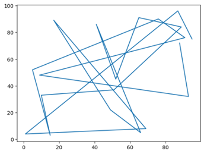
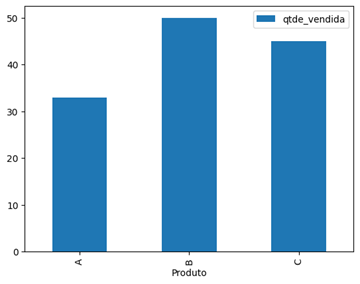
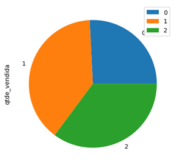
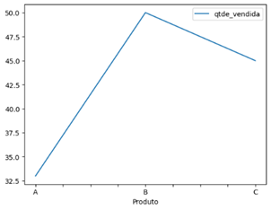
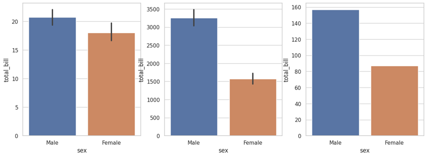
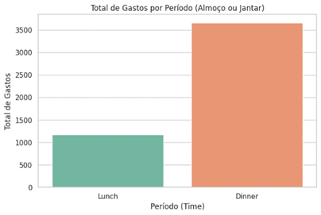
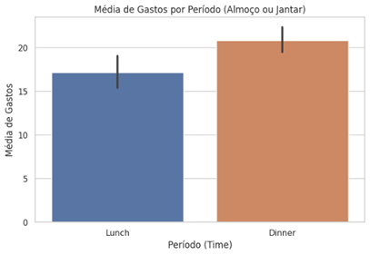
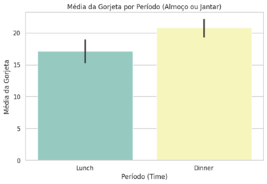

# Aula 4 — Visualização de Dados com Matplotlib, pandas e Seaborn

## Ponto de Partida

Que a linguagem Python tem muitas qualidades você já sabe, agora vamos aprender a utilizar algumas bibliotecas para visualizar dados de diferentes maneiras.

Uma biblioteca já mencionada no decorrer desta disciplina é a **Matplotlib**, que desempenha um papel fundamental, funcionando como uma pedra angular na criação de gráficos em Python. Trata-se de uma escolha universalmente aceita em projetos de visualização de dados.

Outra biblioteca bastante renomada é o `pandas`, que, além de suas funcionalidades amplamente conhecidas, disponibiliza recursos de visualização gráfica.

Por fim, examinaremos a biblioteca **Seaborn**, que é uma extensão da base do Matplotlib, destacando-se como uma ferramenta especializada para a criação de gráficos de alta qualidade em Python.

> **Desafio da aula:** suponha que você precise responder em qual período os clientes gastam mais em um restaurante e verificar se esse mesmo período é aquele em que eles dão mais gorjetas. Como poderíamos representar as respostas graficamente?

## Vamos Começar!

### Matplotlib

A biblioteca Matplotlib exerce uma função central na criação de gráficos em Python, sendo amplamente adotada em projetos de visualização de dados. **John Hunter** é o criador e uma figura-chave para o desenvolvimento dessa biblioteca, que surge como uma alternativa ao uso de ferramentas como gnuplot e MATLAB na comunidade científica. Anteriormente, os cientistas tinham que gerar gráficos em outros softwares após extrair os resultados de suas análises, fato que tornava o processo incômodo. Assim, a biblioteca Matplotlib emergiu como uma solução eficiente para criar visualizações em Python.

A instalação do Matplotlib pode ser facilmente realizada com o comando `pip install matplotlib`. Em ambientes como Anaconda e Google Colab, essa biblioteca já está prontamente disponível. O módulo `pyplot` é uma parte essencial do Matplotlib, pois disponibiliza funções que facilitam a criação e personalização de gráficos. Duas sintaxes comuns para importar o Matplotlib com o apelido `plt` são: `import matplotlib.pyplot as plt` e `from matplotlib import pyplot as plt`.

Os gráficos desempenham o papel de narradores visuais, contando histórias por meio dos dados. Para começar nossa jornada de visualização, vamos usar algo criativo e abstrato. Geraremos duas listas de valores inteiros aleatórios usando o módulo `random` e criaremos um gráfico de linhas com o Matplotlib.

```python
import matplotlib.pyplot as plt
import random

dados1 = random.sample(range(100), k=20)
dados2 = random.sample(range(100), k=20)

plt.plot(dados1, dados2) # pyplot gerencia a figura e o eixo
```



*Figura 1 | Gráfico. Fonte: elaborada pelo autor.*

Existem duas formas de criar o gráfico:

- O `pyplot` cria e gerencia automaticamente figuras e eixos, e usa as funções do `pyplot` para plotagem.
- Criar explicitamente figuras e eixos, e chamar métodos sobre eles (o "estilo orientado a objetos (OO)").

No gráfico criado, utilizamos a opção 1, ou seja, foi o próprio módulo que criou o ambiente da figura e do eixo. Como já aprendemos ao estudar essa biblioteca, ela é de extrema importância para diferentes áreas.

### Biblioteca pandas

Já conhecemos muitas funcionalidades da biblioteca `pandas`; uma delas diz respeito à visualização gráfica. As principais estruturas de dados da biblioteca `pandas` (`Series` e `DataFrame`) possuem o método `plot()`, construído com base no Matplotlib e que permite criar gráficos a partir dos dados nas estruturas.

Confira um exemplo:

```python
import pandas as pd

dados = {
    'Produto':['A', 'B', 'C'],
    'qtde_vendida':[33, 50, 45]
}

df = pd.DataFrame(dados)

df.plot(x='Produto', y='qtde_vendida', kind='bar')
df.plot(x='Produto', y='qtde_vendida', kind=’pie’)
df.plot(x='Produto', y='qtde_vendida', kind='line')
```







*Figura 2 | Gráficos criados. Fonte: elaborada pelo autor.*

Existem muitas visualizações possíveis. No exemplo anterior, utilizamos os gráficos de barras, de pizza e de linhas. No endereço pandas você encontra a lista com todos os tipos de gráficos que podem ser construídos com o método `plot()` da biblioteca.

## Siga em Frente...

### Biblioteca Seaborn

O Seaborn, uma biblioteca Python construída sobre a base do Matplotlib, destaca-se na criação de gráficos de forma especializada. Você pode usar essa biblioteca importando-a em seus projetos da seguinte forma: `import seaborn as sns`. Uma característica notável do Seaborn é seu repositório de conjuntos de dados prontos para uso, o que facilita a exploração das funcionalidades. Você pode acessar esses conjuntos de dados em mwaskom. Para ilustrar, vamos carregar dados sobre gorjetas (tips) e utilizá-los em nosso estudo. O Seaborn simplifica a criação de gráficos e as análises de dados, mostrando-se uma ferramenta valiosa para a visualização de informações.

```python
import seaborn as sns
import matplotlib.pyplot as plt

sns.set(style=“whitegrid”) # opções: darkgrid, whitegrid, dark, white, ticks

df_tips = sns.load_dataset('tips')

fig, ax = plt.subplots(1, 3, figsize=(15, 5))

sns.barplot(data=df_tips, x='sex', y='total_bill', ax=ax[0])
sns.barplot(data=df_tips, x='sex', y='total_bill', ax=ax[1], estimator=sum)
sns.barplot(data=df_tips, x='sex', y='total_bill', ax=ax[2], estimator=len)
```



*Figura 3 | Gráficos utilizando barplot(). Fonte: elaborada pelo autor.*

A escolha entre a função `barplot()` do Seaborn e as funcionalidades de gráficos de barras no pandas dependerá das necessidades específicas da análise de dados. O motivo que leva a optar pelo `barplot()` muitas vezes se baseia nos parâmetros adicionais e na flexibilidade que ele oferece. Vamos dar destaque ao parâmetro `estimator`, que, por padrão, calcula a média.

A função `barplot()` do Seaborn apresenta uma variedade de opções estatísticas, permitindo que os cientistas de dados escolham a métrica que melhor se ajuste aos seus objetivos. Por exemplo, você pode calcular a soma, a contagem ou até mesmo outras métricas personalizadas. Isso é particularmente útil quando você deseja exibir informações diferentes nas barras, como a quantidade (`len`) ou a soma (`sum`) dos valores, em vez da média.

Em contraste, o pandas concede funcionalidades de gráficos de barras mais básicas, que geralmente se concentram na representação da média dos dados. Portanto, a escolha entre as duas abordagens dependerá da necessidade de personalização e da complexidade da análise estatística que você deseja realizar. O Seaborn fornece mais controle e opções para criar gráficos de barras que atendam precisamente às demandas de seu projeto.

Para ilustrar como o parâmetro afeta a construção do gráfico, observe a Figura 1, apresentada anteriormente. Nesse caso, usamos o Matplotlib para construir uma figura e um eixo com três posições. No primeiro gráfico, utilizou-se o padrão, isto é, a média; no segundo gráfico, a função soma; e, no terceiro, a função len.

Ao observar os resultados dos gráficos, podemos perceber as diferenças significativas entre eles. O primeiro gráfico nos fornece uma ideia de que o valor médio da conta entre homens e mulheres é semelhante, com uma ligeira vantagem para os homens. No entanto, o segundo gráfico nos dá a impressão de que os homens gastam muito mais em média. Mas será que isso é realmente verdade?

A resposta está no contexto dos dados. É importante verificar se a quantidade de homens na base de dados é significativamente maior do que a de mulheres, o que pode influenciar a soma total das contas. O terceiro gráfico esclarece essa questão, revelando o número de homens e mulheres na base de dados. Com essa informação, podemos avaliar se a diferença na soma total das contas entre os grupos ocorre por causa da disparidade na quantidade de observações. Portanto, a interpretação correta dos gráficos requer uma análise contextual, para evitar conclusões precipitadas.

## Vamos Exercitar?

Vamos resolver o problema descrito no início desta aula. Para isso, utilizaremos o DataSet sobre gorjeta apresentado nesta etapa de aprendizagem.

```python
import seaborn as sns
import matplotlib.pyplot as plt

sns.set(style=“whitegrid”)

df = sns.load_dataset('tips')

plt.figure(figsize=(8, 5))
sns.barplot(x='time', y='total_bill', data=df, estimator=sum, ci=None, palette=“Set2”)
plt.xlabel('Período (Time)')
plt.ylabel('Total de Gastos')
plt.title('Total de Gastos por Período (Almoço ou Jantar)')
plt.show()
```



*Figura 4 | Total de gastos por período (almoço ou janta). Fonte: elaborada pelo autor.*

Já conseguimos verificar que o gasto no jantar é bem superior ao gasto no almoço. Mas quantos clientes almoçaram e quantas clientes jantaram? Vamos investigar o gasto médio por período.

```python
plt.figure(figsize=(8, 5))
sns.barplot(x='time', y='total_bill', data=df)#, #estimator=sum, ci=None, palette=“Set2”)
plt.xlabel('Período (Time)')
plt.ylabel('Média de Gastos')
plt.title('Média de Gastos por Período (Almoço ou Jantar)')
plt.show()
```



*Figura 5 | Média de gastos por período (almoço ou janta). Fonte: elaborada pelo autor.*

Entendemos que a média gasta no jantar também é superior à do almoço. Logo, esse é o principal período do restaurante em relação a faturamento.

Por fim, vamos verificar a média de gorjeta por período.

```python
# Crie um gráfico de barras com o Seaborn para mostrar a média de gorjetas por período

plt.figure(figsize=(8, 5))
sns.barplot(x='time', y='total_bill', data=df, palette=“Set3”)
plt.xlabel('Período (Time)')
plt.ylabel('Média da Gorjeta')
plt.title('Média da Gorjeta por Período (Almoço ou Jantar)')
plt.show()
```



*Figura 6 | Média de gorjeta por período (almoço ou janta). Fonte: elaborada pelo autor.*

A média de gorjeta no jantar também é superior à do almoço.

Respondemos graficamente às perguntas feitas. Como mencionado anteriormente, a prática é sempre muito importante. Por isso, pense em soluções alternativas, mude parâmetros e se divirta no mundo do Python gráfico.

## Saiba mais

1. A comunicação no mundo dos dados é tão importante quanto saber lidar com eles, por isso sugiro a leitura do capítulo 10 do livro *Comunicação inteligente e storytelling: para alavancar negócios e carreiras*, cujo link de acesso está disponível a seguir.
   > ARRUDA, R. **Comunicação inteligente e storytelling: para alavancar negócios e carreiras**. Rio de Janeiro: Alta Books, 2019. E-book.

2. Outra dica para estudo e aprofundamento sobre esse tema é o livro *Use a cabeça! Python*.
   > BARRY, P. **Use a cabeça! Python**. 2. ed. Rio de Janeiro: Alta Books, 2018. E-book.

3. Para a aplicação do Python em data science, indico a leitura do capítulo 3 do livro *Data science do zero*. Nesse texto, é possível entender como a visualização dos dados é importante para contar a história dos dados.
   > GRUS, J. **Data science do zero: primeiras regras com o Python**. Rio de Janeiro: Alta Books, 2021. E-book.

## Referências

- API reference. Seaborn, 20 out. 2016. Disponível em: https://seaborn.pydata.org/api.html. Acesso em: 5 nov. 2023.
- ARRUDA, R. Comunicação inteligente e storytelling: para alavancar negócios e carreiras. Rio de Janeiro: Alta Books, 2019. E-book. Disponível em: https://integrada.minhabiblioteca.com.br/#/#/books/9788550812977/. Acesso em: 5 nov. 2023.
- BARRY, P. Use a cabeça! Python. 2. ed. Rio de Janeiro: Alta Books, 2018. E-book. Disponível em: https://integrada.minhabiblioteca.com.br/#/books/9786555207842. Acesso em: 12 out. 2023.
- GRUS, J. Data science do zero: primeiras regras com o Python. Rio de Janeiro: Alta Books, 2021. E-book. Disponível em: https://integrada.minhabiblioteca.com.br/#/books/9788550816463. Acesso em: 12 out. 2023.
- MANZANO, J. A. N. G.; OLIVEIRA, J. F. de. Algoritmos: lógica para desenvolvimento de programação de computadores. 29. ed. São Paulo: Érica, 2019.
- MWASKOM/SEABORN-DATA. GitHub, [s. d.]. Disponível em: https://github.com/mwaskom/seaborn-data. Acesso em: 5 nov. 2023.
- PANDAS.DATAFRAME.PLOT. pandas, [s. d.]. Disponível em: https://pandas.pydata.org/pandasdocs/stable/reference/api/pandas.DataFrame.plot.html. Acesso em: 5 nov. 2023.
