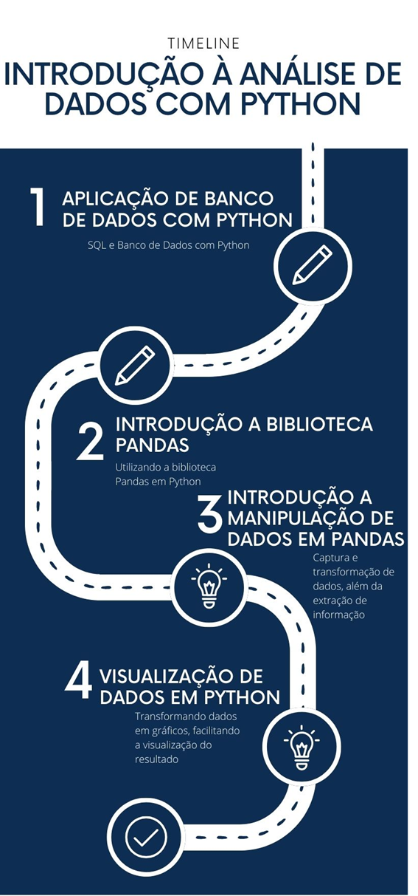

# Aula 5 — Banco de Dados SQLite e Operações CRUD em Python

## Ponto de Chegada

Olá, estudante! Para desenvolver a competência associada a esta unidade de aprendizagem, que é "Compreender os principais recursos de banco de dados e bibliotecas na linguagem Python", devemos, antes de tudo, conhecer os conceitos relacionados à linguagem SQL, saber fazer conexões com bancos de dados e manipular tais dados dentro do banco de dados.

Ao longo desta etapa de estudos, foi possível aliar os assuntos estudados à prática de diversas formas. Você também aprendeu a utilizar a biblioteca `pandas`, que é uma das mais usadas na área de manipulação de dados em Python (Manzano; Oliveira, 2019). Saber utilizar bibliotecas como o `pandas` é de extrema importância para desfrutar do potencial máximo da linguagem Python.

Ao tratar de manipulação de dados, devemos ter em mente que muitas vezes os dados não se apresentam da forma mais padronizada possível, o que dificulta a extração de informações úteis. Por essa razão, a manipulação é uma parte do processo com a qual se deve ter muito cuidado (Perkovic, 2016).

Durante esta trajetória de aprendizagem, você não apenas internalizou os princípios e técnicas apresentados, mas também os colocou em ação em cenários do mundo real. Elaborar uma "história" dos dados com o auxílio gráfico do Python não apenas amplia seu domínio sobre essa ferramenta, mas também aprimora sua capacidade de desmembrar problemas intricados em passos lógicos e de conceber soluções algorítmicas para resolvê-los, a fim de exibir os dados de modo simplificado.

Esse conjunto de habilidades o capacitará para se tornar um solucionador experiente de desafios tecnológicos e computacionais, preparando-o para enfrentar problemas de maneira eficaz. Agora você já possui o conhecimento necessário sobre o uso da visualização gráfica para aprimorar suas competências como programador.

## É Hora de Praticar!

> Para contextualizar sua aprendizagem, imagine a seguinte situação: você está desenvolvendo um programa de gerenciamento de informações sobre funcionários na tabela de um banco de dados SQLite.

### Questões norteadoras

- Como você pode aplicar seus conhecimentos em programação em Python para gerenciar essas informações?
- Como é possível criar o banco de dados e atualizá-lo utilizando os conceitos de Python?

### Reflita

Para encerrar e consolidar seu aprendizado, reflita sobre as seguintes perguntas:

- Aprender sobre SQL e conexão com o banco de dados me ajuda a ser um programador mais completo?
- Qual é a importância das bibliotecas "prontas" da Python, como o `pandas`, na manipulação de dados?
- Como a visualização gráfica dos dados ajuda a contar a "história" dos dados e a tomar decisões?

Essas considerações ajudarão você a incorporar de maneira mais profunda o conhecimento adquirido e a compreender o alcance de suas aplicações.

Desejo a você muito sucesso em sua jornada de aprendizagem!

### Resolução do Estudo de Caso

#### Conectar ao banco de dados SQLite

Primeiro, precisamos criar um banco de dados SQLite e uma tabela para armazenar as informações dos funcionários. Vamos estabelecer uma conexão com o banco de dados.

Confira, a seguir, o código Python a ser usado:

```python
import sqlite3

# Passo 1: Conectar ao banco de dados SQLite (ou criá-lo, se não existir)
conn = sqlite3.connect(“funcionarios.db”)
```

#### Criar a tabela de funcionários

Vamos criar uma tabela chamada `funcionarios` para armazenar as informações dos funcionários.

```python
# Passo 2: Criar a tabela de funcionários
cursor = conn.cursor()

cursor.execute('''
CREATE TABLE IF NOT EXISTS funcionarios (
    id INTEGER PRIMARY KEY,
    nome TEXT,
    cargo TEXT,
    salario REAL
)
''')
```

#### Inserir um novo funcionário

Agora, vamos inserir um novo funcionário na tabela, simulando a operação de "Create".

```python
# Passo 3: Inserir um novo funcionário na tabela
novo_funcionario = (1, “João”, “Analista”, 5000.00)

cursor.execute(“INSERT INTO funcionarios VALUES (?, ?, ?, ?)”, novo_funcionario)
conn.commit()
```

#### Consultar funcionários

Podemos consultar os funcionários existentes na tabela, simulando a operação de "Read".

```python
# Passo 4: Consultar e exibir funcionários
cursor.execute(“SELECT * FROM funcionarios”)
funcionarios = cursor.fetchall()

print(“Funcionários Cadastrados:”)
for funcionario in funcionarios:
    print(funcionario)
```

#### Atualizar informações de um funcionário

Agora, vamos atualizar as informações de um funcionário específico, simulando a operação de "Update".

```python
# Passo 5: Atualizar informações de um funcionário
atualizacao = (“João Silva”, 5500.00, 1)

cursor.execute(“UPDATE funcionarios SET nome = ?, salario = ? WHERE id = ?”, atualizacao)
conn.commit()
```

#### Deletar um funcionário

Por fim, vamos deletar um funcionário da tabela, simulando a operação de "Delete".

```python
# Passo 6: Deletar um funcionário da tabela
id_funcionario_para_deletar = 1

cursor.execute(“DELETE FROM funcionarios WHERE id = ?”, (id_funcionario_para_deletar,))
conn.commit()
```

Esse é um exemplo desenvolvido em um ambiente real. Você deve implementar mecanismos de tratamento de erros e segurança adequados para lidar com operações em um banco de dados. As operações **CRUD** são fundamentais na gestão de dados em sistemas que utilizam bancos de dados relacionais como o SQLite.

### Assimile

O material visual a seguir esquematiza os principais tópicos abordados nesta unidade de aprendizagem, que apresentou uma introdução à análise com Python. Este infográfico exibe uma percepção clara e sucinta de cada parte desta etapa de estudos, enfatizando os conceitos e fundamentos necessários para uma boa compreensão dos saberes desenvolvidos.



*Figura 1 | Infográfico: explorando recursos do Python. Fonte: elaborada pelo autor.*

## Referências

- ARRUDA, R. Comunicação inteligente e storytelling: para alavancar negócios e carreiras. Rio de Janeiro: Alta Books, 2019. E-book. Disponível em: https://integrada.minhabiblioteca.com.br/#/#/books/9788550812977/. Acesso em: 5 nov. 2023.
- GRUS, J. Data science do zero: primeiras regras com o Python. Rio de Janeiro: Alta Books, 2021. E-book. Disponível em: https://integrada.minhabiblioteca.com.br/#/books/9788550816463. Acesso em: 12 out. 2023.
- MANZANO, J. A. N. G.; OLIVEIRA, J. F. de. Algoritmos: lógica para desenvolvimento de programação de computadores. 29. ed. São Paulo: Érica, 2019.
- PERKOVIC, L. Introdução à computação usando Python: um foco no desenvolvimento de aplicações. Rio de Janeiro: LTC, 2016.
