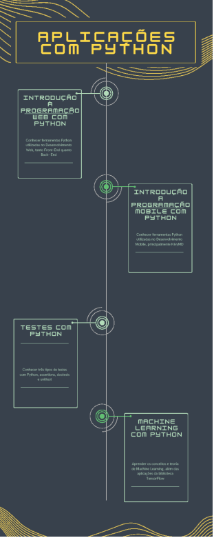

# Aula 5 — Classificação de Dígitos Escritos à Mão com TensorFlow

## Ponto de Chegada

Olá, estudante! Para desenvolver a competência associada a esta unidade de aprendizagem, que é "Diferenciar contextos distintos de utilização da linguagem de programação Python", devemos, antes de tudo, conhecer as principais aplicações de Python. Além disso, é importante aprender os passos a serem seguidos em cada aplicação, seja no desenvolvimento web, seja no machine learning.

Ao longo desta etapa de estudos, foi possível aliar os assuntos estudados à prática de diversas formas. Mostrou-se a diferença entre **front-end** e **back-end** no desenvolvimento web, conceitos que são utilizados por muitas outras linguagens (Maciel, 2018).

Ao examinar as possíveis aplicações de Python, pudemos aprofundar nosso entendimento sobre o **desenvolvimento mobile** (Morais et al., 2022), segmento no qual o Python vem ganhando notoriedade, assim como já acontece no desenvolvimento web. Quando programamos, seja qual for a linguagem adotada, os testes de funcionamento se tornam importantes para validar resultados e criar aplicações corretas. Nesse contexto, aprendemos especificamente sobre `assertions`, `doctests` e `unittest`.

Em relação ao machine learning, a biblioteca `TensorFlow` merece destaque, visto que, além de suas muitas funcionalidades, a constante contribuição da comunidade Python vinculada a essa biblioteca torna a sua utilização bem relevante (TensorFlow, [s. d.]).

Durante este percurso de aprendizagem, você não apenas assimilou os princípios e técnicas apresentados, mas também os aplicou a situações do mundo real. Saber utilizar a linguagem Python nos diversos cenários apresentados em nossos estudos é o que faz de nós, programadores de Python, um recurso importante e desejado pelo mercado. Logo, a necessidade de se manter atualizado é grande.

Essa gama de aptidões o habilita para se transformar em um resolvedor experiente de desafios tecnológicos e computacionais, conferindo-lhe a capacidade de abordar questões de forma eficiente. Além disso, adquirimos proficiência no emprego de aplicações que podem envolver Python.

## É Hora de Praticar!

> Vamos criar um classificador de dígitos escritos à mão, considerando os números de 0 a 9. Para tanto, usaremos um banco de dados pronto do TensorFlow. Em resumo, dada a imagem de um número escrito à mão, quão eficiente será o modelo para acertar o número?

### Questões norteadoras

- Como você pode aplicar seus conhecimentos em programação em Python para criar esse modelo?
- Como é possível ajustar os parâmetros do treino do modelo para torná-lo melhor, caso seja necessário?

### Reflita

Para encerrar e consolidar seu aprendizado, reflita sobre as seguintes perguntas:

- Aprender sobre as diversas aplicações da linguagem Python me ajuda a ser um programador mais completo?
- Qual é a importância das bibliotecas "prontas" da Python tanto no contexto de aplicação na web quanto para mobile?
- Como a biblioteca TensorFlow ajuda a construir modelos de machine learning mais eficientes e robustos?

Essas considerações ajudarão você a incorporar de maneira mais profunda o conhecimento adquirido e a compreender o alcance de suas aplicações. Desejo a você muito sucesso em sua jornada de aprendizagem!

### Resolução do Estudo de Caso

```python
import tensorflow as tf

mnist = tf.keras.datasets.mnist
(x_train, y_train),(x_test, y_test) = mnist.load_data()
x_train, x_test = x_train / 255.0, x_test / 255.0

model = tf.keras.models.Sequential([
    tf.keras.layers.Flatten(input_shape=(28, 28)),
    tf.keras.layers.Dense(128, activation='relu'),
    tf.keras.layers.Dropout(0.2),
    tf.keras.layers.Dense(10, activation='softmax')
])

model.compile(optimizer='adam',
              loss='sparse_categorical_crossentropy',
              metrics=['accuracy'])

model.fit(x_train, y_train, epochs=5)
model.evaluate(x_test, y_test)
```

O conjunto de dados **MNIST** é um conjunto de imagens de dígitos escritos à mão (0 a 9). É frequentemente usado como um ponto de partida para o aprendizado de máquina. `x_train` e `x_test` contêm as imagens, enquanto `y_train` e `y_test` contêm as etiquetas correspondentes.

As imagens são normalizadas dividindo-se cada pixel por 255.0. Isso coloca os valores dos pixels no intervalo [0, 1], facilitando o treinamento do modelo.

Cria-se, então, um modelo sequencial com as seguintes camadas:

- `Flatten`: converte a matriz bidimensional das imagens (28x28 pixels) em um vetor unidimensional.
- `Dense(128, activation='relu')`: camada densa com 128 neurônios e função de ativação ReLU.
- `Dropout(0.2)`: regularização por abandono, desativando aleatoriamente 20% dos neurônios durante o treinamento, para evitar overfitting.
- `Dense(10, activation='softmax')`: camada de saída com 10 neurônios (um para cada dígito) e função de ativação softmax, que produzirá uma distribuição de probabilidade sobre as classes.

O modelo é compilado com o otimizador `'adam'`, a função de perda `'sparse_categorical_crossentropy'` (adequada para problemas de classificação multiclasse) e a métrica de `'accuracy'`.

O modelo é treinado usando-se o conjunto de treinamento (`x_train` e `y_train`) por cinco épocas.

O desempenho do modelo é avaliado utilizando-se o conjunto de teste (`x_test` e `y_test`), e os resultados, incluindo a perda e a precisão, são exibidos.

A arquitetura específica do modelo envolve uma camada inicial que "achata" as imagens bidimensionais em um vetor unidimensional, seguida por uma camada densa (totalmente conectada) com ativação ReLU, uma camada de dropout para regularização e, por fim, uma camada de saída com ativação softmax para gerar probabilidades a cada classe.

Após o treinamento, o modelo pode ser usado para prever a classe de um dígito desconhecido, e a avaliação no conjunto de teste fornece uma medida de quão bem ele generaliza para dados não vistos. A métrica de "accuracy" indica a proporção de previsões corretas em relação ao total de previsões.

### Assimile

O material visual a seguir esquematiza os principais tópicos abordados nesta unidade de aprendizagem em que tratamos de aplicações em Python. Este infográfico exibe uma percepção clara e sucinta de cada parte desta etapa de estudos, enfatizando os conceitos e fundamentos necessários para uma boa compreensão dos saberes desenvolvidos.



*Figura 1 | Infográfico: aplicações com Python. Fonte: elaborada pelo autor.*

## Referências

- AMÍLCAR NETTO; MACIEL, F. Python para data science e machine learning descomplicado. Rio de Janeiro: Alta Books, 2021. E-book. Disponível em: https://integrada.minhabiblioteca.com.br/#/books/9786555203172/. Acesso em: 21 out. 2023.
- BANIN, S. L. Python 3: conceitos e aplicações: uma abordagem didática. São Paulo: Érica, 2018. E-book. Disponível em: https://integrada.minhabiblioteca.com.br/books/9788536530253. Acesso em: 21 out. 2023.
- LEMBURG, M. PEP 249 - Python database API specification v.2.0. Python Enhancement Proposals, 12 abr. 1999. Disponível em: https://peps.python.org/pep-0249/#description. Acesso em: 31 out. 2023.
- MACIEL, F. M. B. Python e Django: desenvolvimento web moderno e ágil. Rio de Janeiro: Alta Book, 2018. E-book. Disponível em: https://integrada.minhabiblioteca.com.br/#/books/9786555200973. Acesso em: 21 out. 2023.
- MANZANO, J. A. N. G.; OLIVEIRA, J. F. de. Algoritmos: lógica para desenvolvimento de programação de computadores. 29. ed. São Paulo: Érica, 2019.
- MORAIS, M. S. de F. et al. Fundamentos de desenvolvimento mobile. Porto Alegre: Grupo A, 2022. Disponível em: https://integrada.minhabiblioteca.com.br/#/books/9786556903057. Acesso em: 21 out. 2023.
- PYTHON para desenvolvimento mobile. Python Brasil, 3 jun. 2016. Disponível em: https://python.org.br/mobile/. Acesso em: 15 nov. 2023.
- TENSORFLOW. Página inicial, [s. d.]. Disponível em: https://www.tensorflow.org/?hl=pt-br. Acesso em: 16 nov. 2023.
- UNITTEST – Unit testing framework. Python 3.12.2 Documentation, [s. d.]. Disponível em: https://docs.python.org/3/library/unittest.html. Acesso em: 16 nov. 2023.
