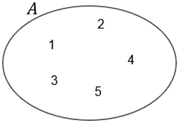
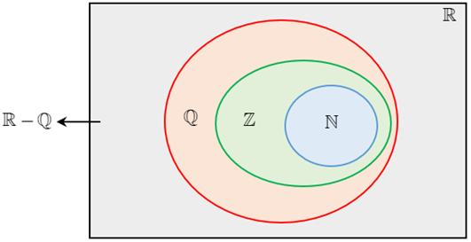
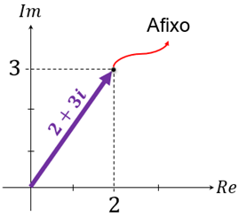

# Aula 1 — Conjuntos Numéricos e Operações

## Ponto de Partida

Desejamos boas-vindas a você para esta aula de Fundamentos de Cálculo Aplicado. Vamos direcionar nossos estudos a conceitos essenciais da Matemática, que são os conjuntos numéricos, suas propriedades e operações. É a partir do conceito de número que podemos explorar os mais variados conteúdos matemáticos, viabilizando, assim, sua aplicação nas mais variadas ciências.

Os principais conjuntos numéricos com os quais trabalhamos são organizados com base nas características dos números que eles contêm. Assim, por exemplo, no conjunto de números racionais temos os números que são obtidos pela divisão entre dois números inteiros, sendo essa divisão associada à representação na forma de fração. Nesse sentido, para a compreensão desses conjuntos, precisamos analisar a estrutura dos números que os compõem e, consequentemente, das operações correspondentes.

Considerando a relevância dos conjuntos numéricos e de suas características, vamos investigar a situação apresentada no que segue.

> Um fazendeiro está adquirindo uma nova propriedade, para a expansão de sua fazenda, com uma área total de 50 alqueires paulistas. Porém, devido à sua localização, $\dfrac{1}{5}$ dessa nova propriedade contempla uma área de preservação permanente, a qual não pode ser modificada, e em $\dfrac{1}{8}$ dela estão localizadas algumas construções, como uma casa e um depósito, os quais serão mantidos após a aquisição.
>
> Com base nessas informações, qual é a fração dessa nova área que está disponível para plantio? Qual a área disponível para plantio em metros quadrados?

Dê continuidade aos seus estudos e confira os conceitos que podem auxiliar na construção da solução para a problemática apresentada.

---

## Vamos Começar!

Teoria dos Conjuntos é um ramo da Matemática voltado ao estudo da noção de conjunto e aos conceitos associados, como a caracterização dos elementos, as representações dos conjuntos, bem como as operações definidas entre conjuntos. Assim, iniciemos nossos estudos pelos conceitos elementares.

### Conjuntos

Um conjunto pode ser entendido como uma coleção de objetos que possuem ao menos uma característica em comum. Por exemplo, um conjunto pode ser composto pelos números 1, 2, 3, 4 e 5, nesse caso, o conjunto tem natureza numérica e a relação existente entre os integrantes do conjunto é que todos eles são números naturais. Cada um desses números pode ser chamado de **elemento** do conjunto.

Os conjuntos são denotados, usualmente, por letras maiúsculas 𝐴, 𝐵, 𝐶, ..., e seus elementos geralmente são representados pelas letras minúsculas 𝑎, 𝑏, 𝑐, .... No caso do exemplo anterior, podemos chamar o conjunto de 𝐴 e utilizar a representação:

$$A = \{1, 2, 3, 4, 5\}$$

Outra possível representação é a indicação de uma propriedade que caracteriza os elementos, o que nesse exemplo pode ser dado por:

$$A = \{x \in \mathbb{N} ; 1 \le x \le 5\}$$

o que pode ser lido como "o conjunto 𝐴 é formado pelos elementos 𝑥 pertencentes ao conjunto de números naturais (𝑥 ∈ ℕ), tais que 𝑥 é maior ou igual a 1 e menor ou igual a 5". Outra possível representação é utilizando os diagramas, conforme Figura 1, sendo mais utilizada para conjuntos com poucos elementos.

**Figura 1** | Representação para o conjunto A = {1, 2, 3, 4, 5}

De posse desses conceitos básicos, vamos ao estudo dos principais conjuntos numéricos e suas operações.

---

## Siga em Frente...

### Conjuntos numéricos

Os conjuntos numéricos são formados por números. Das diversas possibilidades de conjuntos que podemos construir nesse critério, alguns se destacam e, inclusive, recebem notações especiais. Vejamos quais são os principais conjuntos numéricos em destaque na Matemática.

#### Conjunto dos números naturais (ℕ)

O conjunto de números naturais é dado por:

$$\mathbb{N} = \{0, 1, 2, 3, 4, 5, \dots\}$$

cujos elementos são usualmente empregados no processo de contagem. A partir dele, podemos construir outros subconjuntos como o subconjunto dos números naturais não nulos, o qual pode ser representado por ℕ* = {1, 2, 3, 4, 5, ...}.

#### Conjunto dos números inteiros (ℤ)

O conjunto dos números inteiros é dado por:

$$\mathbb{Z} = \{\dots, -3, -2, -1, 0, 1, 2, 3, \dots\}$$

ou seja, contempla o zero, os inteiros positivos e os inteiros negativos. Observe que o conjunto de números naturais é um subconjunto de ℤ, relação esta que pode ser descrita por ℕ ⊂ ℤ.

A partir dos inteiros, podemos construir alguns subconjuntos importantes:

| Notação | Conjunto | Descrição |
|---|---|---|
| ℤ₊ | {0, 1, 2, 3, ...} | inteiros não negativos (coincide com ℕ) |
| ℤ₋ | {0, −1, −2, −3, ...} | inteiros não positivos |
| ℤ* | {..., −2, −1, 1, 2, 3, ...} = ℤ − {0} | inteiros não nulos |
| ℤ*₊ | {1, 2, 3, ...} | inteiros positivos |
| ℤ*₋ | {−1, −2, −3, ...} | inteiros negativos |

#### Conjunto dos números racionais (ℚ)

O conjunto dos números racionais é formado por todos os números que podem ser representados na forma de uma fração $\dfrac{a}{b}$, em que 𝑎 e 𝑏 são números inteiros, com 𝑏 não nulo. Podemos representar esse conjunto na forma:

$$\mathbb{Q} = \left\{ \dfrac{a}{b} \; ; \; a, b \in \mathbb{Z} \text{ e } b \ne 0 \right\}$$

Nesse conjunto são incluídos os números naturais, os inteiros e, também, as dízimas periódicas. E assim como no caso dos inteiros, podemos construir os seguintes subconjuntos, adotando a mesma lógica utilizada no caso de ℤ:

- racionais não negativos (ℚ₊)
- racionais não positivos (ℚ₋)
- racionais não nulos (ℚ*)
- racionais positivos (ℚ*₊)
- racionais negativos (ℚ*₋)

Os números racionais podem ser representados tanto na forma de fração quanto na representação decimal. Se tivermos um número $\dfrac{p}{q}$, basta efetuar a divisão e encontraremos sua representação na forma decimal. Por exemplo, $\dfrac{1}{2}$ e $-\dfrac{3}{5}$ são números racionais, assim como 0,5 e −0,222.... Existem ainda números racionais que são equivalentes, por exemplo, $\dfrac{1}{2}$ e $\dfrac{2}{4}$ são frações equivalentes porque podemos converter uma fração na outra por meio da multiplicação do numerador e do denominador por um mesmo valor.

#### Conjunto dos números irracionais (𝕀)

O conjunto dos números irracionais, diferente dos racionais, é composto por todas as dízimas não periódicas, isto é, pelos números que, quando representados na forma decimal, apresentam infinitas casas decimais, as quais não são periódicas, não repetindo um padrão predefinido. Assim:

$$\mathbb{I} = \{x \; ; \; x \text{ é uma dízima não periódica}\}$$

Nesse conjunto, podemos destacar dois números muito importantes:

- **Número pi** ($\pi = 3,141592654\dots$) — obtido a partir de uma relação de proporção entre a medida da circunferência e a do seu respectivo diâmetro.
- **Número de Euler** ($e = 2,71828182\dots$), também conhecido como número de Neper — empregado principalmente como base dos logaritmos naturais.

#### Conjunto dos números reais (ℝ)

O conjunto dos números reais corresponde à união entre os conjuntos de números racionais e irracionais, podendo ser representado como:

$$\mathbb{R} = \mathbb{Q} \cup \mathbb{I}$$

A partir do conjunto de números reais, podemos definir os intervalos, os quais podem ser organizados em duas categorias.

> **Atenção:** podemos nos referir ao conjunto de números irracionais também pela notação ℝ − ℚ, isto é, entender o conjunto de números irracionais como o complementar dos racionais em relação aos reais.

Observe na Figura 2 a representação dos conjuntos numéricos no diagrama de Venn.

**Figura 2** | Conjuntos numéricos

### Operações com números inteiros

Podemos definir, sobre esses conjuntos numéricos, as operações básicas de adição, subtração, multiplicação e divisão, porém, considerando que algumas dessas operações não são fechadas sobre alguns desses conjuntos. Por exemplo, a subtração não é fechada no conjunto de números naturais, basta considerar que 3 ∈ ℕ e 5 ∈ ℕ, no entanto, 3 − 5 ∉ ℕ.

Vamos analisar a seguir operações para o conjunto ℤ.

| Operação | Definição | Exemplo |
|---|---|---|
| **Adição** | 𝑎 + 𝑏 com 𝑎, 𝑏 ∈ ℤ | 2 + (−3) = −1 |
| **Multiplicação** | 𝑎 · 𝑏 com 𝑎, 𝑏 ∈ ℤ | 3 · (−2) = −6 |
| **Subtração** | 𝑎 − 𝑏 com 𝑎, 𝑏 ∈ ℤ | 2 − (−3) = 5 |

**Divisão:** se 𝑎, 𝑏 ∈ ℤ, com 𝑏 > 0, então existem 𝑞, 𝑟 ∈ ℤ únicos, com 0 ≤ 𝑟 < 𝑏, tais que:

$$a = b \cdot q + r$$

Por exemplo, se 𝑎 = 101 e 𝑏 = 11, então 101 = 11 · 9 + 2. Nesse caso, 𝑞 = 9 é o quociente e 𝑟 = 2 é o resto.

Quando 𝑟 = 0, a divisão é exata e, então, 𝑏 divide 𝑎.

### Operações com frações

Podemos adequar essas operações também para os demais conjuntos numéricos. Vejamos alguns exemplos de como trabalhar com essas operações especificamente no contexto das frações, isto é, dos números racionais representados na forma fracionária. Para esse caso, é importante destacar que a adição e a subtração são efetuadas desde que as frações envolvidas possuam mesmo denominador, sendo necessário trabalhar com frações equivalentes caso contrário, o que pode ser obtido por meio de mínimo múltiplo comum.

**Adição** — como mmc(3, 5) = 15:

$$\dfrac{2}{3} + \dfrac{4}{5} = \dfrac{10}{15} + \dfrac{12}{15} = \dfrac{10+12}{15} = \dfrac{22}{15}$$

**Multiplicação:**

$$\dfrac{2}{3} \cdot \dfrac{4}{5} = \dfrac{2 \cdot 4}{3 \cdot 5} = \dfrac{8}{15}$$

**Subtração** — como mmc(3, 5) = 15:

$$\dfrac{2}{3} - \dfrac{4}{5} = \dfrac{10}{15} - \dfrac{12}{15} = \dfrac{10-12}{15} = -\dfrac{2}{15}$$

**Divisão** — é multiplicação pela fração inversa:

$$\dfrac{2}{3} \div \dfrac{4}{5} = \dfrac{2}{3} \cdot \dfrac{5}{4} = \dfrac{2 \cdot 5}{3 \cdot 4} = \dfrac{10}{12} = \dfrac{5}{6}$$

As operações apresentadas também gozam de diversas propriedades, as quais possibilitam, entre outros, a resolução de problemas que envolvem os números em suas diferentes categorias.

Para concluir o estudo dos conjuntos numéricos, o último desses conjuntos que podemos destacar é o conjunto de números complexos, que engloba todos os conjuntos apresentados anteriormente.

### Conjunto dos números complexos (ℂ)

O conjunto dos números complexos é composto pelos números na forma 𝑎 + 𝑏𝑖, com 𝑎, 𝑏 ∈ ℝ, em que 𝑖 representa a unidade imaginária, tal que 𝑖² = −1. Nesse conjunto temos a possibilidade, por exemplo, de resolver equações na forma 𝑥² = −1, o que não é possível nos conjuntos indicados anteriormente.

Por exemplo, 2 − 𝑖 e 5 + 3𝑖 são números complexos. Ainda, todos os números reais são também complexos porque podemos representá-los na forma 𝑎 + 0𝑖, com 𝑎 ∈ ℝ. Assim, o conjunto dos números complexos contém os naturais, os inteiros, os racionais, os irracionais e os reais.

Na representação algébrica 𝑎 + 𝑏𝑖 para um número complexo, chamamos 𝑎 ∈ ℝ de **parte real** e 𝑏 ∈ ℝ de **parte imaginária**. Assim, por exemplo, no número complexo −1 + 2𝑖 a parte real é −1 e a parte imaginária corresponde a 2. Apesar das nomenclaturas, tanto a parte real quanto a imaginária são formadas por números reais, a unidade imaginária 𝑖 não faz parte de nenhuma dessas duas partes.

Além da representação algébrica, também podemos representar os números complexos de forma geométrica, por meio do plano de Argand-Gauss. Essa representação provém do plano cartesiano usual, mas com a adaptação do eixo 𝑥 para representar as partes reais dos números complexos (eixo 𝑅𝑒), enquanto o eixo 𝑦 corresponde às partes imaginárias (eixo 𝐼𝑚). Veja na Figura 3 a estrutura do plano de Argand-Gauss, também chamado de plano complexo, em conjunto com a representação para o número complexo 2 + 3𝑖.

**Figura 3** | Plano de Argand-Gauss

No plano complexo, o ponto de coordenadas (2, 3) é chamado de **afixo** do número complexo 2 + 3𝑖. O número complexo pode ser representado tanto pelo seu afixo quanto pelo vetor que parte da origem (0, 0) e tem como extremidade o seu afixo.

Assim como temos operações definidas sobre os outros conjuntos numéricos, também podemos definir operações em ℂ, mas considerando a presença das partes real e imaginária, as quais são descritas por números reais, e considerando que 𝑖² = −1.

O conhecimento dos conjuntos numéricos é indispensável para o estudo de problemas que envolvem conceitos matemáticos, visto que é um dos elementos indispensáveis para a interpretação, representação e resolução de problemas de contextos diversos.

---

## Vamos Exercitar?

Para a resolução da situação apresentada, considere uma propriedade com área de 40 alqueires. Sabemos que $\dfrac{1}{5}$ dessa nova propriedade contempla área de preservação permanente e em $\dfrac{1}{8}$ dela estão localizadas algumas construções que serão mantidas.

Fazendo uma análise do ponto de vista das frações, vamos calcular qual fração corresponde à parte da propriedade que será mantida. Assim, devemos calcular $\dfrac{1}{5} + \dfrac{1}{8}$. Calculando o mínimo múltiplo comum entre 5 e 8 teremos mmc(5, 8) = 40, sendo assim:

$$\dfrac{1}{5} + \dfrac{1}{8} = \dfrac{8}{40} + \dfrac{5}{40} = \dfrac{8+5}{40} = \dfrac{13}{40}$$

Dessa forma, $\dfrac{13}{40}$ dessa propriedade será mantida. Vamos calcular a área livre:

$$1 - \dfrac{13}{40} = \dfrac{40}{40} - \dfrac{13}{40} = \dfrac{40-13}{40} = \dfrac{27}{40}$$

Consequentemente, a fração $\dfrac{27}{40}$ corresponde à área da propriedade que está livre para plantio.

Agora, faremos a conversão para metros quadrados. Como um alqueire paulista corresponde a 24.200 metros quadrados, então 50 alqueires correspondem a 1.210.000 metros quadrados. Como apenas $\dfrac{27}{40}$ dessa área estão disponíveis, então:

$$\dfrac{27}{40} \cdot 1.210.000 = 816.750$$

Portanto, a área disponível para plantio é de 816.750 metros quadrados, o que conclui a solução do problema.
